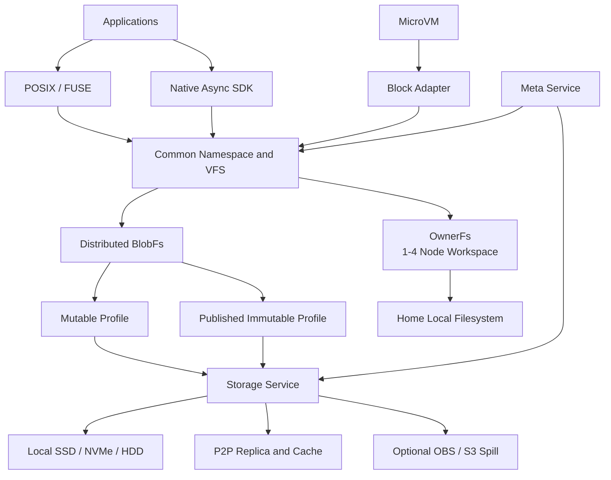

# AFS：近计算的通用分布式文件系统

AFS 部署在 Agent 与 Sandbox 计算集群内部，以计算节点贡献的本地 SSD、NVMe、HDD 等磁盘构成近计算存储层，对应用提供 POSIX 文件语义，并重点优化大规模镜像、Snapshot 与 Checkpoint 的加载、复制和 P2P 分发。

AFS 由一条通用分布式主干和一条小集群特化路径组成：

```text
Distributed BlobFs
├── Mutable Profile              通用多读多写文件
└── Published Immutable Profile  镜像、Snapshot、Checkpoint

OwnerFs
└── 1～4 节点一体机 Workspace，本地 Home 亲和
```

BlobFs 是通用的分布式文件数据引擎。文件数据按 chunk 或 extent 分布在多个 Storage Node，并通过副本协议、故障修复和再平衡提供集群级存储能力。不可变发布物是 BlobFs 的重点优化 Profile，而不是 BlobFs 的全部能力。

OwnerFs 面向 1～4 节点的一体机式 Agent Workspace。一个 Workspace 由一个 Home 节点持有，Agent 与 Home 共置时直接使用本地普通文件，计算迁移后通过 P2P 回到 Home 访问同一份文件。

## 架构



Meta 管理 Namespace、文件布局、Workspace Home、版本、位置和生命周期。文件数据不经过 Meta 转发。Node 与计算节点共置，优先使用本机数据，缺失数据通过节点间链路读取。

## 当前能力

| 能力 | 状态 | 说明 |
| --- | --- | --- |
| MetaStore：etcd、local-file、memory | Experimental | 统一提交入口，后端确认后发布可见状态 |
| OwnerFs 本地 POSIX 路径 | Experimental | Home 使用本地普通文件，已完成 Linux 真 FUSE 验证 |
| OwnerFs 跨节点 P2P | Experimental | 远端节点访问 Home 上的同一份文件 |
| FUSE、REST、gRPC、UDS + SHM 基础设施 | Experimental | 已接入正式进程和配置体系 |
| RDMA transport | Experimental | 已验证握手与诊断链路，文件内容路径尚未接入 |
| Distributed BlobFs | Planned | 通用 chunk/extent 数据引擎尚未实现 |
| Snapshot Publish | Planned | 稳定切点、manifest、发布与 COW 尚未实现 |
| 多源 P2P 与对象存储 spill | Research | 已有独立机制实验，尚未接入 AFS 产品路径 |

完整边界和证据见[当前状态](docs/current-status.md)。

## 阅读路径

1. [产品定位](docs/product-positioning.md)
2. [架构原则](PRINCIPLES.md)
3. [架构总览](docs/architecture/overview.md)
4. [数据 Profile](docs/architecture/profiles.md)
5. [架构设计专题](docs/architecture/design-topics.md)
6. [副本、缓存与外部副本状态](docs/semantics/copy-states.md)
7. [当前状态](docs/current-status.md)
8. [路线图](ROADMAP.md)
9. [参与贡献](CONTRIBUTING.md)

## 运行与开发

权威构建和运行环境为 Linux。工具链由 [rust-toolchain.toml](rust-toolchain.toml) 固定。进程启动、FUSE 挂载、SDK 调用和现有验收流程见[运行指南](docs/foundation-running.md)。源码入口与模块职责见[代码地图](docs/code-layout.md)。

当前实现包含 `afs-meta`、`afs-node`、`afs-client` 和公共 transport/protocol crates。Python 只用于仓库 E2E 脚本，不是产品运行依赖。
