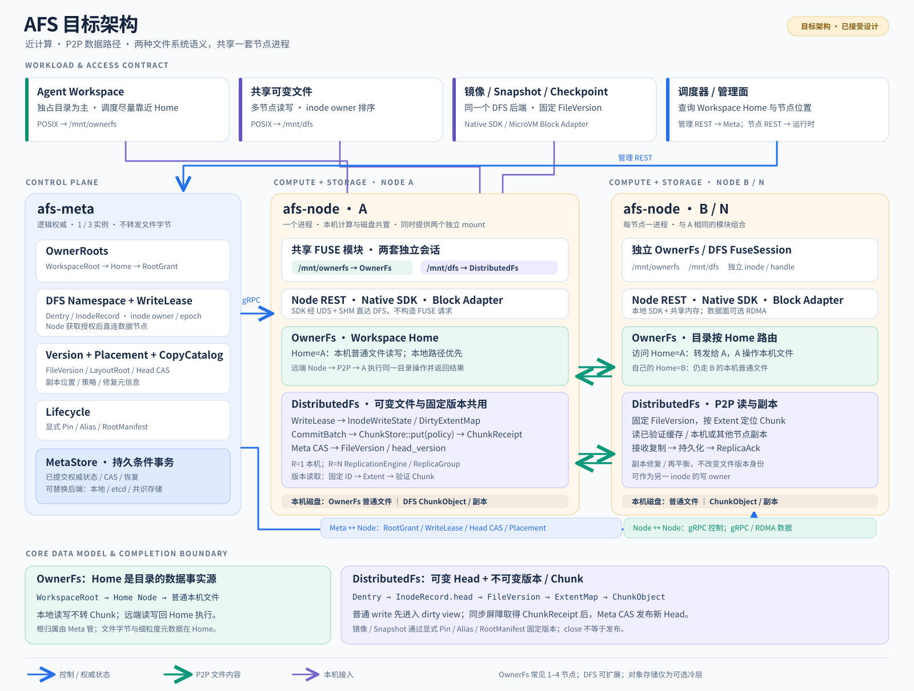

# AFS：近计算的通用分布式文件系统

AFS 部署在 Agent 与 Sandbox 计算集群内部，以计算节点贡献的 SSD、NVMe、HDD 等本地磁盘构成近计算存储层，对应用提供 POSIX 文件语义，并重点优化大规模镜像、Snapshot 与 Checkpoint 的加载、复制和 P2P 分发。

AFS 包含一条通用分布式主干和一条小集群特化路径：

```text
AFS Node
├── /mnt/dfs     → FuseSession<DistributedFs> 通用 POSIX、多读多写、分布式 Chunk、多副本、P2P、Spill
└── /mnt/ownerfs → FuseSession<OwnerFs>       1～4 节点一体机 Workspace，本地 Home 亲和
```

DFS 使用统一的数据模型：可变 `InodeRecord.head_version` 指向不可变 `FileVersion`，文件版本通过不可变 `LayoutRoot/ExtentMap` 引用不可变 `ChunkObject`。普通 write 由 inode owner 排序并进入共享 dirty view，同步或后台 writeback 再形成新的 FileVersion。普通文件、镜像、Snapshot 和 Checkpoint 使用同一数据事实源；不可变工作负载通过 Pin、Alias、RootManifest、多源 P2P 和缓存策略获得额外优化，不建立独立 Blob 对象或第二套文件系统。

OwnerFs 面向 1～4 节点的一体机式 Agent Workspace。一个 Workspace 由一个 Home 节点持有，Agent 与 Home 共置时直接使用本地普通文件，计算迁移后通过 P2P 回到 Home 访问同一份文件。

## 架构



图中展示的是[已接受的目标架构](docs/architecture/overview.md)，不代表所有模块均已实现；实际进度见下方“当前能力”。

两个 mount 复用 FUSE 模块代码与 `Backend` 接口，但分别拥有 FUSE connection、会话 inode/handle table、notifier 和缓存策略。

Meta 管理 Namespace、InodeRecord、WriteLease、FileVersion、LayoutRoot、placement、版本保留和生命周期。文件数据不经过 Meta 转发。Node 与计算节点共置，优先使用本机数据，远程 writer/dirty reader 访问 inode owner，缺失的 committed Chunk 通过节点间链路读取。

## 当前能力

| 能力 | 状态 | 说明 |
| --- | --- | --- |
| MetaStore：etcd、local-file、memory | Experimental | 统一提交入口，后端确认后发布可见状态 |
| OwnerFs 本地 POSIX 路径 | Experimental | Home 使用本地普通文件，已完成 Linux 真 FUSE 验证 |
| OwnerFs 跨节点 P2P | Experimental | 远端节点访问 Home 上的同一份文件 |
| FUSE、REST、gRPC、UDS + SHM 基础设施 | Experimental | 已接入正式进程和配置体系 |
| RDMA transport | Experimental | 已验证握手与诊断链路，文件内容路径尚未接入 |
| DistributedFs R=1 纵向链路 | Experimental | 独立 mount；create/write/fsync/reopen/read；本机不可变 Chunk 与 FileVersion 提交 |
| 不可变工作负载优化 | Planned | Pin、Alias、RootManifest、多源 P2P 与缓存策略尚未实现 |
| 对象存储 Spill | Research | 已有独立机制实验，尚未接入 AFS 产品路径 |

完整边界和证据见[当前状态](docs/current-status.md)。

## 阅读路径

1. [产品定位](docs/product-positioning.md)
2. [架构原则](PRINCIPLES.md)
3. [架构总览](docs/architecture/overview.md)
4. [工作负载路径](docs/architecture/profiles.md)
5. [架构设计专题](docs/architecture/design-topics.md)
6. [FileVersion 与 Chunk 数据模型](docs/architecture/01-file-version-chunk-model.md)
7. [写入完成、持久化与可见性](docs/architecture/02-write-durability-publication.md)
8. [副本、缓存与外部副本状态](docs/semantics/copy-states.md)
9. [当前状态](docs/current-status.md)
10. [路线图](ROADMAP.md)
11. [参与贡献](CONTRIBUTING.md)

## 运行与开发

权威构建和运行环境为 Linux。工具链由 [rust-toolchain.toml](rust-toolchain.toml) 固定。进程启动、FUSE 挂载、SDK 调用和现有验收流程见[运行指南](docs/foundation-running.md)。源码入口与模块职责见[代码地图](docs/code-layout.md)。

当前实现包含 `afs-meta`、`afs-node`、`afs-client` 和公共 transport/protocol crates。DFS 的内部模块、feature、配置和 CLI 统一使用 `dfs`，公开后端类型为 `DistributedFs`。真实 FUSE 的 R=1 验收入口是 `scripts/dfs/r1_e2e.py`。Python 只用于仓库 E2E 脚本，不是产品运行依赖。
