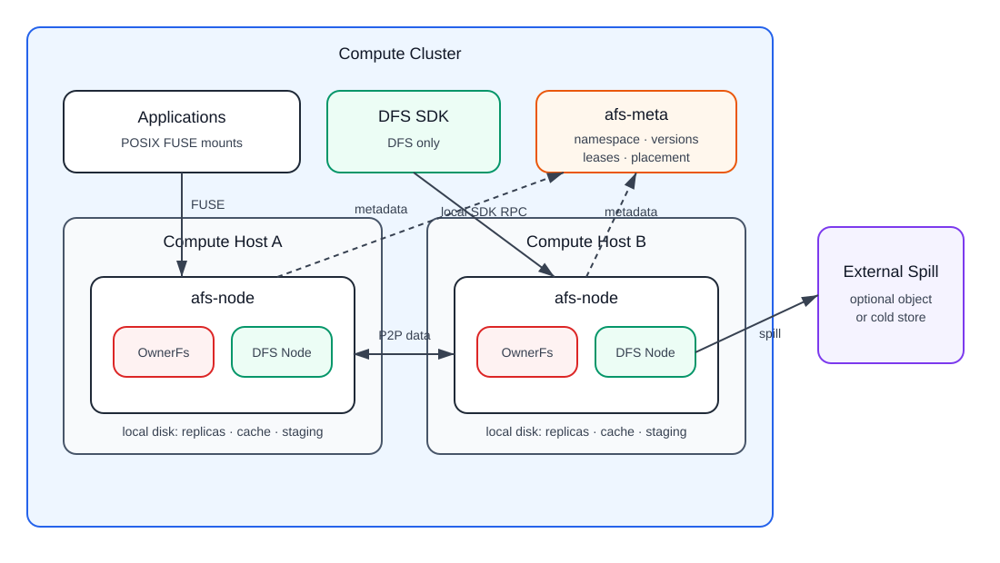

# AFS

AFS is a near-compute distributed file system for Agent, Sandbox and VM clusters. It exposes file interfaces with [same-mount visibility and close-to-open consistency](docs/architecture/write-semantics.md), while using disks on compute nodes as the primary pool for hot data, durable replicas, verified cache and peer-to-peer reads.

AFS has two backends:

- `DistributedFs`: the general DFS path for shared files, immutable chunks, file versions, replicas, P2P reads, cache, repair and optional spill.
- `OwnerFs`: the small-cluster workspace path for 1 to 4 nodes. A workspace has a Home node; local work uses normal local files, and remote work goes back to the Home through P2P.

`afs-meta` owns namespace, inode records, file versions, placement, leases and lifecycle metadata. `afs-node` runs next to workloads, owns FUSE mounts, orders writes, stores chunks on local disks, serves peer reads and manages cache. File bytes do not pass through Meta.

## Read This First

1. [Documentation Home](docs/README.md)
2. [Three-stage trial and acceptance goals](development/trial-release-goals.md)
3. [Current source checkpoint](development/current-checkpoint.md)
4. [Positioning](docs/positioning.md)
5. [Architecture](docs/architecture.md)
6. [Data Model](docs/architecture/data-model.md)
7. [Write Semantics](docs/architecture/write-semantics.md)
8. [Implementation Status](docs/status.md)

[Delivery Acceptance](docs/acceptance.md) defines the detailed case catalog. The current execution order is the three-stage table: first a usable OwnerFs/DFS trial with `memory` demo and `local-file` Meta restart recovery, then small-to-large core performance, then long/complex reliability and remaining persistence backends.

Current priority is:

- G1: historical `g1.5` colleague-trial scope is complete for its stated range.
- G2: standard POSIX fallback suites plus OwnerFs-first performance work are active. OwnerFs local targets at least 90% of native ext4, remote OwnerFs targets MooseFS parity, and DFS targets 3FS parity with the one-writer/many-readers case first.
- G3: long soak, broad fault matrices, etcd memory/resource work and Redis persistence are deferred.

OwnerFs native bind mount is tracked as two separate G2 items: a function gate and a performance gate. It remains default-off; a public production enable switch is not qualified in this checkpoint.

## Development

[Delivery handoff](docs/handoff.md) records the execution checkpoint, remaining gates and portable continuation inputs.

The authoritative build and runtime environment is Linux. The Rust toolchain is pinned by [rust-toolchain.toml](rust-toolchain.toml).

Use the guides for local commands:

- [Quickstart](docs/guides/quickstart.md)
- [Configuration](docs/guides/configuration.md)
- [Operations](docs/guides/operations.md)
- [Validation](docs/guides/validation.md)
