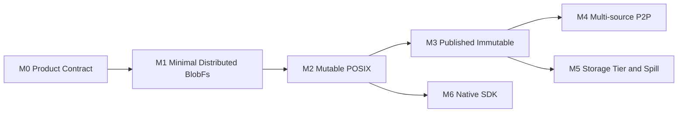

# AFS Roadmap

路线图按可运行的纵向能力组织。每个 Milestone 都需要功能、故障和可观测证据。



## M0：产品与贡献合同

状态：Active

- 产品定位、架构原则和术语统一。
- OwnerFs、Mutable BlobFs、Published Immutable Profile 边界明确。
- 当前能力与目标能力分开呈现。
- RFC、Issue、验证证据和贡献入口可查找。

## M1：最小 Distributed BlobFs

状态：Planned

端到端 Case：

```text
create file
→ write one chunk
→ replicate to another node
→ read from a replica
→ fail one source
→ read from the remaining replica
```

交付范围：

- 固定 chunk layout；
- Storage Service 本地磁盘管理；
- 两副本；
- 文件到 replica group 的布局；
- 写入提交和权威读取；
- 节点故障换源；
- 三节点 Linux E2E。

## M2：Mutable POSIX

状态：Planned

- 多 chunk 文件；
- overwrite、append、truncate；
- rename、unlink、open handle；
- `fsync`、目录持久化和失败结果；
- 并发写入排序；
- 修复、再平衡和节点 drain；
- POSIX 兼容矩阵。

## M3：Published Immutable

状态：Planned

- 显式 Snapshot；
- Namespace 稳定切点；
- generation 与 COW；
- manifest 和 digest；
- 发布门禁；
- pin、引用和 GC；
- 发布中断故障矩阵。

## M4：多源 P2P

状态：Research

- verified cache；
- seed announce；
- piece/source selection；
- 消费者转 seed；
- origin protection；
- 带宽和并发限制；
- 大规模沙箱启动验收。

## M5：Storage Tier 与 Spill

状态：Research

- 磁盘高低水位；
- 外部对象存储提交；
- verified-then-evict；
- recall；
- 外部存储故障；
- tenant quota 和冷数据 GC。

## M6：Native SDK

状态：Planned

- 文件描述符或稳定句柄注册；
- 共享内存与注册 buffer；
- batch range I/O；
- 异步提交和 completion；
- 多 Storage Node 并行；
- backpressure、取消和资源回收。
