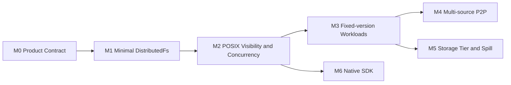

# AFS Roadmap

路线图按可运行的纵向能力组织。每个 Milestone 都需要功能、故障和可观测证据。



## M0：产品与数据合同

状态：Accepted Design

- 产品定位、架构原则和术语统一。
- OwnerFs 与 DistributedFs 的适用边界明确。
- FileVersion、ExtentMap 和不可变 ChunkObject 构成统一事实源。
- 普通可变文件与固定版本工作负载共用数据模型。
- 当前能力与目标能力分开呈现。

## M1：最小 DistributedFs

状态：Experimental / R=1 vertical slice implemented

端到端 Case：

```text
create /xxx.txt
→ FUSE 分段 write
→ finalize durable local Chunk copy
→ commit FileVersion and inode head
→ open and read the committed version
```

交付范围：

- `StagedChunk{ChunkObject identity} → durable local copy`；
- `ExtentMap → LayoutRoot → FileVersion`；
- R=1 本地优先写入；
- R=N 在 `ChunkStore::put` 以下扩展，尚未实现；
- FUSE create/write/fsync/open/read；
- 单节点 Linux 真 FUSE E2E 已通过；三节点与故障切点尚未实现。

## M2：POSIX 可见性与并发

状态：Accepted Design / Planned

- 用户/Node/Meta 三泳道时间线和 write、flush、fdatasync、fsync、close 合同；
- WriteLease、inode owner、共享 InodeWriteState 和 dirty read overlay；
- CommitBatch、后台 writeback、sticky error 与 `O_DSYNC/O_SYNC`；
- 文件同步和目录项 `fsync(dir)` 的独立合同；
- overwrite、append、truncate、rename、unlink 和 open handle；
- inode head CAS、幂等、冲突和失败结果；
- 跨节点读写排序与可见性；
- 修复、再平衡和节点 drain；
- POSIX 兼容矩阵。

## M3：固定版本工作负载

状态：Accepted Design / Planned

- 按 `FileVersionId` 固定读取视图；
- Alias、Pin/Retention 和 RootManifest 可选能力；
- 镜像、Snapshot、Checkpoint 的 range read；
- 内容校验、缓存和 GC；
- 后续写入生成新 Chunk、新布局和新 FileVersion。

## M4：多源 P2P

状态：Research

- verified cache；
- seed announce；
- piece/source selection；
- 消费者转 seed；
- origin protection；
- 带宽和并发限制；
- 大规模沙箱启动验收。

## M5：Storage Tier 与 Spill

状态：Research

- 本地 SSD、NVMe、HDD 的容量和热度管理；
- 磁盘高低水位；
- 外部对象存储提交；
- verified-then-evict；
- recall；
- tenant quota 和冷数据 GC。

## M6：Native SDK

状态：Planned

- 文件描述符或稳定句柄注册；
- 共享内存与注册 buffer；
- batch range I/O；
- 异步提交和 completion；
- 多 Storage Node 并行；
- backpressure、取消和资源回收。
