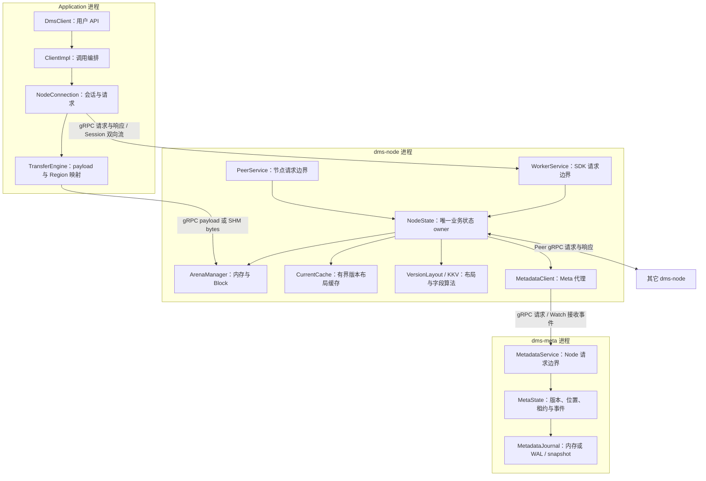

# 架构与关键流程

## 部署：三种进程角色

SDK 是应用内的库，不是第四个后台服务。Peer Node 与接入 Node 是同一种进程。



箭头表达责任关系，不代表业务绕过 Service 直接调用另一进程内存。SHM 另有原生 Unix Socket FD Broker，传递 Region 的 FD；它与 gRPC UDS 是两个通道，不把 FD 塞进 protobuf。

| 进程 | 它拥有的状态 | 不负责什么 |
| --- | --- | --- |
| Application | SDK 会话、mmap 映射的本地引用 | 不决定全局版本，不管理 Node 的物理分配器，不跨请求缓存 value bytes。 |
| Node | Session、Staging、Block 的本地 Allocation、授权期内的 Current 布局、失效等待 | 不独自决定某 key 的全局 Current。 |
| Meta | key 的版本布局、Block 位置、幂等结果、Node 租约与事件 | 不保存或转发用户 payload。 |

## SET：从 `set("k", b"abcdefghij")` 开始

1. SDK 生成本次逻辑写的 OperationId。小 value 内联在一个 SET RPC；大 value 先申请 Staging，再上传 bytes，最后提交 Staging 回执。路径阈值来自配置，不改变 SET 的用户语义。
2. Node 在 Arena 中分配内存并完成数据写入。Staging 是“尚未发布的一次写入”，Allocation 是“Region 内的一段物理空间”；不是两个不同的内存副本。
3. Node 给已完成 bytes 一个 Block 身份，并向 Meta 发送一次提交，携带 key、新布局及本次本地副本信息；普通写不要求先向 Meta 单独 report。
4. Meta 在唯一状态 owner 中校验条件，先记录 Journal，再应用版本和位置。Journal 失败不能先对读者发布新状态。
5. Meta/Node 协调旧 Current 缓存失效。所需 ACK 到齐或相应租约失效后回复成功；网络等待不占住 Node 的整个状态处理循环。

SHM 写同样要有提交控制消息：Client 直接修改共享页不会自动通知 Node 已写完。首次遇到新 Region，SDK 经 FD Broker 取得 FD 并 mmap；后续复用映射，只需 Allocation 的 offset/length，不是每次 SET 都重新 mmap。

Region 默认按 64 MiB 批量扩容（可配置），多个 value/patch 的 Slot 共用 backing。
例如连续写 1 KiB 的 A、B，分别占同一 Region 的 `[0,1024)` 和 `[1024,2048)`；
只需要一个 Region 身份，不能按一次写就创建一个 memfd。超大申请或预算尾部会调整
当次 Region 大小。安全释放的 Slot 可复用；仍导出或已发布的旧 bytes 不能仅为降低
FD 数而回收，完整 GC 的限制不变。

## GET：先确定版本，再取 bytes

```text
client.get("k")
  └─ Node 检查 Current 布局缓存
      ├─ 资格有效且所需 Block 在本地 → 按该版本读取 Arena
      ├─ 资格有效但缺 bytes → 按同次解析的位置提示拉取
      └─ 未命中 / 失效 → Meta 解析版本布局和 Block 位置
          ├─ 本地 Block → 读取 Arena
          └─ 远端 Block → Peer 拉取后读取
```

SDK 是薄 Client：普通 `get` 每次都请求 Node，成功后只把本次返回转成 `Vec<u8>`，不跨请求保存 value bytes。Node 的“已有 Block”与“缓存权威 Current”不是一回事。只有 Meta 授予的剩余租约仍有效、Watch 连通且本地布局没有被失效时，Node 才能复用 Current。缓存保存布局及同次解析的位置提示，不复制 value。范围读只检查所需 Block，不因其它范围缺块重复查询。位置失效时按这次固定版本有界刷新位置，不能重新取 Current 混拼新旧数据。Exact 历史版本和不存在结果不进入这份缓存。首次拉取安装后仍同步登记新增副本，不等于消除了所有 Meta RPC。

缓存截止时间从 resolve 请求开始计算，取 Meta 剩余租约与配置 TTL 的较小值；心跳不延长旧条目。失效事件先清 Node 布局，再完成仍持有缓存租约的旧 SDK 的 ACK/到期义务，最后 ACK Meta；新薄 SDK 不申请这份缓存租约，不新增 value 缓存等待者。本 Node 写完成也清理。失效/Watch 断连重建提升回填 generation，防止迟到的旧查询响应重新塞入缓存。旧 Meta 没有返回资格时自动保留逐次解析路径。配置与命中指标见[配置](configuration.md)。

非 SHM 单 GET 在请求中声明可接受的内联预算：实际读取长度不超过预算和协议 64 KiB 上限时，Node 直接在 GET 响应中返回 bytes，省去后续 Download RPC。内联与 Node 布局缓存是独立优化：前者减少下载往返，后者减少重复权威解析。随机写后的多个 Extent 仍按同一版本拼接，不能混入其它版本。

大对象、未声明预算的旧客户端仍收到读取计划/下载票据，再由 payload RPC 下载；新客户端收到旧服务端的票据也使用原下载路径。MGET 暂不启用内联，避免一批结果突破单响应预算。SHM 不走这条 owned bytes 快路径，仍返回描述符，由 SDK 映射后读取。普通 `get` 最后生成 `Vec<u8>`；`get_view` 才保留只读映射，且当前只支持单个 SHM segment。

SHM 映射复用与数据缓存是两回事：`RegionMappingCache` 复用 FD/mmap，不维护 `key → value`。普通 `get` 在复制期间保护读取数据，复制完成或已知读取响应的处理失败后结束本次借用；`get_view` 的保护持续到用户释放 View。释放进度通过原 Session 心跳上报，不能因收到后续 View 的释放就跨过仍活动的 View。这里只完善使用保护的生命周期，不代表旧 Block 的完整 GC 已实现。

## 随机写：只改 1 byte，为什么不是复制整个 value

接着调用 `set_range("k", 4, b"X")`，结果应为 `abcdXfghij`。Node 新增一个长度为 1 的 patch Block，布局改为：

| 逻辑区间 | 新版本从哪里读 |
| --- | --- |
| `[0,4)` | 原 Block B1 的 `[0,4)` |
| `[4,5)` | 新 Block B2 的 `[0,1)` |
| `[5,10)` | 原 Block B1 的 `[5,10)` |

每行就是一个 Extent。Extent 是映射，不另外保存 bytes；B1 可被前后两行共同引用。Block 是逻辑数据身份，而 Region/Allocation 是某台 Node 保存该 Block 的物理位置。分配器对齐后的实际占用可能大于 1 byte。

Node 以读到的 base version 做 CAS 提交；如果期间有其它写入，返回冲突而不是悄悄覆盖。这个 API 当前不能把 value 延长，也不意味着旧 Block 已立即回收。

## DEL 与 KKV：仍复用同一条版本发布链

`del("k")` 发布删除版本，让后续 Current 读返回不存在，不等于马上清空 Region。

`hset("job", [("a", "A"), ("b", "B")], ...)` 操作主 key 下的字段表。Node 的 `kkv_operations` 负责 Merge/Replace 与字段读写，再编码整个有版本字段表，复用普通对象提交与 CAS。当前字段表包含字段 value，修改小字段可能重编码整个表；它不是独立的分布式 Hash 服务。

## 代码入口

| 要看什么 | 源码 |
| --- | --- |
| 用户 API 与配置类型 | [SDK client.rs](../sdk/rust/dms-client/src/client.rs) |
| 连接、会话、SET 分支 | [node_connection.rs](../sdk/rust/dms-client/src/internal/node_connection.rs) |
| SHM / gRPC payload 与映射 | [transfer_engine.rs](../sdk/rust/dms-client/src/internal/transfer_engine.rs) |
| Node 状态与进程组合 | [Node runtime](../server/src/node/runtime.rs) · [node.rs](../server/src/node.rs) |
| Node 布局缓存、过期与失效围栏 | [current_cache.rs](../server/src/node/current_cache.rs) |
| 物理分配与布局 | [arena_manager.rs](../server/src/node/arena_manager.rs) · [version_layout.rs](../server/src/node/version_layout.rs) |
| KKV 字段表算法 | [kkv_operations.rs](../server/src/node/kkv_operations.rs) |
| 元数据提交、恢复 | [Meta runtime](../server/src/meta/runtime.rs) · [local_wal_journal.rs](../server/src/meta/local_wal_journal.rs) |

日志、指标和 Trace 是观测旁路，不参与提交成功条件。当前可靠性、安全性与回收边界以[能力与限制](product.md)为准。
