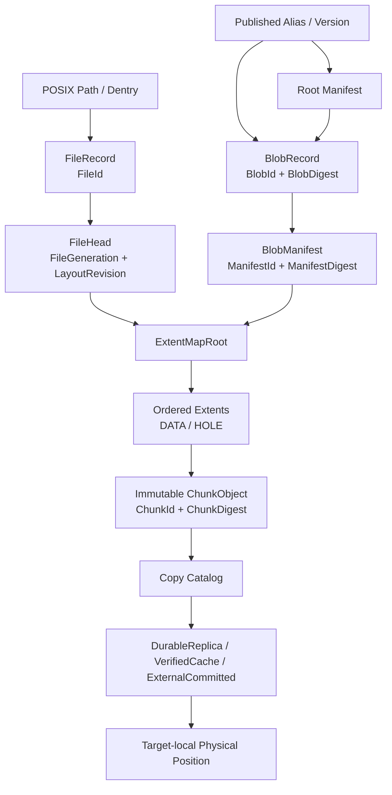

# 专题一：File、Blob、Chunk 统一数据模型

状态：Draft

实现状态：Not Implemented

对应 RFC：[RFC-0002](../rfcs/0002-file-blob-chunk-model.md)

专题入口：[架构设计专题](design-topics.md)

## 研究问题

AFS 需要同时支持通用 POSIX 可变文件，以及镜像、Snapshot、Checkpoint 等不可变发布物。本专题回答四个基础问题：

1. File、Blob、Manifest、Extent、Chunk、Replica 分别处于哪一层；
2. 可变文件和不可变发布物如何共用一份数据；
3. Blob 是否对用户公开；
4. 逻辑身份、内容摘要、复制组和物理位置如何分离。

## 结论排序

| 排名 | 结论 | 置信度 | 依据 |
| --- | --- | --- | --- |
| 1 | File 和 Blob 共用 `ExtentMap → immutable ChunkObject`，文件可变性体现在 Head/ExtentMap 的更新 | 高 | JuiceFS slice overlay、旧 AFS 穿刺 immutable Block、Nydus/OverlayBD 不可变发布模型 |
| 2 | POSIX 是默认入口，Native Blob API 是镜像/Runtime 的可选高性能入口；两者共用身份、授权和数据事实源 | 高 | AFS 产品合同要求通用 POSIX，同时不可变负载需要显式 seal/publish |
| 3 | 分配型 ID 与内容摘要分离；摘要用于校验、P2P 和可选去重，不直接承担授权与物理定位 | 中高 | 3FS/旧穿刺使用分配型身份，Nydus/OCI 使用内容摘要；AFS 还需兼容租户、编码和算法演进 |
| 4 | Manifest 只保存稳定逻辑重建信息，replica、endpoint 和 physical position 放在独立 Copy Catalog | 高 | placement 会随 repair/rebalance/spill 改变，不能改变不可变 Manifest |
| 5 | Stripe/Chain 是布局与复制策略，不是 Blob 或 Chunk 的身份；一条 chain 可以承载多个文件的多个 Chunk | 高 | 3FS `Layout`、`ChainInfo` 和 `TargetInfo` 白盒证据 |

## 证据边界

### 当前 AFS

- **事实：** 当前 VFS 已有 POSIX 风格 `Backend` 接口，但 `BackendInode` 和 `FileHandle` 只是 Node 进程内身份，不能直接作为分布式 FileId。证据：`src/node/vfs.rs:1-6,64-284`、`src/node/vfs/types.rs:21-32`。
- **事实：** OwnerFs 的 `FileIdentity` 来自本机 `dev + ino + birth time + kind`，适合 Home 本地文件防 ABA，不适合作为 BlobFs 全局 FileId。证据：`src/node/vfs/ownerfs/files.rs:13-19`、`src/node/vfs/ownerfs.rs:3030-3073`。
- **事实：** BlobFs 当前是返回 `UNIMPLEMENTED` 的骨架，BlobMeta RPC 也是协议占位；仓库中还没有生产级 FileId、BlobId、ChunkId、Manifest、Extent 或 FileGeneration。证据：`src/node/vfs/blobfs.rs:1-35`、`src/meta/rpc.rs:662-705`、`common/protocol/proto/meta.proto:302-400`。
- **事实：** 旧穿刺已经验证 `inode → exact version → ordered Extent → immutable Block → ReplicaLocation` 模型；旧 `Block` 对应本设计的 `ChunkObject`，旧 `PeerPullBlockChunk` 只是 wire fragment。证据位于历史目录 `source-local-owner-preserved/protocol/proto/dms/v1/node_meta.proto:102-173` 和 `server/src/node/version_layout.rs:51-215`。

### 3FS

- **事实：** 3FS File inode 保存 length、truncate version 和 Layout，不保存 extent、Blob 或 Manifest；ChunkId 由 `(inodeId, track, chunkIndex)` 按文件偏移公式生成。证据：`ref/3FS/src/fbs/meta/Schema.h:140-275`、`Schema.cc:62-90`。
- **事实：** `stripeSize` 表示文件 Layout 中 chain 槽位数。第 `i` 个 Chunk 使用 `chains[i % stripeSize]`；一个完整 stripe 是连续 Chunk 在这些 chain 上的一轮分布。证据：`ref/3FS/src/fbs/meta/Schema.cc:129-197`。
- **事实：** Chain 是有序 target 复制组，一条 chain 承载多个文件的多个 Chunk；Chunk 与 chain 不是一一绑定。证据：`ref/3FS/src/fbs/mgmtd/ChainInfo.h:6-13`、`ref/3FS/src/fbs/meta/FileOperation.cc:78-112,181-220`。
- **事实：** 3FS 旧 ChunkStore 原位覆盖逻辑 Chunk；新 ChunkEngine 可以对覆盖写做物理 COW，但逻辑 ChunkId 不变。它没有用户可见的 snapshot、seal 或 publish 语义。证据：`ref/3FS/src/storage/store/ChunkReplica.cc:148-307`、`ref/3FS/src/storage/chunk_engine/src/core/engine.rs:325-517`。

### 参考系统

- **JuiceFS 事实：** 文件按逻辑 chunk 管理 slice 覆盖，新写发布新 slice 映射，Clone 可以共享 slice 并维护引用。证据：`juicefs/source/juicefs/pkg/meta/interface.go:326,469`、`pkg/vfs/writer.go:109-186`、`pkg/meta/redis.go:3234,5288`。
- **Nydus 事实：** RAFS bootstrap 保存 inode 与文件 chunk 映射，数据 blob/chunk 使用摘要校验，文件系统镜像本身不可变；可变 upper 由 snapshotter/overlay 层承担。来源：Nydus 官方 [nydus-design.md](https://github.com/dragonflyoss/nydus/blob/master/docs/nydus-design.md)、[nydus-image.md](https://github.com/dragonflyoss/nydus/blob/master/docs/nydus-image.md)。
- **OverlayBD 事实：** writable upper 追加数据并发布新映射，seal 写最终索引并将 layer 固定为只读 lower。证据：`ref/AgentENV/storage/overlaybd/src/lsmt/file/readwrite.rs:783,862,967`。

## Draft 设计

### 对象层次



### 术语与职责

| 类型 | 稳定含义 | 是否可变 | 不包含什么 |
| --- | --- | ---: | --- |
| `FileId` | POSIX regular inode 的全局稳定身份；rename/link 不改变 | 否 | 本机 inode、路径、物理位置 |
| `FileHead` | 文件当前可见的数据头 | 是 | 历史 Snapshot 的所有权 |
| `FileGeneration` | snapshot/truncate/COW 的分支与 fencing 边界 | 单调推进 | PublishedVersion、AccessGeneration |
| `LayoutRevision` | 某个 generation 内一次已提交 ExtentMap 状态 | 单调推进 | 数据持久级别 |
| `BlobId` | 一个 sealed 不可变逻辑字节对象的分配型身份 | 否 | alias、路径、physical replica |
| `BlobDigest` | Blob 规范化逻辑内容的强摘要 | 否 | 授权、租户、位置 |
| `ManifestId` | Manifest 记录的分配型身份与 schema 版本锚点 | 否 | 动态 endpoint |
| `ManifestDigest` | 规范序列化 Manifest 的强摘要 | 否 | Copy Catalog |
| `Extent` | Blob/File 逻辑范围到 ChunkObject 子范围的映射 | 随 FileHead 变；在 Manifest 中不可变 | 副本位置 |
| `ChunkId` | 已提交 ChunkObject 的分配型身份 | 否 | 内容摘要、物理 slot |
| `ChunkDigest` | Chunk 逻辑明文或规范数据的强摘要 | 否 | Node 身份 |
| `ReplicaGroup/Chain` | 写入、读取和修复所使用的副本策略组 | 可重配置 | Chunk 内容身份 |
| `PhysicalReplica` | 某个 Node incarnation/target 上的实际副本 | 可迁移、可删除 | File/Blob 身份 |

不再使用裸 `Generation` 或裸 `Version`。协议字段必须写成 `FileGeneration`、`LayoutRevision`、`PublishedVersionId`、`ChainVersion`、`NodeEpoch` 等具体类型。

### File：可变 Namespace 对象

`FileRecord` 至少包含：

```text
FileId
InodeRevision
POSIX attributes
FileHead {
  FileGeneration
  LayoutRevision
  LogicalLength
  ExtentMapRoot
  LayoutPolicyId
}
```

- `FileId` 由 Meta 分配，跨 Node、重启和路径变化保持稳定。
- 普通 write 创建 Staging Chunk，校验并提交为不可变 ChunkObject，再原子更新 FileHead 的 ExtentMapRoot。
- 覆盖写只替换受影响 Extent；未修改 Extent 和 ChunkObject 继续共享。
- Snapshot 固定一个精确的 `FileGeneration + LayoutRevision + ExtentMapRoot`。活动文件切到新的 generation，并继续 COW。
- ExtentMap 使用持久化 COW 结构；已提交 root 及其可达节点不可原地修改。
- ExtentMap 如何落盘、如何压缩小随机写和何时 compact，由专题四决定。

`FileGeneration` 与 `LayoutRevision` 的推进规则：

| 操作 | FileGeneration | LayoutRevision | 说明 |
| --- | --- | --- | --- |
| overwrite / append | 不变 | `+1` | 在同一活动 generation 内提交新 ExtentMap |
| chmod / chown 等纯属性修改 | 不变 | 不变 | 只推进 InodeRevision |
| truncate shrink / extend | `+1` | 从新 generation 初始 revision 开始 | 隔离 truncate 前的迟到 write 和 length hint |
| snapshot / freeze | 活动 Head `+1`；冻结视图保留原值 | 新 generation 从共享 root 开始 | 冻结视图继续引用原 root |
| writer fencing / session reset | 仅在必须拒绝旧 writer 时 `+1` | 新 generation 初始 revision | 普通重连不自动推进 |

### Blob：不可变逻辑字节对象

Blob 不是第二套存储引擎，也不是任意一段 transport buffer。它表示一个 sealed、可校验、可 range-read 的逻辑字节序列，例如：

- OCI/Nydus/EROFS/OverlayBD 数据对象；
- MicroVM disk image；
- 一个 frozen regular file；
- checkpoint shard 或模型 shard。

`BlobRecord` 至少包含：

```text
BlobId
BlobDigest { algorithm, bytes }
LogicalLength
ManifestId
ManifestDigest
FormatVersion
DedupDomainId
CreatedAt
SourceRef? { FileId, FileGeneration, LayoutRevision }
```

Blob `seal` 后不允许修改。内容变化产生新的 BlobId。目录树或多文件 Snapshot 由 Root Manifest 引用多个 Blob；PublishedVersion/Alias 只是对 BlobId 或 RootManifestId 的命名与发布记录，不成为另一种数据对象。

对象存在规则：

| 对象 | 何时存在 | 是否必需 |
| --- | --- | --- |
| BlobManifest | 描述一个 Blob 的字节布局 | 每个 sealed Blob 必需 |
| BlobRecord | 保存 BlobId、摘要、长度、Manifest 与 source ref | 每个 sealed Blob 必需 |
| RootManifest | 描述目录树、镜像组合或多个 Blob；包含路径、属性、hard-link 关系和 BlobRef | 组合发布必需；单 Blob 不需要 |
| PublishedAlias/Version | 将用户名称和 revision 指向 BlobId 或 RootManifestId | 只有需要全局发布名称时存在 |

首版允许 tagged target：单 Blob 发布为 `Alias → BlobId`，目录/镜像组合发布为 `Alias → RootManifestId`。Alias 是可变命名指针，目标内容对象保持不可变。

### ExtentMap：File 与 Blob 的共用桥梁

逻辑范围 `[0, logical_length)` 由按 offset 排序、互不重叠的 Extent 覆盖：

```text
Extent {
  logical_offset
  logical_length
  kind = DATA | HOLE
  chunk_id?          // DATA only
  chunk_offset?      // DATA only
  chunk_digest?      // pinned manifests MUST carry it
}
```

- `HOLE` 不引用 ChunkObject，读取返回零。
- 一个 Extent 可以引用 ChunkObject 子范围；一个 ChunkObject 可以被多个 File/Blob 引用。
- FileHead 使用可持久化的 ExtentMapRoot；BlobManifest 固定一个规范化、不可变的 ExtentMap。
- Manifest 不保存 replica endpoint、target、RDMA key、cache node 或外部临时 URL。

### ChunkObject：提交后不可变

本 Draft 选择“提交后不可变 ChunkObject”，与 3FS 的稳定可变逻辑 Chunk 不同：

```text
StagingChunk
  → length/digest/encoding verified
  → ChunkObject committed
  → never modified in place
```

理由：

1. Snapshot 与活动 File 可以安全共享旧 Chunk；
2. P2P 多源只需校验同一 ChunkDigest；
3. spill、cache、repair 和 dedup 使用同一内容证明；
4. File overwrite 只修改 ExtentMap，不修改 Published Blob；
5. response loss 后可以按 OperationId/ChunkId 幂等确认。

代价是小随机写可能造成 extent 数量和写放大。首版不要求整块 read-modify-write：小写可以生成较小 patch Chunk，并由后台 compaction 合并。粒度、overlay 上限和 compaction 门禁留给专题四。

### 分配型身份与内容摘要分离

本 Draft 不把 FileId、BlobId 或 ChunkId 直接定义成裸 hash：

- ID 由 Meta/Storage 按租户和操作幂等规则分配，作为授权、引用和生命周期主键；
- Digest 使用带算法标识的强摘要，作为完整性、P2P 匹配和可选去重键；
- 可选去重索引键为 `DedupDomainId + algorithm + digest + logical_length + encoding`；
- 跨租户去重默认关闭，避免配额和存在性侧信道；
- 更换摘要算法或编码不会改变 FileId/BlobId 的授权语义。

### Stripe、Replica Group 与 Chain

3FS 的准确含义保留为参考：

```text
chunkIndex = floor(fileOffset / chunkSize)
chainSlot = chunkIndex % stripeSize
chain = layout.chains[chainSlot]
replicas = chain.targets[]
```

AFS 不把 Stripe 或 Chain 放进 Blob/Chunk 身份：

- `Stripe` 是连续 Chunk 的布局/并行分散规则；
- `ReplicaGroup` 是副本集合；`Chain` 是 ReplicaGroup 的一种有序写协议；
- 一个 Chunk 在某时刻解析到一个 versioned ReplicaGroup；
- 一个 ReplicaGroup 可以承载多个 Blob/File 的多个 Chunk；
- repair/rebalance 可以替换 ReplicaGroup 或 PhysicalReplica，而不改变 ManifestDigest；
- R=1 本地亲和、R=N chain、异步副本和 external spill 由 placement/copy catalog 表达。

Copy Catalog 分成两类记录：

```text
PlacementRecord {
  ChunkId
  PlacementEpoch
  ReplicaGroupId
  ChainVersion?
  DurabilityPolicyId
}

CopyRecord {
  ChunkId
  PlacementEpoch
  CopyId
  CopyState
  NodeEpoch / ExternalProvider
  Locator
  VerifiedDigest
}
```

PlacementRecord 表达“应该由哪组副本按什么策略负责”；CopyRecord 表达“当前实际有哪些 copy”。两者共同决定提交、读取、repair 和逐出的合法性。

## API 决定：POSIX + 可选 Native Blob API

### POSIX

普通应用只使用 path、fd、read/write/fsync，不需要理解 Blob。`fsync` 不隐式 seal 或 publish。

### Native Blob API

Runtime、镜像转换器和大对象管线可以使用：

```text
BeginBlob(options) -> DraftId
PutBlobPart(DraftId, offset, payload/descriptor)
SealBlob(DraftId, expected_length, expected_digest?) -> BlobId
ReadBlobAt(BlobId, offset, length)
PublishAlias(name, expected_revision, BlobId/RootManifestId)
PublishFile(FileId, expected_generation, expected_revision) -> BlobId
```

外部 API 不暴露 raw Chunk CRUD、物理位置或 chain target。具体 RPC、完成级别和错误语义由专题二定义。

## 三个端到端 Case

### Case A：普通 POSIX 覆盖写

```text
/workspace/a.bin
→ FileId F1
→ FileHead(G7, R31, ExtentRoot E31)
→ write(offset, data)
→ StagingChunk S9
→ committed ChunkObject C9
→ Extent overlay produces E32
→ CAS FileHead(G7, R31 → R32, E32)
```

旧 Extent 和旧 Chunk 仍可被 Snapshot/reader 引用。文件路径和 FileId 不变。

### Case B：File Snapshot 零拷贝发布

```text
freeze F1@(G7,R32,E32)
→ active FileHead moves to G8 and initially shares E32
→ build BlobManifest from E32
→ verify referenced ChunkObjects and durability policy
→ seal Blob B4
→ RootManifest references B4
→ publish PublishedVersion V12
```

这里的“零拷贝”表示不重写未修改 ChunkObject；Manifest 和引用账本仍需创建并提交。

### Case C：OCI layer 直接摄入与 P2P 读取

```text
BeginBlob
→ parallel PutBlobPart
→ immutable ChunkObjects
→ seal BlobManifest
→ publish alias image/layer@revision
→ sandbox range read
→ resolve ChunkDigest to DurableReplica / VerifiedCache / ExternalCommitted
→ verify bytes
→ consumer may become VerifiedCache seed
```

P2P seed 变化只更新 Copy Catalog，不改变 BlobId、Manifest 或 Namespace publication。

## 引用、Pin、配额与 GC

### 强根

- 当前 FileHead；
- retained FileGeneration/Snapshot；
- 显式长期 pin。

PublishedAlias、RootManifest 和 BlobManifest 形成有向所有权边。Alias/retained snapshot/explicit pin 是命名根，Manifest 是根可达的内容节点；同一引用边只计一次，不能把每一层都重复计为独立永久根。

### 运行期保护

open/read lease、in-flight I/O 和短期 cache pin 防止物理回收，但不增加永久逻辑引用。

### 回收原则

1. `LogicalRef` 只来自 FileHead、retained snapshot、Manifest 所有权边和 explicit pin；
2. `CopyLiveness` 只管理 DurableReplica、VerifiedCache、ExternalCommitted 和在途 copy；它不增加逻辑内容引用；
3. 删除先移除 Alias/FileHead 等命名根，再事务性减少 Manifest/Chunk 逻辑引用，最后按 copy policy 回收物理副本；
4. Chunk 在逻辑引用归零后进入 `Deleting`，等待保护窗口和在途 I/O 清空；
5. 后台 reconciliation/mark-and-sweep 校验引用账本，避免单次计数错误造成数据丢失；
6. 权威数据 GC、VerifiedCache 淘汰、坏副本隔离和 external object 删除是四种不同操作；
7. 配额至少分别记录逻辑字节、持久副本物理字节、缓存字节和 external 字节。

## 备选方案

| 方案 | 判断 | 原因 |
| --- | --- | --- |
| 完全照搬 3FS：`FileId + ChunkIndex` 可变逻辑 Chunk | 不采用为统一主模型 | 可变文件高效，但跨 File/Blob 共享、内容 P2P、Snapshot 与 GC 需要额外版本层 |
| 所有 ID 都等于内容 hash | 不采用 | 授权、租户、算法演进、编码和操作幂等与内容身份耦合 |
| Blob 只做内部类型，不提供 API | 保留兼容但不是目标上限 | 普通 POSIX 足够，但镜像/Runtime 无法显式并行上传、seal 和 range-read |
| Blob 与 File 使用两套 Chunk Store | 不采用 | 复制、修复、spill、quota 和 GC 会出现两份事实源 |
| Manifest 保存 live replica endpoints | 不采用 | repair/rebalance 会改变不可变 Manifest 和 digest |

## 未决问题

1. 默认 Chunk 目标大小、最小 patch 大小和最大 Extent 数；
2. ExtentMap 使用 B-tree、LSM overlay、Merkle tree 还是分层组合；
3. Digest 默认算法、canonical serialization 与升级方式；
4. 同租户去重何时启用，跨租户是否永远禁用；
5. 小文件 inline/packing 是否进入首版；
6. BlobManifest 自身的复制、缓存和分片上限；
7. `PublishFile` 的 RPC 参数、权限和幂等结果；对象层次已经确定为单文件直接发布 BlobId；
8. Stripe/ReplicaGroup 在首版使用公式布局还是显式 Chunk placement record。

这些问题不阻止确定对象层次，但会进入专题二、三、四、五和六继续收敛。

## 下一步

1. 评审 [RFC-0002](../rfcs/0002-file-blob-chunk-model.md) 的对象身份与不变量；
2. 用三类 Case 为字段表编写可序列化样例；
3. 在专题二定义 write/fsync/seal/publish 的完成级别；
4. 在专题四用最小 Rust 穿刺比较 immutable patch Chunk 与固定大 Chunk COW 的写放大和读取复杂度。
