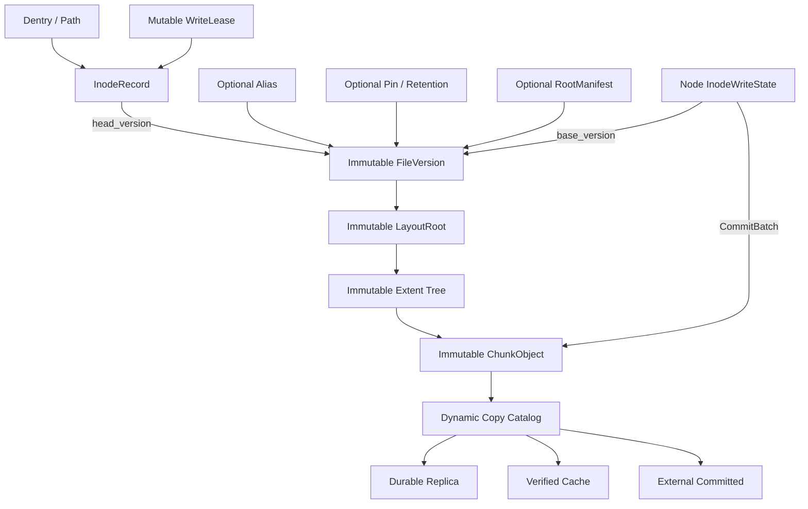
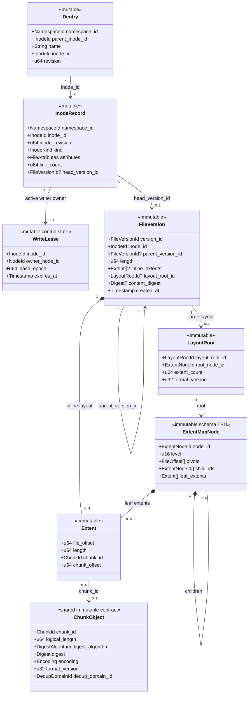
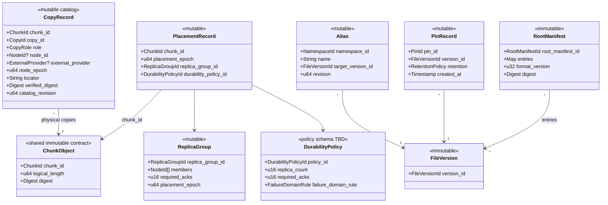
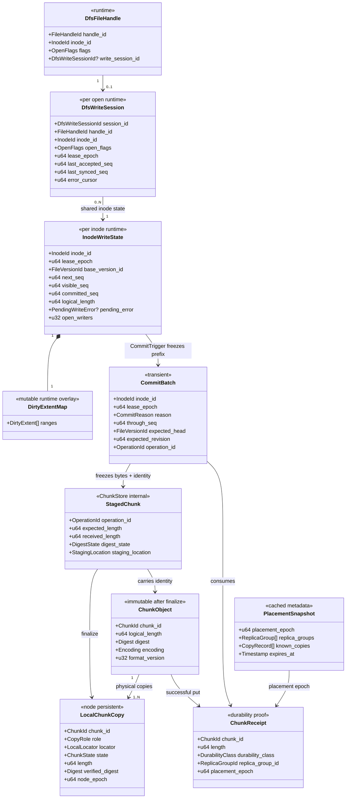

# 专题一：FileVersion、Extent 与 Chunk 数据模型

状态：Accepted Design
实现状态：R=1 最小纵向链路已实现
专题入口：[架构设计专题](design-topics.md)
对应 RFC：[RFC-0002](../rfcs/0002-file-version-chunk-model.md)

## 1. 目标

定义 DistributedFs 从 POSIX 文件到本地或多副本 Chunk 的统一数据模型，使普通可变文件、大文件、镜像、Snapshot 和 Checkpoint 使用同一数据事实源，并为后续专题固定对象身份、可变边界、RPC 边界和模块职责。

## 2. 决策摘要

1. `InodeRecord.head_version` 是文件已提交内容的唯一可变权威指针；尚未提交的内容由 inode owner 的运行时状态管理。
2. `FileVersion`、`LayoutRoot/ExtentMap` 和 `ChunkObject` 提交后不可变。
3. 普通 `write` 只修改 inode owner 上的 dirty overlay；CommitTrigger 冻结一个写入前缀，创建新 Chunk、新布局节点和新 FileVersion，未修改范围复用旧对象。
4. 不引入基础 `BlobRecord`、`BlobManifest` 或必须调用的 Blob API。
5. `fdatasync`、`fsync`、同步 write 和后台 writeback 都可以触发 FileVersion 提交；只有同步 API 向调用者提供相应完成保证，且都不自动 Pin、Publish 或创建业务 Alias。
6. 多文件 Snapshot 使用可选 `RootManifest` 引用精确 FileVersionId。
7. R=1 与 R=N 只在 `ChunkStore::put_batch` 以下分叉，文件布局层只消费 `ChunkReceipt`。
8. 多源读取必须先固定 FileVersion，再按 ChunkId 从多个合格 Copy 读取。
9. FUSE 请求大小、Peer Frame 大小和存储 Chunk 大小彼此独立。
10. 公开后端类型使用 DistributedFs；内部模块、feature、配置、CLI 和协议统一使用 `dfs` / `DfsMeta`。
11. `FileVersion.length` 定义该版本的 EOF；只记录 DATA Extent，`[0, length)` 中未被 Extent 覆盖的区间是隐式 Hole，读取返回零且不创建零数据 Chunk。

## 3. 对象关系



### 可变对象

- Dentry；
- `InodeRecord.head_version` 和 inode 属性；
- `WriteLease`、Node 上的 `InodeWriteState/DirtyExtentMap` 和 `DfsWriteSession`；
- CommitBatch 和 ChunkStore 内部的 StagedChunk；
- Placement、Copy Catalog 和 Cache 状态；
- Alias、Pin 与保留策略。

### 不可变对象

- FileVersion；
- LayoutRoot 和已提交 Extent Tree Node；
- ChunkObject；
- RootManifest。

已提交文件内容的可变性来自 Head 指针切换：

```text
InodeRecord.head_version: V7 -> V8
```

不是原地修改 V7、LR7 或旧 Chunk。Head 尚未切换时，普通文件的活动视图由 committed version 加 Node 上的 dirty overlay 组成；该运行时 overlay 不是另一个持久 FileVersion。

## 4. 核心数据类型

### 4.1 InodeRecord

```text
InodeRecord {
  namespace_id
  inode_id
  inode_revision
  kind
  mode / uid / gid / timestamps
  link_count
  head_version_id?
}
```

InodeRecord 表示稳定文件身份。Dentry 把名称映射到 inode；rename 只修改 Dentry，hard link 让多个 Dentry 指向同一 InodeRecord。普通文件通过 `head_version_id` 指向当前内容。

### 4.2 WriteLease、InodeWriteState 与 DfsWriteSession

```text
WriteRequest {
  inode_id
  handle_id
  offset
  payload
  flags
}

WriteLease {
  inode_id
  owner_node_id
  lease_epoch
  expires_at
}

InodeWriteState {
  inode_id
  lease_epoch
  base_version_id
  next_seq / visible_seq / committed_seq
  logical_length
  dirty_extents
  pending_error
  open_writers
}

DfsWriteSession {
  session_id
  handle_id
  inode_id
  open_flags
  lease_epoch
  last_accepted_seq
  last_synced_seq
  error_cursor
}
```

WriteRequest 是一次入口请求，不是存储格式。WriteLease 为活跃可写 inode 指定 owner 并提供 epoch fencing；InodeWriteState 保存该 inode 共享的 DirtyExtentMap、逻辑长度和写入水位；DfsWriteSession 只保存一次 open 的 flags、水位和错误观察位置。普通 write 由 owner 排序并更新 InodeWriteState，不为每个 FUSE WRITE 执行 Meta 事务。它们属于 DistributedFs；OwnerFs 使用自己的本地文件句柄，不进入该状态机。

### 4.3 StagedChunk 与 ChunkObject

```text
StagedChunk {
  operation_id
  expected_length
  received_length
  digest_state
  staging_location
}

ChunkObject {
  chunk_id
  logical_length
  digest_algorithm
  digest
  encoding
  format_version
  dedup_domain_id
}
```

生命周期方向固定为：

```text
frozen bytes -> StagedChunk{ChunkObject identity} -> finalize -> durable local copy
```

StagedChunk 是 CommitBatch 在 ChunkStore 内部使用的临时构造状态，包含完整冻结字节和已经确定的不可变 ChunkObject 身份，但尚未形成持久副本证明，因此不允许被 FileVersion、普通读取、Snapshot 或 P2P Seed 引用。Finalize 校验长度、摘要、编码和本地提交状态后产生 LocalChunkRecord 与 ReplicaAck。StagedChunk 不进入 Meta UML，也不是公开 API 或长期文件身份。

ChunkId 使用带 DedupDomain、算法、Digest、长度和 Encoding 的规范化内容身份；知道 ChunkId 不等于获得读取授权，授权来自 Namespace 和 FileVersion 可达性。

### 4.4 Extent

```text
Extent {
  file_offset
  length
  chunk_id
  chunk_offset
}
```

Extent 只描述文件逻辑范围到 Chunk 子范围的数据映射。相邻 Extent 不重叠，且必须完全位于 `[0, FileVersion.length)`；该区间内没有被 Extent 覆盖的范围是隐式 Hole，读取时返回零。大范围 Hole 不创建零数据 Chunk，也不要求显式 HOLE Extent。第一阶段只保证稀疏范围的读取语义；`SEEK_HOLE`、`SEEK_DATA`、`fallocate`、hole punch 和精确 `st_blocks` 留给后续 POSIX 完整性设计。

### 4.5 LayoutRoot

小文件可以在 FileVersion 中内联少量 Extent。大文件通过 LayoutRoot 指向持久化 Extent Tree。

例：1 TiB 文件使用 4 MiB Chunk 时约有 262144 个映射。读取其中 1 MiB 不应加载全部映射；覆盖中间 4 KiB 也不应复制整张列表。

```text
LR1
├── N1
├── N2
└── N3

4 KiB 修改只落在 N2：

LR2
├── N1   复用
├── N2'  新建
└── N3   复用
```

LayoutRoot 解决：

- 大文件 Range Lookup；
- Extent 元数据分片；
- 小范围 COW；
- FileVersion 间的结构共享；
- 单条 Meta 记录大小控制。

### 4.6 FileVersion

```text
FileVersion {
  version_id
  inode_id
  parent_version_id?
  length
  inline_extents? / layout_root_id?
  content_digest?
  created_at
}
```

FileVersion 是一个文件在某个提交点的完整、不可变视图。读取端先固定 FileVersionId，再解析布局；即使 InodeRecord 已经指向下一版本，当前读取也不会混入新版本的数据。

### 4.7 ReplicaGroup、Chain 与 ChunkReceipt

```text
ReplicaGroup {
  replica_group_id
  members
  required_acks
  placement_epoch
}

ChunkReceipt {
  chunk_id
  length
  durability_class
  replica_group_id
  placement_epoch
}
```

ReplicaGroup 描述目标副本集合；Chain 是一次写入的有序传输协议。Chain 不是数据身份。文件布局层只验证 ChunkReceipt 是否满足当前 DurabilityPolicy。

### 4.8 CopyRecord

```text
CopyRecord {
  chunk_id
  copy_id
  role: STAGED | DURABLE_REPLICA | VERIFIED_CACHE | EXTERNAL_COMMITTED
  node_id / external_provider
  node_epoch
  locator
  verified_digest
  catalog_revision
}
```

Copy Catalog 是动态位置目录，不进入 FileVersion 或 LayoutRoot。Repair、Rebalance、Cache Eviction 和 Spill 只改变 CopyRecord。

### 4.9 Meta UML：Namespace、Version 与 Layout

下图是逻辑类模型，不预先固定 Rust 文件拆分。`ExtentMapNode` 的树形字段仍由专题四确定；其余关系是本专题的 Accepted Design。



### 4.10 Meta UML：Placement、Copy 与生命周期



`ChunkObject` 是 Meta 与 Node 共享的不可变值契约。Meta 通过 `ChunkId` 表达逻辑可达性和副本目录；Node 保存实际字节及校验所需头信息。是否为每个 Chunk 建立独立 Meta Catalog 行，留给持久化 schema 设计决定。

### 4.11 Node UML：DFS 写入运行时



该图不定义 `ReadSlice`、`ReadPlan` 或 `ChunkReadTask`。读取实现先固定 FileVersion，再遍历 Extent 并根据 Copy Catalog 选择来源；只有后续调度设计证明需要时，才引入 Node 私有执行计划类型。

## 5. E2E Case 1：本地单副本文件

输入：

```text
文件：/xxx.txt
写入：10 MiB
FUSE max_write：1 MiB
目标 Chunk：4 MiB（示例参数）
DurabilityPolicy：R=1 LocalDurable
```

### 5.1 创建文件身份

```text
CREATE /xxx.txt
  -> Dentry(/xxx.txt -> inode 1001)
  -> InodeRecord(1001, head_version = Empty)
  -> WriteLease(owner = local node, epoch = 1)
  -> InodeWriteState(base = Empty)
  -> DfsWriteSession(handle watermarks)
```

新文件需要一次逻辑 Meta 创建和 writer owner 建立；两者可以合并为一次 `CreateAndOpenWrite`。后续每个 WRITE 由 owner 排序并更新 InodeWriteState，不访问 Meta。

### 5.2 聚合 FUSE 请求

应用一次或多次写入 10 MiB，内核最多按 1 MiB 交付 FUSE WRITE。每次请求先进入 inode 共享 DirtyExtentMap：

```text
WRITE × 10
  -> owner assigns WriteSeq
  -> DirtyExtentMap [0, 10 MiB)
```

write 返回时尚不要求产生 Chunk 或 FileVersion。其他普通 reader 通过 owner 读取 `Empty base + dirty overlay`。FUSE 请求是内核传输单位，Chunk 是存储、复制、P2P 和 GC 单位，两者不绑定。

### 5.3 Finalize Chunk

`fdatasync`、`fsync`、同步 write 或后台 writeback 触发 CommitBatch。CommitBatch 冻结写入前缀，再按目标 Chunk 大小构造 ChunkStore 内部的 StagedChunk：

```text
DirtyExtentMap [0, 10 MiB)
  -> StagedChunk OP1 -> C101  4 MiB
  -> StagedChunk OP2 -> C102  4 MiB
  -> StagedChunk OP3 -> C103  2 MiB
```

R=1 时，本机 ChunkStore 对每个 StagedChunk 执行 staging write、Digest、长度校验、介质持久化和原子 Finalize，并返回 ChunkReceipt。

### 5.4 构造布局和版本

```text
E1 [0, 4 MiB)  -> C101 [0, 4 MiB)
E2 [4, 8 MiB)  -> C102 [0, 4 MiB)
E3 [8, 10 MiB) -> C103 [0, 2 MiB)

LayoutRoot LR1 = [E1, E2, E3]
FileVersion V1 = { inode=1001, length=10 MiB, layout=LR1 }
```

### 5.5 原子提交

```text
CommitFileVersion(
  inode_id = 1001,
  expected_head = Empty,
  new_version = V1
)
```

CAS 由 MetaService 的事务合同实现，不要求业务层直接依赖某个数据库产品。

同步 trigger 只有在所有 Chunk 满足当前策略且 Head CAS 成功后返回。后台 trigger 可以执行相同提交，但不产生用户可依赖的完成点。Chunk 成功而 Meta CAS 最终失败时，Chunk 是完整但不可达的 Orphan，由 GC 在安全窗口后清理。

### 5.6 4 KiB 覆盖写

对文件偏移 5 MiB 覆盖 4 KiB，只创建普通 patch Chunk P9：

```text
V2 / LR2
├── [0, 4 MiB)              -> C101
├── [4 MiB, 5 MiB)          -> C102 [0, 1 MiB)
├── [5 MiB, 5 MiB + 4 KiB)  -> P9
├── [5 MiB + 4 KiB, 8 MiB)  -> C102 [1 MiB + 4 KiB, ...)
└── [8 MiB, 10 MiB)         -> C103
```

后台 Compaction 可以把 C102 与 P9 合成 C102' 并提交新版本；如果 Head 已变化，Compaction 必须重新基于新版本计算或放弃，不能覆盖前台写入。

### 5.7 写过 EOF 的稀疏文件

初始 V2 的长度为 4 KiB。应用在 1 GiB 偏移写入 4 KiB 并执行 `fsync`：

```text
pwrite(fd, 4 KiB, offset = 1 GiB)

V3.length = 1 GiB + 4 KiB
V3 layout:
  DATA [0, 4 KiB)              -> 原 Chunk
  HOLE [4 KiB, 1 GiB)          -> 不保存 Extent，不创建 Chunk
  DATA [1 GiB, 1 GiB + 4 KiB)  -> 新 Chunk
```

读取 Hole 返回零。布局中只有两个 DATA Extent；文件逻辑长度与实际分配字节数是不同指标。后续 truncate 缩小再扩大时，被截断的旧数据不能重新出现，扩大的范围重新表现为 Hole。

## 6. E2E Case 2：同步 N 副本 Chain（N=3 示例）

FileVersion 以上的流程与 Case 1 完全相同。分叉只发生在：

```text
ChunkStore::put_batch([chunk])  // 使用文件系统初始化时固定的 N/M 副本策略
```

假设副本组为 A、B、C，写节点 A 是 Chain Head：

```text
CommitBatch
    -> A: local staging + digest
    -> B: local staging + digest
    -> C: local staging + digest
```

A 在接收 Frame 时同时写本地并转发 B；B 同样流水转发 C，不等待整个 Chunk 在上一节点写完。最后一个 Frame 确认总长度、Chunk 身份和 PlacementEpoch。C、B、A 依次完成幂等 Finalize，A 返回满足该同步 N=3 策略的 ChunkReceipt。N=2、4 使用同一合同。

Chunk 已不可变，文件逻辑可见点又是 FileVersion CAS，因此不增加第二轮 Chunk Visibility Commit。副本成功、Meta 失败时留下 Orphan Chunk，不产生半个可见文件。

中间节点断电时，未取得策略要求的 Receipt，FileVersion 不提交。重试携带 OperationId、ChunkId 和 PlacementEpoch；已经 Finalize 的节点对重复请求返回同一结果。

## 7. E2E Case 3：固定版本的多源 Range Read

节点 D 读取 `/xxx.txt [3 MiB, 9 MiB)`：

```text
resolve /xxx.txt -> inode 1001 -> FileVersion V1

V1 range mapping:
C101 [3, 4 MiB) -> 1 MiB
C102 [0, 4 MiB) -> 4 MiB
C103 [0, 1 MiB) -> 1 MiB
```

假设 Copy Catalog 显示：

```text
C101: A, B
C102: B, C
C103: A
```

D 可以并行执行：

```text
C101 <- A
C102 <- C
C103 <- A
```

三个来源可以不同，因为读取身份是 `FileVersionId + ChunkId + Range`，不是“路径 + 当前偏移”。D 校验 Chunk 后可以保留 Verified Cache，并异步登记为新的 P2P Seed；Cache 不自动计入持久副本，只有显式 Promotion 才能成为 Durable Replica。

## 8. RPC 与数据 Hop 预算

### Case 1：新文件、R=1、三个 Chunk

| 操作 | 数量 |
| --- | ---: |
| Meta Create | 1 |
| FUSE WRITE 回调 | 10，属于内核 IPC |
| 本地 ChunkStore Put | 3 |
| Peer Data Hop | 0 |
| FileVersion CAS | 1 |
| 每个 WRITE 的 Meta RPC | 0 |
| 每个 Chunk 的路由 RPC | 0 |

### Case 2：同步 N=3、三个 Chunk

| 操作 | 数量 |
| --- | ---: |
| Policy/Placement 刷新 | 每会话最多 1，正常缓存命中 |
| 新建 Peer 连接 | 正常为 0，复用连接池 |
| 逻辑 PutChunk | 3 |
| Peer Data Hop | 6：每个 Chunk 两跳 |
| FileVersion CAS | 1 |

### Case 3：三个 Chunk 的 Range Read

| 操作 | 数量 |
| --- | ---: |
| 路径和 FileVersion 解析 | 1 次或缓存命中 |
| Layout Range Lookup | 0～1 次，取决于内联和缓存 |
| 同步逐 Chunk 路由 RPC | 0 |
| Peer Range Read | 3 个并行逻辑请求 |
| 同步 Cache 登记 | 0 |

实现必须分别统计连接建立、逻辑操作、Meta 事务和 Data Hop，不能用一个“RPC 次数”掩盖差异。

## 9. 抽象取舍

| 抽象 | 决定 | 理由 |
| --- | --- | --- |
| InodeRecord | 保留 | 稳定 POSIX 文件身份、属性和 Head |
| 独立 FileHead 表 | 不要求 | 可作为 InodeRecord 字段，逻辑上仍是 CAS 点 |
| WriteLease | 新增 | 指定 inode owner，并用 epoch fencing 拒绝旧 owner 提交 |
| InodeWriteState | 新增 | 保存 inode 共享的 DirtyExtentMap、逻辑长度、写入顺序和延迟错误 |
| DfsWriteSession | 保留并收窄 | 只保存 open flags、水位和错误游标，不拥有 dirty data |
| CommitBatch | 新增的临时对象 | 冻结一个写入前缀并连接 dirty overlay、ChunkStore 和 FileVersion CAS |
| BufferPool | 内部实现 | 控制在途内存，不是持久领域对象 |
| StagedChunk | 保留为 ChunkStore 内部状态 | 流式接收时最终 Chunk 尚未完成，不进入 Meta 和公开 API |
| ChunkObject | 保留 | 存储、校验、复制、P2P、Cache、Spill、GC 的统一单位 |
| Extent | 保留 | Range Mapping 与小写 COW 基础 |
| LayoutRoot | 大文件保留 | Range Lookup、分片和结构共享；小文件可内联 |
| FileVersion | 保留 | 稳定读取、Snapshot、P2P 的一致性边界 |
| BlobRecord / BlobManifest | 删除 | FileVersion 和 LayoutRoot 已承担其职责 |
| RootManifest | 可选 | 只用于多文件一致视图 |
| ReplicaGroup | 保留 | 描述持久化目标 |
| Chain | 协议概念 | 描述一次副本传播，不是数据身份 |
| ChunkReceipt | 保留 | 隔离文件布局层与副本实现 |
| CopyRecord | 保留 | 区分 Staged、Replica、Cache 和 External Copy |
| Alias / Pin | 可选 | 业务命名和版本保留，不进入基础写路径 |

## 10. 性能边界

- FUSE `max_write` 初始采用 1 MiB；Ubuntu 24.04 常规内核以 256 个 4 KiB page 限制单次请求。更大值需要内核、FUSE 库、接收缓冲和并发内存共同支持，不能假设越大越快。
- Chunk 目标大小、Patch 阈值和 Peer Frame 大小由实验确定，不与 FUSE 请求绑定。
- 小数据可以 inline；大数据使用 Streaming Frame、共享内存、注册 Buffer 或 RDMA 描述符。
- R=N 必须并行执行本地 staging 和下一跳转发，不能完整落盘后再串行复制。
- P2P 连接由公共连接池处理 Keepalive、LRU、Backpressure、Reconnect、Circuit Breaker 和 NodeEpoch 失效。
- 不允许每个 WRITE 访问 Meta、每个 Chunk 同步查路由、Client 向所有副本 Fan-out、每次传输新建连接或每次 Cache 命中同步登记。

## 11. 模块边界

```mermaid
flowchart LR
    OwnerMount[/mnt/ownerfs] --> OwnerSession[OwnerFs FuseSession]
    DfsMount[/mnt/dfs] --> DfsSession[DFS FuseSession]

    subgraph Shared[Shared code]
        Fuse[FUSE module<br/>src/node/fuse.rs]
        Backend[Backend trait]
        Pool[PeerConnectionPool]

        Fuse -.instantiates.-> OwnerSession
        Fuse -.instantiates.-> DfsSession
    end

    subgraph Owner[OwnerFs Backend]
        OwnerFs[OwnerFs]
        OwnerHandle[OwnerFs File Handle]
        Home[Home Local Filesystem]
        OwnerPeer[P2P to Home]

        OwnerFs --> OwnerHandle --> Home
        OwnerHandle --> OwnerPeer
    end

    subgraph DFS[DistributedFs Backend]
        DistributedFs[DistributedFs]
        DfsHandle[DFS File Handle]
        Session[DfsWriteSessionManager]
        InodeState[InodeWriteState Manager]
        Commit[CommitBatch]
        Builder[ChunkBuilder]
        Buffer[BufferPool]
        Store[ChunkStore]
        Repl[ReplicationEngine]
        ReplPool[PeerConnectionPool]
        Cache[CacheManager]
        Spill[SpillManager]
        Disk[(Local Disk)]

        DistributedFs --> DfsHandle --> Session --> InodeState --> Commit --> Builder --> Buffer --> Store
        Store --> Disk
        Store --> Repl --> ReplPool
        Store --> Cache
        Store --> Spill
    end

    subgraph Meta[Meta Cluster]
        MetaSvc[MetaService]
        NS[NamespaceService]
        Leases[WriteLeaseService]
        Versions[VersionService]
        Placement[PlacementService]
        Copies[CopyCatalog]
        Lifecycle[LifecycleService]
        Txn[MetaStore / CAS]

        MetaSvc --> NS
        MetaSvc --> Leases
        MetaSvc --> Versions
        MetaSvc --> Placement
        MetaSvc --> Copies
        MetaSvc --> Lifecycle
        MetaSvc --> Txn
    end

    OwnerSession --> Backend --> OwnerFs
    DfsSession --> Backend --> DistributedFs
    OwnerFs -->|RootAccess / Home lookup| MetaSvc
    InodeState -->|Acquire / Renew WriteLease| MetaSvc
    Commit -->|CommitFileVersion| MetaSvc
    MetaSvc -->|Policy + PlacementEpoch| Repl
    OwnerPeer --> Pool
    ReplPool --> Pool
    Pool --> Peers[Peer Nodes / ChunkStores]
```

`FUSE module` 是当前已有的 `src/node/fuse.rs`，不增加 `FuseFrontend`。OwnerFs 和 DistributedFs 分别创建独立 mount 和 `FuseSession`；每个 Session 在构造时绑定一个 Backend，并拥有自己的 FUSE inode/handle table、notifier 和缓存策略。两者复用的是 FUSE 代码与 `Backend` 接口，不是在同一 mount 内按虚拟根路由。

| 归属 | 核心模块名 | 核心类型 |
| --- | --- | --- |
| Shared Node | `fuse` | `FuseSession`、会话内 inode/handle 映射 |
| Shared Node | `peer` | `PeerConnectionPool`；OwnerFs 与 DFS 的业务消息保持分开 |
| OwnerFs | `ownerfs` | `OwnerFs`、`OwnerFsHandle`、Home 与 RootGrant |
| DFS Node | `dfs` | `DistributedFs`、`DfsFileHandle` |
| DFS Node | `write` | `DfsWriteSession`、`InodeWriteState`、`DirtyExtentMap`、`CommitBatch`、`ChunkBuilder` |
| DFS Node | `chunk` | `StagedChunk`、`ChunkObject`、`LocalChunkCopy`、`ChunkReceipt`、`ChunkStore` |
| DFS Node | `replication` | `ReplicationEngine` 与副本写入状态 |
| DFS Node | `cache` / `spill` | 缓存与外部层执行状态 |
| Meta | `namespace` | `Dentry`、`InodeRecord` |
| Meta | `version` | `WriteLease`、`FileVersion`、`LayoutRoot`、`ExtentMapNode`、`Extent` |
| Meta | `placement` | `DurabilityPolicy`、`ReplicaGroup`、`PlacementRecord`、`CopyRecord` |
| Meta | `lifecycle` | `Alias`、`PinRecord`、`RootManifest` |

OwnerFs 不需要采用 FileVersion/Extent/Chunk 数据模型，也不经过 `DfsWriteSession`、`ChunkBuilder` 或 `ChunkStore`。当前阶段不设计 OwnerFs 到 DFS 的 Snapshot 转换。

DistributedFs 后台模块包括 IntegrityVerifier、Compactor、GarbageCollector 和 RepairScheduler。Meta 保存权威状态，Node 执行数据操作。

## 12. 后续专题输入

[专题二](02-write-durability-publication.md)与 [RFC-0003](../rfcs/0003-write-visibility-durability.md)已经在本模型上定义普通 write、append、truncate、fdatasync/fsync、O_SYNC/O_DSYNC、flush、close、WriteLease、EOF 和全局 dirty 可见性。专题三定义 ChunkReceipt、R=1/R=N、Chain 重配置和 result-unknown。专题四定义本地 staging、Finalize、Truncate Layout COW、Compaction 和恢复。原专题五的有效结论已经归并到专题一、二、四；专题六定义 P2P、Cache、Spill、Native SDK 和可靠性验收。
