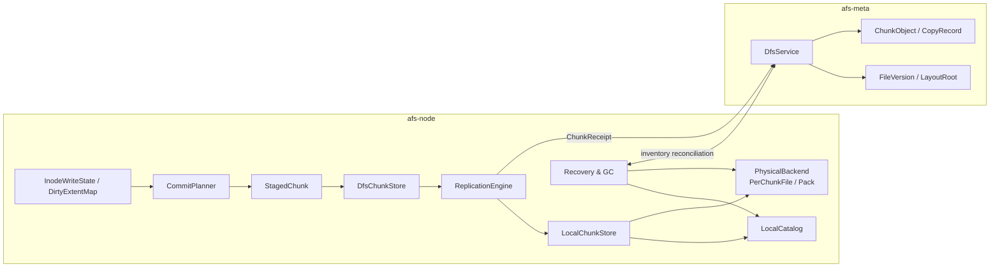

# 专题四：本地 ChunkEngine、COW 与崩溃恢复

状态：Accepted Design

实现状态：Framework Implemented；R1 已接入 per-chunk file、LocalCatalog、批量 finalize、Layout COW 和 expected-base 继承

专题入口：[架构设计专题](design-topics.md)

规范合同：[RFC-0005](../rfcs/0005-local-chunk-engine-cow.md)

上游合同：[RFC-0002](../rfcs/0002-file-version-chunk-model.md) · [RFC-0003](../rfcs/0003-write-visibility-durability.md) · [RFC-0004](../rfcs/0004-replication-state-machine.md)

## 1. 目标

本专题定义一个不可变 Chunk 从冻结字节到本机持久副本的过程，并回答三个问题：

1. 文件更新如何避免重写整文件；
2. 本机 Chunk 如何在掉电后保持可识别、可恢复、可回收；
3. 本地文件后端和未来 Pack 后端如何共用一套持久化合同。

专题一已经确定文件的可变性由 `InodeRecord.head_version` 和新的不可变布局表达。本专题不再为同一个 Chunk 内容增加 pending/committed 版本，而是在两个层面使用 COW：

- **Layout COW**：文件内容变化时生成新 ChunkId，并用新的 ExtentMap 组合新旧 Chunk；
- **Physical COW**：本机副本迁移、压缩或重编码时保持 ChunkId 和逻辑内容不变，只切换本地物理位置。

## 2. 核心结论

1. `ChunkObject` 是提交后不可变的逻辑内容对象；同一个 ChunkId 的内容、长度和内容摘要永远不变。
2. 4 KiB 覆盖写产生一个普通的 4 KiB Chunk，并由新 Extent 覆盖旧布局；不增加 `PatchChunk` 类型。
3. 已 finalize 的 Chunk 禁止原地 overwrite 和 append。追加文件内容同样生成新 Chunk，并由新布局引用。
4. 本地物理迁移允许同一个 ChunkId 从 Position A 切到 Position B，因为逻辑内容没有变化；旧位置在 reader pin 释放后回收。
5. `StagedChunk` 已经包含完整冻结字节和确定的 `ChunkObject` 身份。Local finalize 产生 `LocalChunkRecord + ReplicaAck`，不在此时重新创造内容身份。
6. 文件布局可以继承 expected base FileVersion 的旧 Chunk。只有本次新增 Chunk 必须提供 `ChunkReceipt`；Meta 必须验证复用关系，不能要求布局中每个 Chunk 都在本次 receipt 列表里。
7. 第一阶段每个 Chunk 使用独立文件；未来 Pack/Allocator 后端替换物理存储，不改变 `LocalChunkStore`、`LocalChunkRecord`、ACK 或 Meta 合同。
8. 成功 ACK 的门槛是字节持久化、原子发布和本地目录记录完成。直接 I/O 或传输完成本身不能替代持久化屏障。
9. Truncate 使用 Layout COW：Shrink 裁剪或删除新 EOF 之后的 Extent，Grow 只推进 FileVersion length 并形成隐式 Hole；两者都不能原地修改旧 Chunk。

## 3. 两层 COW

### 3.1 Layout COW：表达文件修改

文件版本 V1：

```text
0                                                        4 MiB
└──────────────────────── Chunk C20 ────────────────────────┘
```

在 1 MiB 偏移覆盖 4 KiB 后，V2 不修改 C20：

```text
0                  1 MiB       +4 KiB                     4 MiB
├── C20[0..1MiB] ──┼── CP1 ────┼── C20[1MiB+4KiB..] ───────┤
```

`CP1` 是普通 `ChunkObject`。Extent 的 `(file_offset, length, chunk_id, chunk_offset)` 决定它覆盖文件的哪一段。旧 FileVersion 继续完整引用 C20，新 FileVersion 同时复用 C20 和新增 CP1。

这解决的是**文件内容如何变化**。

### 3.2 Physical COW：改变本地摆放

```text
ChunkId C20
  LocalChunkRecord(position = PackA:64MiB)
        │
        │ copy + verify + durable publish
        ▼
  LocalChunkRecord(position = PackB:8MiB)
        │
        └── old reader pins released → reclaim PackA range
```

Physical COW 用于 Pack compaction、设备迁移、重编码和坏盘修复。它不创建 FileVersion，不修改 ExtentMap，也不改变 ChunkId。

这解决的是**同一逻辑内容如何安全换位置**。

## 4. 数据对象与完成边界

### 4.1 逻辑内容对象

```text
ChunkObject {
  chunk_id
  logical_length
  content_digest { algorithm, bytes }
  logical_encoding
}
```

`ChunkObject` 描述跨节点一致的逻辑内容。第一阶段只开放 `Raw`，避免在内容身份尚未稳定时引入压缩与加密兼容问题。

### 4.2 Node 临时对象

```text
StagedChunk {
  operation_id
  chunk: ChunkObject
  bytes
}
```

`StagedChunk` 来自冻结的 CommitBatch。它的字节不再变化，ChunkId、长度和内容摘要都已确定，但还没有任何持久副本承诺。

### 4.3 Node 本地持久目录

```text
LocalChunkRecord {
  chunk_id
  logical_length
  stored_length
  physical_location
  device_id
  device_epoch
  physical_encoding
  stored_checksum
  catalog_revision
  created_at
  deletion_state
}
```

`LocalChunkRecord` 是本节点的物理事实：字节放在哪里、如何编码、属于哪个设备代际、目录推进到哪个 revision。它不能并入 Meta 的 `CopyRecord`：前者服务本机恢复和读取，后者是 Meta 接受后的全局副本事实。

Local finalize 返回的 `ReplicaAck.catalog_revision` 取自本次 LocalCatalog 原子提交后的 revision。ReplicationPlan 中目标设备的 revision 只是 Meta 已知下界；校验规则是 ACK revision 不小于该下界，而不是相等。

### 4.4 Wire 与 Meta 对象

- `ReplicaAck`：本节点针对本次 operation 的 durable proof；
- `ChunkReceipt`：ReplicationEngine 聚合出的同步策略证明；
- `CopyRecord`：Meta 校验 ACK 后建立的长期全局目录；
- `FileVersion/LayoutRoot/Extent`：文件如何引用新旧 Chunk 的 committed 布局。

```text
StagedChunk
  → Local finalize
  → LocalChunkRecord + ReplicaAck
  → ReplicationSatisfied / ChunkReceipt
  → Meta FileVersion CAS
  → committed visibility
```

## 5. 本地 finalize 合同

逐文件后端的规范顺序：

1. 在 staging namespace 创建唯一临时文件；
2. 写入全部字节，同时计算内容摘要和 stored checksum；
3. 对数据执行持久化屏障；
4. 校验长度、内容摘要和 checksum；
5. 以 **no-replace** 语义原子发布到 ChunkId 对应的 final name；
6. 持久化父目录变更；
7. 原子持久化 `LocalChunkRecord` 并推进 catalog revision；
8. 返回 `ReplicaAck`。

如果 final name 已存在：

- 先核对已存在记录与请求的 ChunkId、长度和摘要；
- 完全一致时按幂等成功处理；
- 任一字段不同则报告本地目录损坏，不能覆盖旧文件。

普通 rename 在部分平台可以覆盖目标，因此 `exists() + rename()` 不能作为可靠的 content-addressed publish。实现必须使用真正的 no-replace 原语或等价的原子目录事务。

## 6. E2E Case 1：顺序写入 10 MiB 文件

用户执行：

```text
open("/xxx.bin")
write 10 MiB
fdatasync
```

### 6.1 普通 write 阶段

每次 FUSE write 只进入 inode owner 的 `DirtyExtentMap`，记录文件 offset、长度、WriteSeq 和 buffer 引用。此时：

- 不创建 FileVersion；
- 不访问 Meta；
- 不写 Chunk 文件；
- owner 上的普通 reader 可以叠加 committed base 与 dirty overlay 读取最新数据。

### 6.2 CommitTrigger 阶段

`fdatasync` 冻结 `through_seq` 之前的修改。`CommitPlanner` 遍历 base layout 与 dirty overlay，按 4 MiB 目标大小形成三个逻辑范围：

```text
C1 = file[0 .. 4 MiB)
C2 = file[4 MiB .. 8 MiB)
C3 = file[8 MiB .. 10 MiB)
```

它以流式 reader 生成三个 `StagedChunk`，不把 10 MiB 文件再次物化成一个 `Vec<u8>`。

### 6.3 本地与副本阶段

每个 `StagedChunk` 独立执行 local finalize。R1 直接得到单 ACK receipt；RN 把同一不可变 Chunk 发送给其他目标并聚合 ACK。三个 Chunk 都满足同步策略后，文件层建立包含三个 Extent 的 LayoutRoot。

### 6.4 Meta 阶段

Node 只执行一次 `CommitFileVersion(expected_head=V0)`：Meta 校验三个新 Chunk 的 receipts，在一个事务中写入 Chunk/Copy/Placement/LayoutRoot/FileVersion，并 CAS inode head 到 V1。

### 6.5 预算

| 阶段 | Meta RPC | Peer RPC | 本地数据 I/O |
| --- | ---: | ---: | --- |
| 普通 write | 0 | 0 | dirty buffer |
| placement cache hit | 0 | 0 | 0 |
| R1 finalize | 0 | 0 | 10 MiB 写入 + 元数据屏障 |
| RN finalize | 0 | 由拓扑决定 | 每目标 10 MiB |
| FileVersion commit | 1 | 0 | Meta transaction |

冷启动 placement cache miss 可以增加一次 `GetPlacementSnapshot`，但不能按 Chunk 查询 Meta。内容摘要在写 staging 时计算，正常路径不再完整重读 10 MiB。

## 7. E2E Case 2：4 MiB Chunk 中覆盖 4 KiB

初始状态：

```text
V1 → [Extent(0, 4MiB, C20, 0)]
```

用户在 `1 MiB` 处写 4 KiB 并 `fdatasync`：

1. DirtyExtentMap 只记录 `(1MiB, 4KiB, new bytes)`；
2. CommitPlanner 生成 4 KiB 的普通 Chunk `CP1`；
3. LocalChunkStore 和 ReplicationEngine 只持久化 CP1；
4. 新布局复用 C20 的前后区间，并在中间引用 CP1；
5. Meta 验证 C20 可从 expected base V1 合法继承；
6. Meta 只要求 CP1 提供本次 ChunkReceipt；
7. 一次 CAS 把 head 从 V1 切到 V2。

```text
V2 → [C20 prefix] [CP1] [C20 suffix]
```

本次数据写放大接近 4 KiB，不是 4 MiB。代价是 Extent 数量增加，读取时需要组合更多区间。

### 7.1 Compaction

当 overlay 深度、Extent 数、覆盖比例或元数据成本超过阈值时，CommitPlanner 可以把受影响窗口重写成较大新 Chunk。第一阶段 compaction 随下一次正常 CommitBatch 一起提交，避免维护任务单独争抢 inode head 和产生用户不可解释的 FileVersion。

触发器同时考虑：

- Extent 数量与 overlay 深度；
- patch 覆盖比例；
- 预期减少的布局元数据；
- 重写字节数和设备负载；
- 当前 inode 是否有频繁写入。

### 7.2 Truncate 的 Layout COW

初始布局：

```text
V1.length = 8 MiB
[0, 4 MiB) -> C1
[4, 8 MiB) -> C2
```

Shrink 到 6 MiB 时，新版本复用 C1 和 C2 的前 2 MiB：

```text
V2.length = 6 MiB
[0, 4 MiB) -> C1
[4, 6 MiB) -> C2[0, 2 MiB)
```

本次不写新 Chunk。V1 仍完整引用 C2，V2 只引用其子范围。Grow 到 20 MiB 时只创建 `V3.length=20 MiB`，`[6,20 MiB)` 是不保存 Extent 的 Hole。若先 Shrink 再 Grow，旧版本在截断范围中的 Chunk 不得重新进入新布局；新增区间必须读取为零。

旧 Chunk 是否仍可回收由全部 FileVersion 可达性和 GC 决定，truncate 热路径不删除物理数据。

## 8. E2E Case 3：崩溃、重试与孤儿

```text
user             node/local disk                     meta
  │ fdatasync          │                                │
  ├───────────────────>│ write staging                  │
  │                    │ durable + final + catalog      │
  │                    │ ReplicaAck                     │
  │                    ├───────────────────────────────>│ CAS FileVersion
  │                    │<───────────────────────────────┤ OperationOutcome
  │<───────────────────┤ success                        │
```

| 故障点 | 重启后事实 | 处理 |
| --- | --- | --- |
| 普通 write 返回后、CommitTrigger 前 | 只有 owner dirty view | 允许丢失；该 write 没有同步持久保证 |
| staging 写到一半 | 没有 final record | 校验失败并清理过期 staging |
| 字节持久但 final name 未发布 | staging orphan | 依据 operation journal 重试或清理 |
| final 已发布、catalog 未完成 | 数据可能存在但不可 ACK | 启动扫描核对并补 catalog，不能直接计入可靠性 |
| LocalChunkRecord 完成、Meta CAS 前 | durable local orphan | 同 OperationId 重试 commit，超时后进入 orphan reconciliation |
| Meta CAS 成功、响应丢失 | OperationOutcome 已存在 | 查询或重放相同 OperationId，返回原结果 |
| compaction 新 Chunk 完成、CAS 失败 | 新 Chunk 是 orphan | 保留 grace period 后由 reconciliation 回收 |
| GC 标记删除期间崩溃 | deletion state 可恢复 | 继续删除或撤销；读取不能选择 Deleting copy |

不能在启动时把所有可见 staging 自动提交为 committed Chunk。恢复只能依据已验证内容、catalog 状态、OperationId 和 Meta 引用关系决定继续、保留或回收。

## 9. Meta 对旧 Chunk 复用的校验

Meta 接收新的 LayoutRoot 时把 Chunk 分为两类：

1. **new chunks**：出现在本次 receipts 中，必须通过副本策略、epoch、长度和 digest 校验；
2. **reused chunks**：没有本次 receipt，必须能从 `expected_head` 对应的 base layout 合法到达，且逻辑区间不能越界。

Node 不发送一个可伪造的 `existing_chunk_ids` 白名单。Meta 自己读取 expected base layout 并验证继承关系。未来 clone/copy-range 若允许跨文件引用，再增加明确的授权来源，不能放宽为“任意已存在 ChunkId 都可引用”。

## 10. 摘要与校验分层

三个值承担不同职责：

| 值 | 作用域 | 目的 |
| --- | --- | --- |
| content digest | 跨 Node 的逻辑 ChunkObject | 内容身份、去重、P2P 验证 |
| stored checksum | 一个 LocalChunkRecord | 检测本地编码或介质损坏 |
| range checksum | Pack 内的小范围 | 避免 range read 为校验而读取整个大 Chunk |

正式分布式内容身份使用带算法版本的 BLAKE3-256。当前 per-chunk raw backend 复用内容摘要校验持久字节；未来 Pack 可增加独立的每范围 checksum。旧无版本 128-bit FNV 原型不是兼容 wire/persistent identity。

如果未来同一逻辑内容在不同节点使用不同压缩或加密方式，物理编码属于 `LocalChunkRecord/CopyRecord`，不能改变逻辑 ChunkObject。

## 11. 物理后端演进

### 11.1 第一阶段：PerChunkFileBackend

- 一个 Chunk 一个 final file；
- 简单、可检查、便于故障注入；
- 空间回收直接 unlink；
- 小 Chunk 多时 inode 和目录成本较高。

### 11.2 后续：PackBackend

- 固定大小 pack file + allocator；
- `LocalChunkRecord` 指向 pack、offset、length 和 generation；
- local catalog 与 allocator 更新必须原子提交；
- reader 获得 position pin 后读取；
- compaction 复制、校验、原子切换 record，旧 pin 清空后释放空间。

两种后端必须实现同一个内部合同：

```text
LocalChunkStore {
  finalize(StagedChunk, ReplicaTarget) -> ReplicaAck
  open_verified(ChunkId) -> PinnedChunkReader
  relocate(ChunkId, PhysicalTarget) -> LocalChunkRecord
  mark_deleting(ChunkId) -> DeleteToken
  finish_delete(DeleteToken)
  recover()
}
```

`relocate` 是 Physical COW；它不能出现在文件层或 FileVersion API 中。

## 12. GC 与 reconciliation

本地 Chunk 在 Meta commit 前不需要第二次热路径 RPC 登记 orphan。后台 reconciliation 负责：

1. 按 catalog revision 分批上报本地 Chunk inventory；
2. Meta 返回仍被 CopyRecord、进行中 Operation 或 repair 引用的集合；
3. 未引用 Chunk 进入 grace period；
4. 二次确认后标记 `Deleting`；
5. 等 reader pin 清空，删除物理数据和 LocalChunkRecord。

这样保持正常提交只有一次 FileVersion CAS，同时避免网络分区期间立即删除仍可能被重试引用的数据。

## 13. 与 3FS 的关系

3FS 的新 Rust chunk engine 提供了可借鉴的本地机制：

- 数据先写，随后用一个 metadata batch 提交 chunk mapping 与 allocator 事件；
- writing record 支持重启后占住尚未决议的位置；
- overwrite 通过 physical COW 切换位置；
- reader 通过 `Arc` pin 旧位置。

源码入口：

- `ref/3FS/src/storage/chunk_engine/src/core/engine.rs:295`：update 流程；
- `ref/3FS/src/storage/chunk_engine/src/alloc/chunk.rs:89`：physical COW；
- `ref/3FS/src/storage/chunk_engine/src/alloc/chunk.rs:176`：safe append；
- `ref/3FS/src/storage/chunk_engine/src/meta/meta_store.rs:348`：writing record；
- `ref/3FS/src/storage/chunk_engine/src/core/engine.rs:481`：commit。

AFS 不采用 3FS 的两项内容语义：

- 不在同一 ChunkId 下发布可变内容版本；
- 不对已 finalize 的 Chunk 做 in-place append。

这些差异来自 AFS 已接受的 immutable Chunk + Layout COW 基座，而不是对 3FS 机制优劣的判断。

## 14. 当前实现映射与剩余边界

已经接入的合同：

- `src/node/vfs/dfs.rs` 的 DirtyExtentMap 只保存脏范围；FrozenCommit 把一次提交前缀与后续 write 分开；
- CommitPlanner 归一化覆盖关系，将相邻脏数据合并成不超过 4 MiB 的普通 Chunk，并直接继承未覆盖的 base Extent；
- `src/node/chunk.rs` 使用带算法标识的 BLAKE3 摘要、不可覆盖的 final name、批量目录屏障和单次 LocalCatalog 提交；
- LocalChunkRecord 区分逻辑 Chunk 身份、本机物理位置、设备代际、物理编码和 catalog revision；
- Node 启动先恢复 LocalCatalog，再把真实 device epoch 和 revision 注册到 Meta；
- `src/meta/dfs.rs` 区分 receipt-backed 新 Chunk 与 expected-base inherited Chunk，并校验继承范围；
- PlacementSnapshot 中的 catalog revision 按下界解释，ReplicaAck 携带本次本地 catalog 提交后的精确 revision。

仍未实现的合同：

- Pack backend、allocator 和 Physical COW relocation；
- reader pin 计数、删除状态机和旧位置回收；
- orphan grace period、Node inventory 与 Meta reconciliation；
- Extent 数量阈值、overlay 深度阈值和随正常 CommitBatch 执行的布局 compaction；
- RN 目标端 staging/finalize 与真实多节点 durable ACK；
- 进程崩溃和 VM 掉电故障矩阵。

## 15. 模块关系



这些是职责边界，不要求每个框单独成为一个 Rust 文件。

## 16. 已接受决策

1. immutable Chunk + Layout COW 是文件更新基座；
2. 不新增 PatchChunk；
3. finalize 后禁止 overwrite 和 in-place append；
4. Physical COW 只服务本地 relocation/re-encoding；
5. DirtyExtentMap 不保存完整 base 文件；
6. CommitBatch 不包含 whole-file `Vec<u8>`；
7. Meta 允许合法复用 expected base 的旧 Chunk；
8. 只有新增 Chunk 必须提供本次 receipt；
9. 第一阶段 compaction 随正常 CommitBatch 提交；
10. durable barrier、no-replace publish、目录持久化和 catalog 完成后才能 ACK；
11. orphan 使用 grace period + Meta reconciliation 回收，不增加第二次热路径 commit；
12. ChunkObject 内容身份与 LocalChunkRecord/ReplicaAck 的物理持久证明分离；
13. 使用带版本强摘要与本地 checksum 分层；
14. 第一阶段 per-chunk file，未来 Pack 后端保持相同上层合同。
15. Truncate 只生成新 length 和新布局；Shrink 可以复用旧 Chunk 子范围，Grow 不分配零 Chunk，Shrink 后 Grow 不暴露已截断旧数据。

## 17. 验收标准

- 10 MiB 顺序文件形成多个 Chunk，commit 过程不物化 whole-file buffer；
- 4 KiB 覆盖写只写入 patch 数据并合法复用旧 Chunk；
- Shrink 不重写旧 Chunk，Grow 不创建零 Chunk，Shrink 后 Grow 的新增范围读取为零；
- Meta 拒绝引用既无 receipt、也不能从 expected base 继承的 Chunk；
- staging、finalize、catalog、Meta CAS 和删除各故障点均能重启恢复；
- 已 ACK 的本地副本在模拟掉电后仍可按 ChunkId 和摘要读取；
- 相同 OperationId 重试不覆盖已存在 Chunk，也不重复推进 catalog；
- R1 与 RN 共用相同 LocalChunkStore finalize 原语；
- compaction CAS 失败只留下可回收 orphan，不破坏旧 FileVersion；
- 正常 R1 commit 除 placement cache miss 外只有一次 Meta FileVersion RPC；
- 报告顺序写、4 KiB 覆盖写、compaction 和恢复扫描的写放大、空间放大与 p50/p95/p99。
