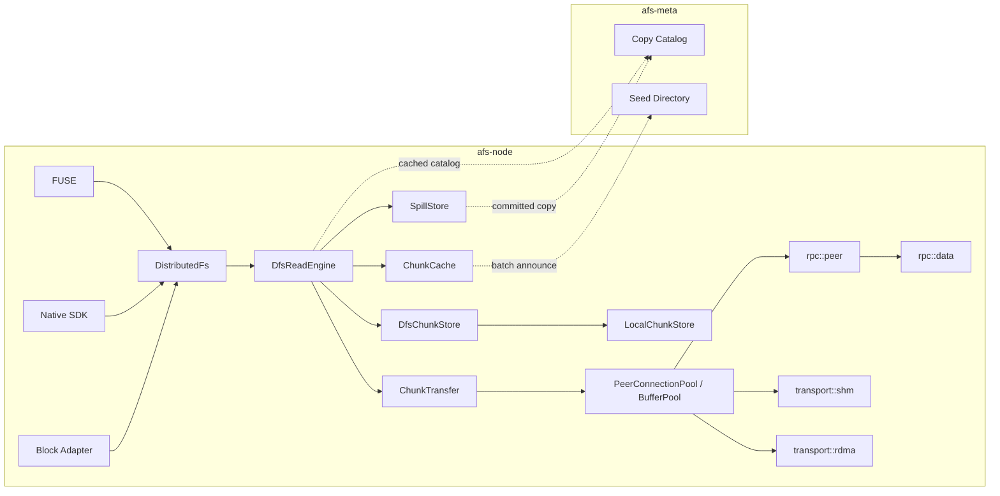

# 专题六：固定版本 Chunk 的传输、P2P、Cache 与 Spill

状态：Accepted Design

实现状态：Not Implemented；当前 DFS 读取只支持本机 DurableReplica，SHM/RDMA 与文件内容路径尚未接通

专题入口：[架构设计专题](design-topics.md)

规范合同：[RFC-0006](../rfcs/0006-chunk-transfer-cache-spill.md)

上游合同：[RFC-0002](../rfcs/0002-file-version-chunk-model.md) · [RFC-0003](../rfcs/0003-write-visibility-durability.md) · [RFC-0004](../rfcs/0004-replication-state-machine.md) · [RFC-0005](../rfcs/0005-local-chunk-engine-cow.md)

## 1. 要解决的问题

专题一到四已经回答文件版本如何产生、Chunk 如何不可变、R1/RN 如何确认持久副本，以及本机 Chunk 如何 finalize。本专题只回答之后的一个独立问题：

> 当读取已经固定到 `FileVersionId → Extent → ChunkId + Range` 后，Chunk 字节如何在持久副本、缓存、P2P Seed、外部 Spill 和应用 Buffer 之间高效、安全地移动？

这个问题直接决定三类业务路径：

1. 普通 FUSE 应用读取固定文件版本时，如何就近命中本机磁盘或远端 Node；
2. 数千个沙箱同时按需读取同一镜像或 Snapshot 时，如何让已下载并校验的消费者成为新 Seed，避免持续压垮少数持久副本；
3. Native SDK 如何把大量 Range 合批，并通过 SHM、RDMA 或流式网络直接写入调用方 Buffer，减少逐请求 RPC 和内存复制。

Spill 属于同一个专题，因为它改变 Chunk 的可选来源和本地逐出条件，但不改变 FileVersion、Extent 或 Chunk 身份。

## 2. 非目标与上游边界

本专题不重新设计：

- POSIX `write/flush/fdatasync/fsync/release`；
- FileVersion CAS 和 inode head 切换；
- R1/RN 写入完成、ReplicaAck、ChunkReceipt 和同步副本数量；
- LocalChunkStore finalize、Layout COW、Physical COW 和启动恢复；
- truncate、Hole、append 和文件长度；
- OwnerFs 的 Home 普通文件与远端回 Home 语义。

这些语义是读取和传输的输入。Transport 完成、缓存命中或 P2P 下载都不能自行创建 FileVersion，也不能冒充同步写入完成。

## 3. 核心结论

1. 所有读取入口先固定 FileVersion，再把文件范围映射为 Chunk 范围；不允许按“路径当前 head”从多个来源拼接数据。
2. FUSE、Native SDK 和未来 Block Adapter 在 `DfsReadEngine` 汇合；三者共享选源、并发、校验、重试和降级规则。
3. `ChunkReadOp` 是 Node 私有的运行时执行项，不进入 Meta、wire 或持久格式，也不恢复早期已经删除的 `ReadSlice`。
4. `DurableReplica`、`VerifiedCache`、`ExternalCommitted` 是 Copy 的角色；`Ready`、`Corrupt`、`Deleting` 是正交状态。角色与健康状态必须拆开表达。
5. `StagedChunk` 是 Node 内部临时对象，不进入 Meta Copy Catalog；只有完整、校验通过并发布的副本或缓存才能登记。
6. Seed 不是第四种 Copy。它是某个 `Ready DurableReplica` 或 `Ready VerifiedCache` 在有限租期内对外提供读取的能力。
7. 只有完整 Chunk 通过内容摘要校验后，才能安装为 VerifiedCache 或成为 Seed。部分 Range 可以返回应用，但不能据此宣布持有完整 Chunk。
8. 读取来源按本机性、故障域、负载和成本排序；选择失败后可以换源，不能改变 ChunkId 或 FileVersionId。
9. 小数据可随控制消息 Inline；大数据使用共享内存、注册 Buffer/RDMA 或流式网络。Transport 只搬字节，不改变授权、身份、校验和持久化合同。
10. Meta 不参与每个 FUSE read，也不为每个 Chunk 做同步选源。Node 缓存 Copy Catalog/Seed 目录，增量变更采用批量异步登记。
11. Cache 不计入同步持久副本数。外部副本默认也不计入集群内 `sync_required_copies`；需要 external-only durability 时必须显式启用独立分层策略。
12. Spill 必须先完成外部临时写、完整校验和 Meta `ExternalCommitted` 提交，再判断能否逐出本地 Copy。

## 4. 从文件范围到传输任务

### 4.1 文件层输入

读取开始时已经有稳定输入：

```text
ReadContext {
  inode_id
  file_version_id
  layout_root_id
  file_offset
  length
  authorization
}
```

`DistributedFs` 遍历 Extent，将文件范围转换为若干运行时操作：

```text
ChunkReadOp {
  file_version_id
  chunk_id
  chunk_offset
  length
  destination_offset
}
```

`destination_offset` 表示这段字节写入调用方结果 Buffer 的位置。Hole 不生成 ChunkReadOp，由文件层直接填零。

`ChunkReadOp` 的必要性来自并行选源、任务级重试、合并和异步完成；它不是新的数据模型。FileVersion、Extent 和 ChunkObject 仍是唯一持久事实。

### 4.2 合批执行

Native SDK 或一次较大的 FUSE read 可以形成：

```text
ReadBatch {
  read_id
  operations: Vec<ChunkReadOp>
  deadline
  priority
  max_inflight_bytes
}
```

`DfsReadEngine` 对 ReadBatch 执行：

1. 为每个 ChunkReadOp 查找合格来源；
2. 按来源 Node、Transport 和连续 Range 合组；
3. 受全局、每 Peer、每设备和每租户的并发/字节预算约束；
4. 选择 Inline、LocalShm、RdmaRegion 或 Stream；
5. 校验完成结果并发布给上层；
6. 在满足完整 Chunk 条件时安装缓存并异步登记 Seed。

## 5. Copy、状态与 Seed

### 5.1 Copy 角色与状态

```text
CopyRecord {
  copy_id
  chunk_id
  role: CopyRole
  state: CopyState
  location
  node_epoch / device_epoch / catalog_revision
  persisted_bytes
  verified_digest
}

CopyRole {
  DurableReplica
  VerifiedCache
  ExternalCommitted
}

CopyState {
  Ready
  Corrupt
  Deleting
}
```

角色回答“这份 Copy 承担什么责任”，状态回答“当前还能否安全使用”。例如：

- `DurableReplica + Ready`：可读、可作为 Seed，并按 placement policy 计入集群内可靠副本；
- `VerifiedCache + Ready`：可读、可作为 Seed、可被逐出，不计入同步可靠副本；
- `ExternalCommitted + Ready`：可回源、可作为本地逐出的依据，是否计入总耐久性由显式 tiering policy 决定；
- 任意角色进入 `Corrupt`：立即退出选源、Seed 和可靠副本计数；
- 任意角色进入 `Deleting`：不再接受新读取，已有 pin/in-flight I/O 完成后删除。

`StagedChunk` 不属于 CopyRecord。它没有达到可读和可登记门槛。

### 5.2 SeedLease

```text
SeedLease {
  chunk_id
  copy_id
  node_id
  node_epoch
  endpoint
  expires_at
  load_hint
}
```

SeedLease 是软状态：

- 只引用 `Ready DurableReplica` 或 `Ready VerifiedCache`；
- 过期、Node 重启、Copy 状态变化或压力过高时失效；
- 不计入副本数量，不提供持久性承诺；
- 通过批量异步 announce/renew/revoke 更新，不能阻塞应用读取；
- 实际请求仍须校验 Node epoch、授权、ChunkId、Range 和 completion。

## 6. 来源选择

默认优先级：

```text
1. 本机 Ready DurableReplica
2. 本机 Ready VerifiedCache
3. 同主机或同机架 Seed
4. 远端 Ready DurableReplica
5. 远端 Ready VerifiedCache Seed
6. Ready ExternalCommitted
```

优先级不是固定单列表。`DfsReadEngine` 还要考虑拓扑距离、当前并发与排队字节、Node/device epoch、Circuit Breaker、近期校验失败、外部流量成本，以及 Range 能否合并。

同一 Node 上多个消费者请求相同 Chunk 时，使用 in-flight coalescing：第一个请求建立下载，其余请求等待同一结果或读取正在形成的受控临时对象，避免每个 FUSE 请求单独回源。

## 7. PayloadDescriptor 与 Transport

```text
PayloadDescriptor {
  Inline { bytes }
  LocalShm { region_id, offset, length }
  RdmaRegion { region_id, address, rkey, length }
  Stream { stream_id, length }
}
```

### 7.1 选择原则

| 场景 | 默认路径 | 原因 |
| --- | --- | --- |
| 很小的控制附带数据 | Inline | 避免额外 Buffer 注册和消息往返 |
| 同节点 Native SDK | LocalShm/memfd | 复用页并减少用户态复制 |
| 跨节点大 Range 且双方具备能力 | RDMA Registered Buffer | 降低 CPU copy 和协议栈开销 |
| 普通网络或 RDMA 不可用 | Stream | 通用、可回退、支持背压 |

阈值由实测配置，不写入协议语义。设置更大的单次传输并不总是更快：它会增加 pinned memory、队头阻塞、重试代价和单租户占用，因此需要并发字节预算和分段上限。

### 7.2 completion

```text
TransferCompletion {
  read_id
  operation_index
  attempt_id
  source_copy_id
  transferred_bytes
  range_checksum
  result
}
```

`attempt_id` 防止超时换源后，旧请求迟到并覆盖新 Buffer 结果。只有当前 attempt 的 completion 通过长度、身份和校验后，DfsReadEngine 才把对应范围发布给调用方。

RDMA completion 只表示设备完成了内存操作，不表示字节属于期望 Chunk、完整 Chunk 摘要已经通过、数据已经持久化或 Cache/Seed/Replica 状态已经提交。

## 8. 校验与缓存门禁

当前 ChunkObject 使用完整 Chunk 的 BLAKE3-256 内容摘要。由此得到两个明确边界：

1. 部分 Range 可以通过传输 checksum 检测链路错误并返回应用；
2. 只有取得完整 Chunk，并对完整逻辑字节验证 Chunk digest 后，才能安装 `VerifiedCache` 和申请 SeedLease。

第一阶段不引入 Merkle Tree 或持久 segment digest。它的代价是：只读取 4 KiB Range 时无法仅凭整 Chunk digest 把该 Range 晋升为完整缓存。若镜像负载证明小 Range 缓存价值足够高，再单独评审 segment digest/Merkle 格式；不能把 range checksum 当成内容身份。

缓存安装流程：

```text
receive full Chunk into staging
  → verify length + Chunk digest
  → no-replace publish into cache namespace
  → commit LocalChunkRecord(role=VerifiedCache, state=Ready)
  → serve local reads
  → async SeedLease announce
```

相同 ChunkId 的并发安装和重试必须幂等。已存在的 Ready cache 只有长度和 digest 完全一致时才复用。

## 9. E2E Case 1：FUSE 读取固定镜像范围

用户读取：

```text
pread(fd_of_/images/base.img, 6 MiB, 3 MiB)
```

文件已经固定到 V42：

```text
V42
  [0, 4 MiB)  -> C101
  [4, 8 MiB)  -> C102
  [8, 12 MiB) -> C103
```

读取范围映射为两个 ChunkReadOp：

```text
C101[3 MiB, 4 MiB) -> dst[0, 1 MiB)
C102[0, 2 MiB)     -> dst[1 MiB, 3 MiB)
```

执行过程：

1. FUSE 把路径/inode 解析到 V42。必须先固定版本，否则两个来源可能分别返回不同 head 的数据。
2. DistributedFs 遍历 V42 的 Extent。C101、C102 是存储和校验实体，FUSE read 大小只是一次前端请求。
3. DfsReadEngine 发现 C101 在本机 DurableReplica，直接通过 PinnedChunkReader 读取；C102 本机不存在，从目录中选择远端 Ready Copy。
4. C102 的 2 MiB Range 通过已复用的 PeerConnection 发送，服务端校验授权与 Copy 状态后回传。
5. 两个 operation 写入同一个目标 Buffer 的不同区间；只有两个 completion 都成功，FUSE 请求才完成。
6. 因为只取得 C102 的部分 Range，本次结果不能登记为完整 VerifiedCache，也不能成为 Seed。

逻辑预算：

| 项目 | 数量 |
| --- | ---: |
| 路径/版本解析 | 依既有 inode cache；不因每个 Chunk 增加 |
| Meta 选源 RPC | 热路径 0 |
| Peer 请求 | 1 个合批 Range 请求 |
| 数据 Hop | C101 本机 1；C102 网络 1 |
| 新建连接 | 0，复用连接池 |

## 10. E2E Case 2：8192 个沙箱突发读取同一镜像

初始只有三个 DurableReplica 持有 Chunk C500。大量 Node 同时读取 C500：

1. 每个消费者先固定同一个镜像 FileVersion，因此所有 C500 都有相同内容身份。
2. 初始请求由三个持久副本承担；选源器按拓扑、负载和连接状态分散请求。
3. 每个消费 Node 对相同 C500 使用 in-flight coalescing，本机多个沙箱只触发一次完整下载。
4. 完整下载进入 staging，BLAKE3 校验通过后安装为 VerifiedCache。
5. 新 cache 异步取得短期 SeedLease；后续消费者可以从这些新 Seed 下载，形成多源扩散。
6. SeedLease 到期、节点过载、cache 被逐出或 Node epoch 改变时，该来源退出候选集。
7. 任一 Seed 超时或校验失败，读取以新的 attempt_id 换源；失败 Seed 不影响 FileVersion 或其他 Copy。

这条路径的核心收益来自种子数量随已完成消费者增加。Meta 只接收批量 soft-state 更新，不参与每个沙箱、每个 read 或每个 Chunk 的同步路径。

必须施加四层背压：全 Node 最大 in-flight bytes、每 Peer 并发和排队字节、每设备读取并发，以及每租户/镜像的公平份额。没有这些限制时，多源会把单源瓶颈转换为连接、内存或磁盘随机读风暴。

## 11. E2E Case 3：Native SDK 批量 Range Read

加载器一次提交 64 个 Range：

```text
readv_fixed_version(V42, ranges[64], registered_buffer)
```

1. SDK 向本机 Node 提交一个 ReadBatch，而不是 64 次独立 RPC。
2. DfsReadEngine 将 Range 映射为 ChunkReadOp，并把相邻、同来源 operation 合并。
3. 本机命中的数据直接写入共享内存或注册 Buffer；远端大数据优先使用 RDMA，能力不匹配时使用 Stream。
4. 每个 completion 带 read_id、operation_index 和 attempt_id；SDK 可以异步收割完成，不轮询 64 个 RPC。
5. 局部失败只重试相关 operation，已验证范围不重复搬运。

这条路径吸收 3FS 的三项通用原则：批量提交、按服务端分组和大小分流；不复制其可变 Chunk/CRAQ 写入语义。

## 12. E2E Case 4：Spill、逐出与回源

本地容量达到高水位，需要把冷 Chunk C900 放到对象存储：

```text
Ready DurableReplica
  → external temporary upload
  → complete length + digest verification
  → atomic external publish
  → Meta CopyRecord(ExternalCommitted, Ready)
  → evaluate local durability and pin policy
  → local Copy enters Deleting
  → drain readers and delete
```

为什么要先提交 ExternalCommitted：对象存储写成功但 Meta 不知道位置时，外部对象只是 orphan，不能作为删除本地唯一事实源的依据。

回源时，DfsReadEngine 找不到合格本地/Peer 来源才选择 ExternalCommitted。Range 可以直接服务本次读取；若策略决定恢复完整 Chunk，则下载到 staging，完整校验后安装 VerifiedCache 或通过 Promotion 流程成为 DurableReplica。外部对象损坏时将该 Copy 标记 Corrupt，不能静默返回其他版本或空数据。

默认 `ExternalCommitted` 不满足集群内 `sync_required_copies`。只有显式 tiering policy 才能把外部层计入整体耐久性，并同时定义外部不可用时的可用性合同。

## 13. 重试、幂等与降级

### 13.1 读取重试

读取本身不修改 FileVersion，可以换源重试；但写入目标 Buffer 的动作需要 attempt fencing：

```text
attempt 7 timeout
  → allocate or reserve attempt 8 destination
  → read from another source
  → publish attempt 8
  → late completion of attempt 7 is discarded
```

不能让两个 RDMA source 同时无围栏地写同一 Buffer range。

### 13.2 状态修改

VerifiedCache 安装、Cache Promotion、Spill publish、External recall、Repair 和 relocation 使用持久 OperationId。Seed announce/renew 是可丢失的软状态，不要求持久 OperationId。

### 13.3 Transport 降级

- RDMA 在传输开始前能力协商失败：同一 attempt 可以切换 Stream；
- RDMA 已经可能写入 Buffer 后失败：创建新 attempt 和受围栏目标区间，再换源或换 Transport；
- SHM region 失效：重新注册或退回普通本地复制；
- Peer 熔断：从候选集中临时移除，选择其他 Copy 或 ExternalCommitted。

Transport 降级不允许跳过 checksum、身份验证或授权。

## 14. RPC、连接与 Data Hop 预算

### 14.1 热路径约束

- 每次 FUSE read 不访问 Meta；
- 每个 Chunk 不同步查询一次路由；
- 每个 Chunk 不新建 Peer 连接；
- Cache/Seed 登记不阻塞读取返回；
- 同一个 ReadBatch 对同一来源尽量使用一次合批请求；
- 大 Payload 不在多个中间 `Vec<u8>` 间复制。

### 14.2 公共连接与内存管理

`PeerConnectionPool` 统一处理 NodeId/endpoint 到连接的复用、keepalive、idle LRU、重连、Node epoch 失效、capability negotiation、每 Peer 并发、排队字节和 circuit breaker。

`BufferPool` 统一管理普通可复用 Buffer、SHM region、RDMA registered memory、pinned memory 上限、attempt 生命周期与 completion 后回收。

这些是传输公共能力。DfsReadEngine 决定读取语义，ReplicationEngine、Repair 和 Spill 可以复用连接与 Buffer 管理，但不能把业务状态机下沉到 Transport。

## 15. 模块关系



| 模块 | 职责 |
| --- | --- |
| `DistributedFs` | 固定 FileVersion，遍历 Extent，处理 Hole 和 POSIX 结果 |
| `DfsReadEngine` | 生成/执行 ReadBatch，选源、合批、限流、重试、校验和完成发布 |
| `DfsChunkStore` | 为已知 ChunkId 提供本地持久副本入口，并与复制写路径保持共同 Chunk 边界 |
| `LocalChunkStore` | 读取本机 DurableReplica，提供 PinnedChunkReader |
| `ChunkCache` | VerifiedCache 安装、打开、逐出和本机 in-flight coalescing |
| `ChunkTransfer` | Peer Range/Chunk 搬运与 PayloadDescriptor 适配 |
| `SpillStore` | 外部临时写、提交、回源、删除和外部校验 |
| `PeerConnectionPool` | 连接复用、能力协商、并发、背压、熔断和重连 |
| `BufferPool` | 普通/SHM/RDMA Buffer 生命周期与内存上限 |
| `rpc::data` / `rpc::peer` | Node 间入站/出站协议适配，不承载读取策略 |

第一版可以把 Source Resolver、Retry Controller 和 Batch Scheduler 作为 `DfsReadEngine` 内部对象，不为每个概念新建文件。

## 16. 故障矩阵

| 故障 | 对用户读取的处理 | 状态处理 |
| --- | --- | --- |
| Seed 在请求前过期 | 重新选源 | 异步移除 lease |
| Peer 中途断连 | 新 attempt 换源 | 熔断并记录失败 |
| Range checksum 失败 | 丢弃 attempt，换源 | 来源降权；重复失败触发 Copy 校验 |
| 完整 Chunk digest 失败 | 不安装 cache，不成为 seed | 标记/报告 Corrupt，触发 repair |
| RDMA completion 丢失 | 新 attempt，旧 Buffer 不发布 | 回收旧 registration |
| Cache 安装后响应丢失 | 以 ChunkId 幂等重开 | 返回既有 Ready cache |
| 外部上传完成、Meta 提交失败 | 不删除本地 Copy | 外部对象进入 orphan reconciliation |
| Meta 已提交 ExternalCommitted、响应丢失 | OperationId 查询原结果 | 禁止重复覆盖对象 |
| 唯一本地 Copy 损坏且外部不可用 | 返回明确 I/O 错误 | Placement 进入 BlockedNoSource |
| Node 重启 | 本机 soft Seed 全部失效 | Ready Copy 从持久 catalog 恢复后重新 announce |

读取不能通过返回旧版本、零数据或未校验 staging 来掩盖来源失败。

## 17. 与 3FS 的关系

3FS 证明了以下机制对高性能文件数据面有价值：将文件 Range 映射到 Chunk Range 后再调度；按目标服务端合批并限制全局/单服务端并发；小数据 Inline、大数据使用注册 Buffer；缓存路由、连接复用、失败换源和异步完成；通过用户态共享队列和注册内存减少 FUSE 数据搬运。

AFS 吸收这些执行原则，但保持自身的数据合同：AFS 的 Chunk 内容不可变，普通文件可变性由 FileVersion/Layout COW 表达；读取 P2P 不复制 3FS 为可变 Chunk 多副本写设计的 CRAQ 链语义。

## 18. 被拒绝方案

- 把 Seed 建模为第四种 Copy：Seed 是临时服务能力，混入持久 Copy 会把可用性误当耐久性。
- 把 Cache 计入 `sync_required_copies`：缓存可按压力逐出，不能承担未声明的持久承诺。
- 每个 Range 完成后立即注册 Seed：部分 Range 不能证明完整 Chunk，且同步登记会放大 Meta 压力。
- 每个 read/Chunk 查询 Meta：大规模启动会把数据面扩散转化为控制面瓶颈。
- RDMA 单独定义文件语义：Transport 必须可降级，不能成为身份、授权或完成语义的唯一来源。
- 只用 Range checksum 代替 Chunk digest：只能检测一次传输，不能证明全局内容身份。
- 外部上传成功即删除本地数据：Meta 未提交和校验完成前，外部对象不能成为可靠事实源。
- 恢复 `ReadSlice` 持久类型：运行时 ChunkReadOp 已足够，持久化会复制 Extent 事实并增加兼容负担。

## 19. 验收标准

### 19.1 功能

- FUSE、本机 SDK 和 Block Adapter 对同一 FileVersion/Range 返回相同字节；
- 本机 DurableReplica、VerifiedCache、远端 Peer 与 ExternalCommitted 能按规则换源；
- 完整 Chunk 下载后可形成 VerifiedCache/Seed，部分 Range 不可；
- Spill/recall 保持 ChunkId 和 FileVersion 不变。

### 19.2 故障

- 覆盖超时、断连、迟到 completion、校验失败、Node 重启、Seed 过期；
- 覆盖外部上传/Meta 提交各切点及 orphan reconciliation；
- 任意换源不产生 mixed-version read；
- Buffer attempt fencing 可拒绝迟到 RDMA 写完成。

### 19.3 性能

- 报告 FUSE、SHM、Stream 和 RDMA 的吞吐、p50/p95/p99、CPU、复制次数和 pinned memory；
- 报告 batch size、inline 阈值、每 Peer 并发和 max in-flight bytes 的曲线；
- 8192 沙箱或等价并发模型报告 origin bytes、P2P bytes、seed 增长、回源比例和完成时间；
- 稳态热路径验证无 per-read Meta RPC、无 per-Chunk 建连。

### 19.4 容量与运维

- 达到高低水位时安全逐出，不删除唯一事实源；
- Copy/Seed/Cache/External 的数量、状态和失败原因可观测；
- drain、repair、spill、recall 与删除可暂停、恢复和幂等重试；
- 外部存储不可用时按 tiering policy 返回可解释结果。

## 20. 实施顺序

1. 实现 `DfsReadEngine + ChunkReadOp/ReadBatch`，闭合本机与单个远端 DurableReplica 换源；
2. 增加公共连接池、合批、并发字节限制和流式 Peer Range Read；
3. 增加完整 Chunk VerifiedCache、in-flight coalescing 和 SeedLease；
4. 接通 Native SDK 的 SHM/registered buffer，再以相同接口增加 RDMA adapter；
5. 实现 SpillStore、ExternalCommitted、逐出和 recall；
6. 执行大规模多源、故障和容量矩阵。

每一步都复用相同 FileVersion、ChunkId、Copy Catalog 和校验合同，不建立独立镜像数据面。
