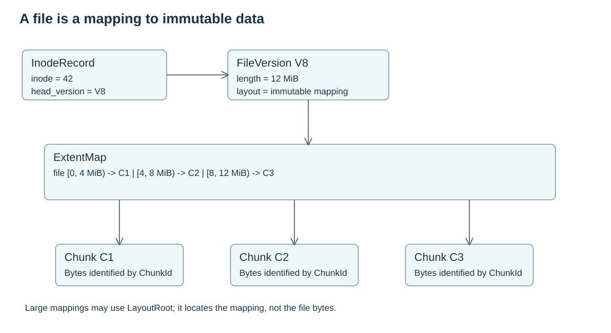

# Data Model

DFS exposes mutable files but stores committed content as immutable versions and chunks.



## Example: `/xxx.txt`

A user creates `/xxx.txt`, writes data and calls `fsync`. Meta holds a stable inode. Node turns the synced byte ranges into chunks. Meta commits a new file version and moves the inode head to it.

A later reader opens `/xxx.txt` and resolves the current file view. A committed read plan loads one version's layout and referenced chunks without mixing different versions. Ordinary read-only handles are not lifetime snapshots: same-mount readers observe accepted local writes, and a new open on another mount after successful writer close observes the completed changes. See [Write Semantics](write-semantics.md).

## Core Objects

| Object | Role |
| --- | --- |
| `Dentry` | Maps a directory name to an inode |
| `InodeRecord` | Stable identity, attributes and mutable `head_version` pointer |
| `FileVersion` | Immutable committed file view at one length |
| `LayoutRoot` | Root of the layout for one file version |
| `Extent` | Maps a file range to a chunk range |
| `ChunkObject` | Immutable content identity: length, digest and encoding |
| `CopyRecord` | Cluster-visible record of where a chunk copy can be read or recovered |

Only `InodeRecord.head_version` moves when a committed file changes. Existing versions, layouts and chunks remain valid until lifecycle rules allow collection.

## Holes And Sparse Files

`FileVersion.length` defines EOF. Extents describe data ranges. A range inside `[0, length)` without an extent is a hole and reads as zero. Growing a file can create holes without writing zero chunks.

## LayoutRoot Boundary

`LayoutRoot` is the named root of a committed version's layout. It can point to inline extents, a tree, or another layout representation. Readers only depend on the resolved mapping, not on the physical representation.

Open question Q1: whether every committed `FileVersion` must always have a `LayoutRoot`, including tiny files that could otherwise inline all extents directly in the version record. The status page tracks implementation progress; this page defines the contract.

## UML View

The names below mirror the domain structs used by the framework. Meta records are the committed authority; Node runtime records are in-memory write-path state used to produce the next Meta commit.

### Meta Committed Records

```text
InodeRecord {
  namespace_id: NamespaceId
  inode_id: InodeId
  kind: InodeKind
  attributes: InodeAttributes
  head_version: Option<FileVersionId>
  revision: u64
}

DentryKey {
  namespace_id: NamespaceId
  parent_inode_id: InodeId
  name: Vec<u8>
}

Dentry {
  key: DentryKey
  inode_id: InodeId
}

FileVersion {
  id: FileVersionId
  inode_id: InodeId
  parent_version: Option<FileVersionId>
  length: u64
  layout_root: LayoutRootId
  created_at_unix_ms: u64
}

LayoutRoot {
  id: LayoutRootId
  file_length: u64
  inline_extents: Vec<Extent>
}

Extent {
  file_offset: u64
  length: u64
  chunk_id: ChunkId
  chunk_offset: u64
}

ChunkObject {
  id: ChunkId
  length: u64
  content_digest: ContentDigest
  encoding: ChunkEncoding
}

CopyRecord {
  id: CopyId
  chunk_id: ChunkId
  role: CopyRole
  location: CopyLocation
  state: CopyState
  persisted_bytes: u64
  verified_digest: ContentDigest
}
```

### Node Runtime Write State

```text
InodeWriteState {
  inode: InodeRecord
  write_lease: WriteLease
  base_version: Option<FileVersion>
  base_layout: LayoutRoot
  logical_length: u64
  metadata_dirty: bool
  dirty_extents: DirtyExtentMap
  in_flight: Option<InFlightCommit>
  commit_busy: bool
  dirty: bool
  next_write_seq: u64
  visible_write_seq: u64
  durable_write_seq: u64
  committed_write_seq: u64
  open_writers: u64
  last_writer_background_requested: bool
  background_error: Option<ObservedWriteError>
  terminal_error: Option<Error>
}

DirtyExtentMap {
  extents: Vec<DirtyExtent>
}

DirtyExtent {
  file_offset: u64
  length: u64
  write_seq: u64
  data: Option<Arc<[u8]>>
}

FrozenCommit {
  through_seq: u64
  logical_length: u64
  inode: InodeRecord
  write_lease: WriteLease
  base_version: Option<FileVersion>
  base_layout: LayoutRoot
  dirty_extents: DirtyExtentMap
}

InFlightCommit::Preparing(Box<FrozenCommit>)
InFlightCommit::File(Box<PendingFileCommit>)
InFlightCommit::Metadata(SyncInodeMetadata)

PendingFileCommit {
  frozen: FrozenCommit
  batch: CommitBatch
}

CommitBatch {
  through_seq: u64
  commit: CommitFileVersion
}

CommitFileVersion {
  operation_id: OperationId
  inode_id: InodeId
  write_lease: WriteLease
  expected_inode_revision: u64
  expected_head_version: Option<FileVersionId>
  file_version: FileVersion
  layout_root: LayoutRoot
  chunk_receipts: Vec<ChunkReceipt>
  metadata_delta: CommitMetadataDelta
}
```

### Referenced Value Types

```text
InodeAttributes {
  mode: u32
  uid: u32
  gid: u32
  nlink: u32
  atime_unix_ms: u64
  mtime_unix_ms: u64
  ctime_unix_ms: u64
}

ContentDigest {
  algorithm: DigestAlgorithm
  bytes: [u8; 32]
}

CommitMetadataDelta {
  mode: CommitMetadataMode
  mtime_unix_ms: Option<u64>
  ctime_unix_ms: Option<u64>
}

CopyLocation::Node {
  node_id: String
  node_epoch: u64
  device_id: String
  device_epoch: u64
  catalog_revision: u64
}

CopyLocation::External {
  store_id: String
  object_key: String
  object_revision: String
}
```
