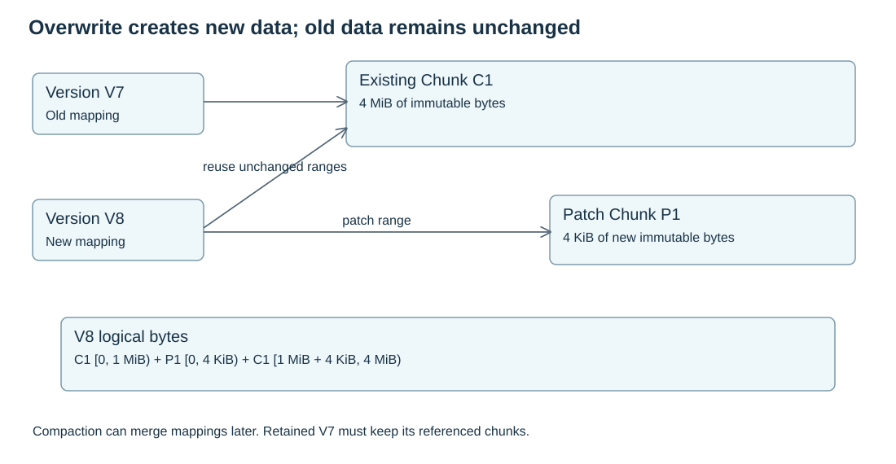

# Local Storage And COW

Local storage turns immutable chunk identities into bytes on a node disk.



## Chunk Finalization

A chunk is readable only after finalization:

```text
staged bytes
  -> length and digest verification
  -> durable data barrier
  -> no-replace publish
  -> local catalog update
  -> ReplicaAck
```

Meta may record a durable copy only after the node can later find and verify it.

## Layout COW

File updates create new layout records and file versions. A small overwrite creates a new chunk for the overwritten range and reuses old chunks for unchanged ranges.

```text
old: [0, 4MiB) -> chunk-a
write 4KiB at 1MiB
new: [0,1MiB) -> chunk-a
     [1MiB,1MiB+4KiB) -> chunk-b
     [1MiB+4KiB,4MiB) -> chunk-a
```

This keeps old versions valid and lets the inode head move to a new version.

## Physical COW

Physical COW moves an existing chunk between local locations, packs or media without changing its `ChunkId`. It first writes and verifies the new location, then switches the local record. Reader pins protect old locations until in-flight reads finish.

Physical COW does not create a new `FileVersion`.

## Corrupt Copies And Repair

A pinned file descriptor preserves a physical inode across rename. It does not prove that later disk reads remain intact. Each nonempty range read verifies the Chunk's length and digest, retaining the requested bytes from that same verification pass before returning them. gRPC verifies a bounded requested range once, then emits its frames; RDMA uses the same verified bytes.

Detected missing or corrupt local bytes enter the existing `Quarantined` catalog state through a durable catalog transaction. The publication lock protects a fresh physical-file recheck, so an old failed pin cannot quarantine a healthy replacement. Catalog persistence errors remain explicit; fallback can still return checksum-verified peer bytes, but no successful quarantine or report is inferred.

An authenticated Node reports only its own device's quarantined copy. Meta excludes that physical copy and records repair debt atomically with the exact idempotent operation outcome. The report carries the durable quarantine catalog revision; an older report cannot invalidate a replacement with a newer receipt revision. Unknown acknowledgements retain the exact request. A definitive rejection keeps local quarantine and is logged; it does not prevent unrelated repair tasks from progressing.

Repair writes the same expected Chunk content into a new file, syncs it, atomically replaces the bad physical inode, syncs the directory, and commits a new Durable catalog record before acknowledging. Reader pins continue to reference their original inode and must still verify it. The Chunk identity and file version stay unchanged.

No readable source produces `EIO` for the committed data range; it is not a sparse hole. `BlockedNoSource` records missing repair authority without declaring permanent data loss.

## Recovery

On restart, a node reconciles staged files, local catalog records and Meta copy records. Staged objects are not served. Catalog entries are useful only when they verify against the expected `ChunkObject`.

Missing or length-invalid local records are durably quarantined during recovery so they do not prevent service of healthy files. Same-length corruption is detected by digest verification when bytes are read. Quarantine survives restart and is reported again under the new Node session until Meta confirms it or a verified replacement restores the local copy.

The persistent device ID and device epoch survive a process restart. After catalog recovery, Node registration advertises that device and its recovered catalog revision. Meta can derive fresh read authority for an existing durable copy without rewriting its original receipt. A changed device identity, older recovered catalog or invalid Node session cannot acquire that authority. This recovery uses the existing registration and read-grant interfaces; file bytes do not pass through Meta.
