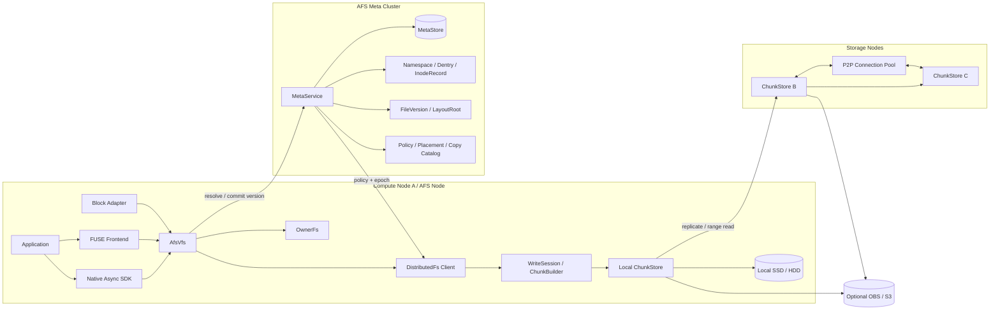
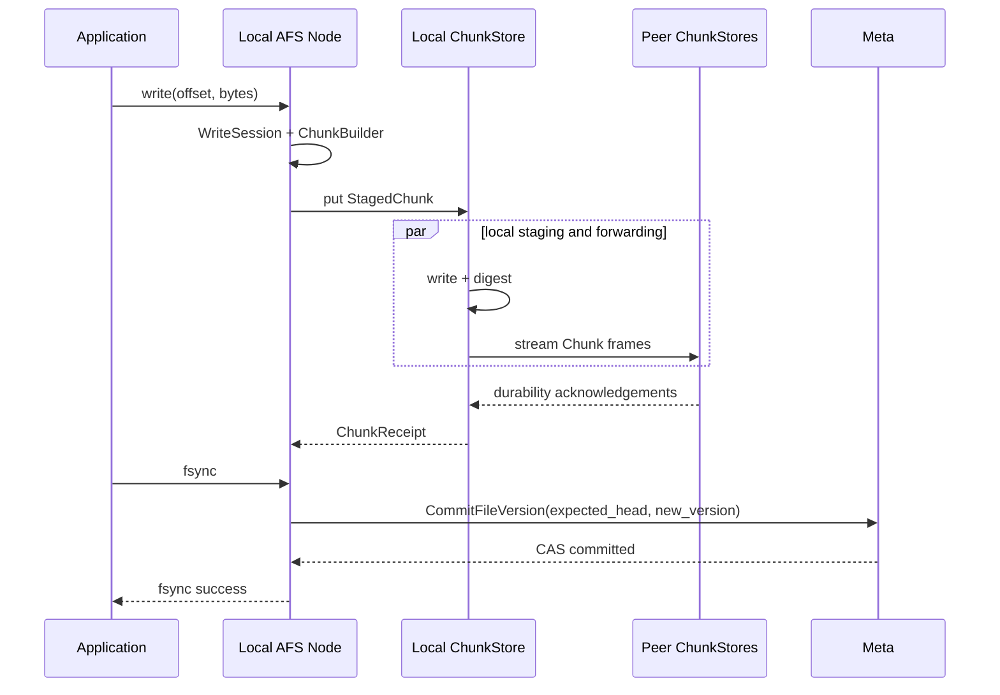

# AFS 架构总览

状态：Accepted Design
实现状态：Partial
产品合同：[产品定位](../product-positioning.md) · [架构原则](../../PRINCIPLES.md)

详细设计入口：[架构设计专题](design-topics.md)。专题一的数据模型已经 Accepted；其余专题仍处于 Research，不代表对应能力已经实现。

## 系统结构



Compute Node 与 Storage Node 可以同机或同进程部署，但逻辑边界保持独立。

## Meta 组件

Meta 保存和处理：

- Namespace、Dentry、InodeRecord、权限和租户；
- `InodeRecord.head_version` 的 CAS；
- FileVersion、LayoutRoot 和 Extent Tree；
- ReplicaGroup、DurabilityPolicy 和 PlacementEpoch；
- Durable Replica、Verified Cache 和 External Copy 的目录；
- Pin、Alias、RootManifest、配额和生命周期。

Meta 不负责：

- 转发文件内容；
- 参与每个 FUSE WRITE；
- 参与每个已解析 Chunk 的读取；
- 保存应用数据副本。

## Node 组件

AFS Node 与计算节点共置，承载：

- FUSE/VFS、Native SDK 和 Block Adapter；
- OwnerFs 与 DFS 请求路由；
- FileHandle、WriteSession 和 read-your-writes；
- ChunkBuilder、BufferPool 和本机 ChunkStore；
- 节点间复制、P2P Range Read 和连接池；
- 本机 Cache、Durable Target、Spill 和资源统计。

## DFS 数据模型

```text
Dentry
  -> InodeRecord
       -> head_version
            -> FileVersion
                 -> LayoutRoot / inline Extents
                      -> Extent[]
                           -> ChunkObject[]
```

可变对象：Dentry、InodeRecord.head_version、WriteSession、StagedChunk。
不可变对象：FileVersion、LayoutRoot/Extent Tree Node、ChunkObject。

## 写入数据路径



R=1 与 R=N 在 `ChunkStore::put` 以下分叉。文件布局层只消费满足策略的 ChunkReceipt。

## 固定版本的多源读取

```text
resolve path
  -> fix FileVersionId
  -> map range through LayoutRoot
  -> obtain ChunkIds
  -> select DurableReplica / VerifiedCache / ExternalCommitted
  -> read ranges in parallel
  -> verify Chunk identity and digest
```

读取过程中 FileHead 可以前进到新版本；当前请求仍只读取已固定的 FileVersion。

## OwnerFs 路径

```text
Home local access:
Application → FUSE → OwnerFs → local filesystem

Remote access:
Application → local FUSE → local Node → P2P → Home Node → local filesystem
```

OwnerFs 到 DFS 的转换由显式 Snapshot 触发。跨后端 rename 和 hard link 不提供隐式迁移语义。

## 接口层

| 入口 | 使用者 | 主要用途 |
| --- | --- | --- |
| POSIX/FUSE | 普通 Linux 应用 | 兼容性、目录和文件操作 |
| Native Async SDK | 数据加载器和高性能应用 | Batch Range、共享内存、异步完成 |
| Block Adapter | Firecracker 等 MicroVM | 固定基础版本和私有写层 |
| Runtime API | Sandbox 管理器 | Snapshot、Pin、Alias、Restore |
| Management API | 控制面和调度器 | Node、Home、Replica、容量和 Placement 查询 |
