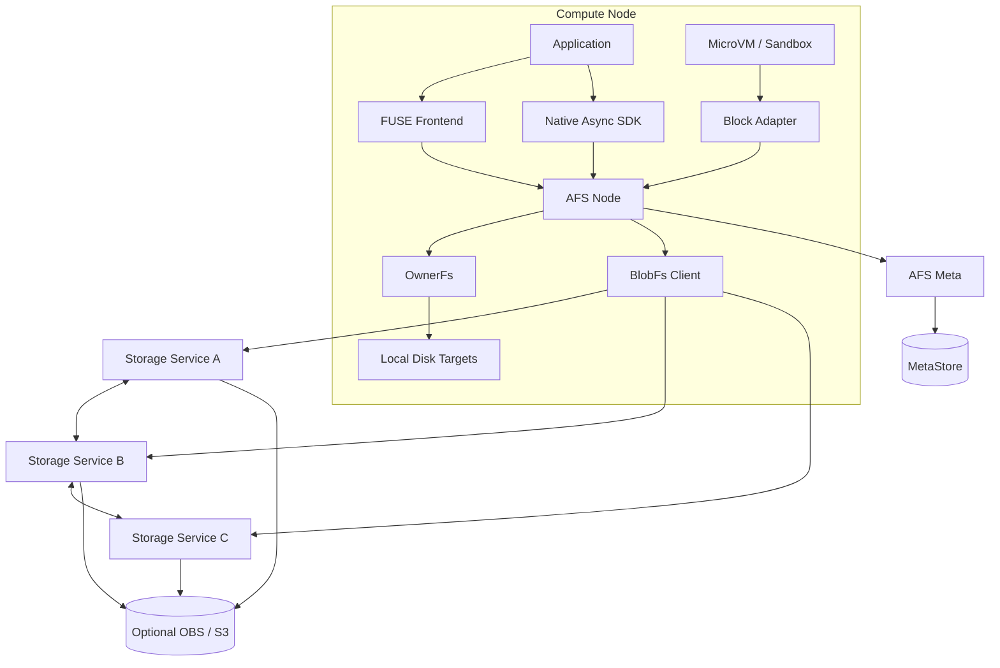
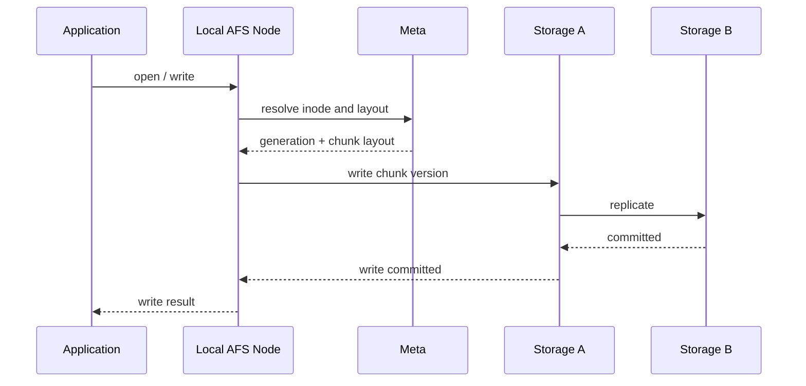
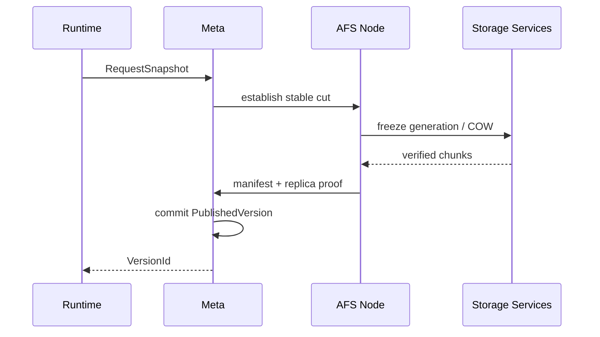

# AFS 架构总览

状态：Accepted Design
实现状态：Partial
产品合同：[产品定位](../product-positioning.md) · [架构原则](../../PRINCIPLES.md)

详细设计入口：[架构设计专题](design-topics.md)。六个专题处于 Research，不代表对应能力已经实现。

## 系统结构



## 组件职责

### AFS Meta

负责：

- Namespace、inode、dentry 和权限；
- 文件 layout 和 generation；
- Workspace Home；
- replica group、copy state 和外部位置；
- Snapshot、Version 和发布记录；
- tenant、quota、pin 和生命周期；
- 节点注册、故障域和 placement 输入。

不负责：

- 转发文件内容；
- 参与每个已解析 chunk 的读取；
- 保存应用数据副本。

### AFS Node

Node 与计算节点共置，承载：

- FUSE/VFS；
- Native SDK 本地入口；
- Block Adapter；
- OwnerFs；
- BlobFs 数据客户端；
- 节点间控制和数据传输；
- 本机缓存、持久 target 和资源统计。

### Storage Service

Storage Service 管理本地磁盘 target，提供：

- chunk/extent 读写；
- 副本协议；
- checksum；
- committed/pending version；
- scrub、repair 和 rebalance；
- 高低水位；
- spill 和 recall；
- 数据面 metrics。

一个 Node 进程可以与 Storage Service 同进程，也可以作为独立部署单元。外部协议不依赖具体进程拆分。

### OwnerFs

OwnerFs 为 1～4 节点 Workspace 提供 Home 本地普通文件路径。Meta 管理 WorkspaceRoot 和 Home，远端操作由 Node 发送到 Home。OwnerFs 不使用通用 BlobFs chunk 多副本写协议。

### Distributed BlobFs

BlobFs 将文件逻辑范围映射到 chunk/extent 和 replica group。客户端取得 layout 后直接访问 Storage Service。Mutable 与 Published Immutable Profile 共用数据引擎和资源体系。

## 控制面与数据面

```text
控制面：Client/Node → Meta → MetaStore
数据面：Client/Node → Owner Home 或 Storage Service
复制面：Storage Service → Storage Service
外部层：Storage Service → OBS/S3
```

控制面提交成功只表示元数据权威状态已确认。数据写入、复制、发布和外部提交各自具有独立完成条件。

## Mutable 文件路径



布局缓存有效时，后续数据 I/O 不逐次访问 Meta。

## Published Immutable 路径



发布后的读取可以从 DurableReplica 或 VerifiedCache 选择来源。P2P consumer 只有在完整校验后才能成为 seed。

## OwnerFs 路径

```text
Home local access:
Application → FUSE → OwnerFs → local filesystem

Remote access:
Application → local FUSE → local Node → P2P → Home Node → local filesystem
```

OwnerFs 到 BlobFs 的转换由显式 Snapshot/Promote 触发。跨后端 rename 和 hard link 不提供隐式迁移语义。

## 接口层

| 入口 | 使用者 | 主要用途 |
| --- | --- | --- |
| POSIX/FUSE | 普通 Linux 应用 | 兼容性、目录和文件操作 |
| Native Async SDK | 数据加载器和高性能应用 | batch range、共享内存、异步完成 |
| Block Adapter | Firecracker 等 MicroVM | 不可变基础磁盘和私有写层 |
| Runtime API | Sandbox 管理器 | Snapshot、Publish、Pin、Restore |
| Management API | 控制面和调度器 | Node、Home、replica、容量和 placement 查询 |
