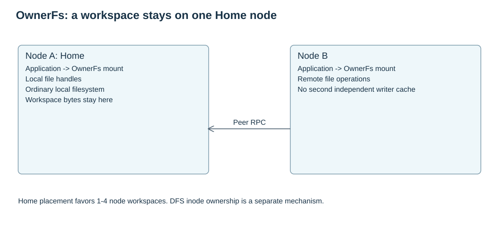

# OwnerFs

OwnerFs 面向小规模 Agent workspace。Home 节点把 workspace 保存为普通本地文件；当计算节点不在 Home 上时，远端节点通过 peer RPC 或数据传输回到 Home 访问这些文件。

## 适用范围

OwnerFs 优先服务以下场景：

- 一个 Agent workspace 的频繁小文件操作；
- 1 到 4 个节点的小集群；
- 主 Agent 和 workspace 尽量同址；
- 远端 worker 偶尔访问 Home 上的 workspace。

OwnerFs 不实现 DFS 的 chunk、副本、缓存或 spill 状态机。它可以复用 FUSE、传输和进程基础设施，但后端状态与 DFS 分离。

## 远端访问

远端节点打开、读写、flush、sync 和 close 文件时，Home 节点仍是权威执行者。远端会话必须绑定已认证 peer、root grant、调用进程 session、Home 进程 session 和 fence。传输会话本身不授予文件访问权限，每次文件操作仍要校验句柄、权限和授权范围。

当 RDMA 可用时，OwnerFs 可以把文件字节通过已注册 buffer 搬运；元数据和授权仍走控制 RPC。若 RDMA 传输的不确定性会影响数据正确性，不能静默退回 gRPC 并宣称成功。容量、校验和、授权、协议和未知写结果的错误必须向上返回。

## 持久化边界

OwnerFs 的持久性来自 Home 节点本地文件系统和 Meta 对 workspace 授权状态的持久化。普通写入成功不等于持久屏障；需要按 sync、flush、close-time barrier 和错误传播规则确认。若 sync 失败，后续写、truncate、flush 和 sync 必须继续暴露该错误，直到句柄释放。修复存储故障后，应重新打开句柄并重写未确认内容。

## Workspace bind mount

当前实际使用场景优先开启 OwnerFs workspace bind mount。该能力把 Home 上 workspace 的底层真实目录覆盖挂载到 OwnerFs FUSE 根目录下对应的一级目录，例如 `/ownerfs/agent1`。覆盖后，该 workspace 子树的新路径访问走底层文件系统；把 FUSE 目录自身 bind 到别处不满足此设计。

核心挂载实现属于 `src/node/vfs/ownerfs/bind_mount.rs`。该文件只负责挂载、身份核验和卸载：

- 输入必须是已授权的 Home source 描述符、OwnerFs root 描述符和一个已验证的 workspace 一级目录名；
- 记录目录、namespace 和 mount 身份；
- 默认带 `nosuid`、`nodev`；
- 只在仍能证明自己拥有该 mount claim 时正常卸载。

runc 或容器只是适配层。容器启动、执行、停止和探针配置不属于核心 bind 文件；Node 负责生命周期接线。

## 当前限制

bind 功能默认 OFF。ON 场景必须保留授权、Home/root/epoch 核验、数据新鲜度、close-to-open、权限、错误传播和卸载/排空约束。历史命名 `native_workspace` 只作为兼容配置入口存在，不能用改名掩盖行为差异。

当前 bind 历史八个小规模核心性能 case 可有限复用；新版本受影响部分仍需回归。完整功能、性能和交付状态见 [当前计划](../development/plan.md)。

混合 native/FUSE 同时 append、经典锁与 watch 传播当前不支持，原失败记录保留；本次官方 fuser 版本不承诺跨节点锁或等待取消；单挂载内核本地回退和 bind 本机锁属于不同锁域，不能作为分布式或混合锁通过证据。已有 native FD/mmap 的即时撤权和刷新不在当前保证内，变更身份或停止前必须先停止受管用户并排空引用。
