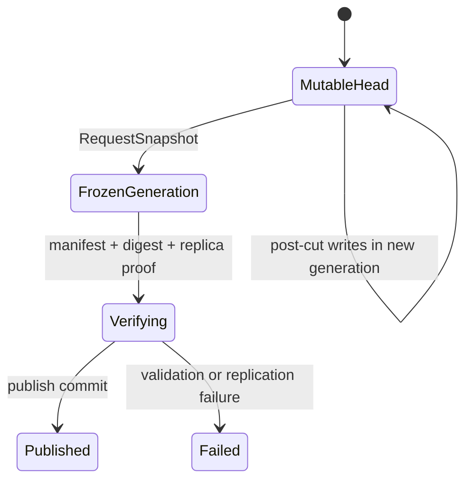

# AFS 数据 Profile

状态：Accepted Design
实现状态：OwnerFs Experimental；BlobFs Profiles Planned

## 结构

```text
AFS Namespace
├── OwnerFs Backend
│   └── 1～4 节点 Workspace
│
└── Distributed BlobFs Backend
    ├── Mutable Profile
    └── Published Immutable Profile
```

OwnerFs 是独立 Backend。Mutable 与 Published Immutable 是同一个 Distributed BlobFs 内的两个 Profile。

## 共用核心

Mutable 与 Published Immutable 共用：

- Namespace、inode、dentry、权限和租户；
- Meta 事务与幂等提交；
- 文件 layout、generation 和 extent map；
- Storage Service 与本地磁盘 target；
- chunk/extent 物理容器；
- placement、replica group 和故障域；
- TCP、RDMA 和共享内存 transport；
- checksum、scrub、repair、rebalance 和 drain；
- quota、pin、引用、GC 和 spill 账本；
- FUSE、Native SDK 和 Block Adapter；
- metrics、trace、审计和运维接口。

## Mutable Profile

### 适用范围

- 通用共享文件；
- 大文件写入；
- 多客户端读写；
- 需要 overwrite、append 或 truncate 的数据；
- 不适合放在单 Home 的规模化 Workspace。

### 数据身份

```text
FileId + Generation + ChunkIndex
```

可变 chunk 的正确性来自写入排序、副本协议和 committed version，不依赖内容哈希作为主身份。

### 状态机职责

- overlapping write 排序；
- append reservation；
- truncate 和 hole；
- file length；
- chunk committed/pending version；
- `fsync` / `fdatasync`；
- open handle、unlink 和 rename；
- cache coherence；
- writer lease/session；
- 修复中的读写行为。

## Published Immutable Profile

### 适用范围

- OCI 镜像；
- Nydus/EROFS/OverlayBD 数据；
- MicroVM 根磁盘；
- Agent Workspace Snapshot；
- Checkpoint；
- 模型、数据集和只读构建产物。

### 数据身份

```text
PublishedVersion
└── Manifest
    └── Logical Range → Content Digest / Chunk Version
```

### 状态机职责

- `RequestSnapshot`；
- Namespace 稳定切点；
- frozen generation；
- COW；
- manifest；
- digest；
- 发布门禁；
- P2P seed；
- 去重；
- pin/unpin；
- 热度和逐出；
- spill/recall。

## Mutable 到 Immutable



Snapshot 不原地 seal 活动 inode。稳定切点冻结一个 generation；后续覆盖写进入新 generation 或触发 COW。未修改 chunk 可以由活动文件和 Snapshot 共享。

## OwnerFs

### 适用范围

- 1～4 节点；
- 一体机式部署；
- Agent Workspace；
- 大多数操作发生在 Home；
- 调度器可以维持计算与 Home 亲和。

### 数据路径

- Home 使用本地普通文件系统；
- 本机访问不分 chunk；
- 远端访问回到 Home；
- Meta 管理 WorkspaceRoot、Home、授权和会话；
- Snapshot/Promote 显式生成 BlobFs 稳定版本。

### 边界

- Home 永久丢盘不自动由缓存接管；
- 不提供通用多副本写；
- 不提供跨大量节点聚合文件带宽；
- OwnerFs 与 BlobFs 之间的 rename/link 返回明确错误；
- 共享基础设施不合并两种后端的文件状态机。

## 入口选择

| 条件 | 推荐路径 |
| --- | --- |
| 1～4 节点 Agent Workspace，本地亲和明显 | OwnerFs |
| 通用共享可变文件 | BlobFs Mutable |
| 大文件跨节点并行 I/O | BlobFs Mutable + Native SDK |
| 镜像、Snapshot、Checkpoint | BlobFs Published Immutable |
| MicroVM 基础磁盘 | Published Immutable + Block Adapter |
