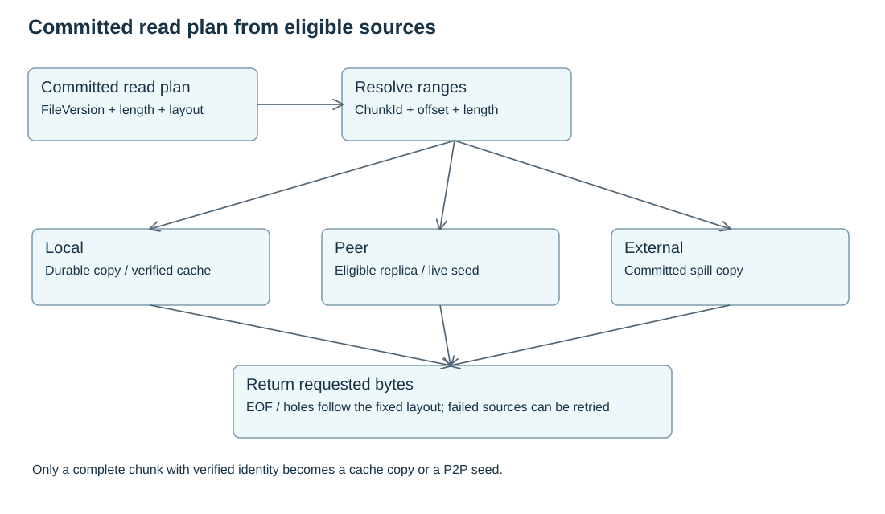

# Read, Cache And Spill

Committed read plans use immutable versions for source selection and data assembly. Ordinary file visibility follows [same-mount visibility and close-to-open](write-semantics.md); it does not pin every read-only handle until close. Stable chunks also support image lazy loading, checkpoint restore and dataset scans.



## Read Flow

1. Resolve the current file view, including local accepted dirty state when applicable; fix one committed `FileVersion` for each committed read plan.
2. Convert file offsets to chunk ranges through that version's layout.
3. Select eligible sources for each chunk range.
4. Read ranges from local durable replicas, peer replicas, verified cache or external committed copies.
5. Verify identity and assemble the user response.

A committed read plan never combines bytes using different version layouts. Changes in ordinary file visibility can produce a later plan; they do not mutate existing Chunk contents.

The [delivery scope](../acceptance.md) includes local/peer durable replicas and source retry. VerifiedCache, seed propagation and spill are outside this release.

## Source Types

| Source | Role |
| --- | --- |
| Durable replica | Counts toward durability when Ready |
| Verified cache | Can serve reads after full chunk verification; can be evicted |
| Seed lease | Temporary advertisement for a Ready durable or cache copy |
| External committed copy | Optional spill or cold source after verified commit |

Partial range verification can protect transfer integrity. A node becomes a seed only after it has a complete chunk and verifies the full digest.

## Cache

Verified cache is useful when many consumers read the same fixed chunks. Cache does not silently become durability. Promotion to durable replica requires placement and Meta commitment.

## Spill

External spill is optional. It can provide cold capacity, archive or disaster recovery after write, verification and Meta commit.

Open question Q2: the minimum spill durability contract is not fixed. An external committed copy does not automatically reduce the configured local durable replica requirement unless the filesystem defines that stronger external durability contract explicitly.

## Authorization Boundary

Peer range reads require both peer authentication and a read authorization decision for the fixed file version, layout and chunk range. Authorization is tied to the committed version and chunk range being served, so a peer cannot use a stale grant to read a different version.

Each source candidate carries a per-operation `DfsReadGrant`, binding namespace, file version, layout root, caller node identity and epoch, expiry, fence and token. A peer batch preserves those independent grants rather than sharing one grant across different chunks.

A durable copy records the process epoch that produced its receipt. A restarted Node can serve that copy through its current live process after recovering the same persistent device. Source selection and receiver validation derive the same serving location: the device ID and device epoch must match; when the process epoch advances, the recovered catalog revision must cover the original copy record. The stored receipt, copy record and placement are unchanged. New grants authenticate the current serving epoch, so an old process grant cannot authorize the replacement process. This does not grant new write authority. Each actual disk read still verifies the expected chunk identity; a missing or corrupt local object fails the read.

Receiver authorization caching retains the exact validated capability and covered ranges. Meta limits the authorization to the original grant, caller and receiver leases, and its five-second authorization window. The receiver limits local retention to five seconds using a monotonic deadline. It rejects expired, changed or overbroad replies; it does not require identical wall clocks on Meta and the receiver to accept a valid reply.

In the protobuf, `DfsReadGrant.caller_node_epoch` retains field 5. The former batch-level grant at `DfsReadRangesRequest` field 5 is reserved; each `DfsChunkReadOp` carries its own grant at field 7. Peers must use compatible protocol versions during a coordinated upgrade.

`PeerConnectionPool` is transport plumbing only. It may reuse lazy gRPC channels and enforce capacity, but grant validity remains with each read operation. Pool eviction, backpressure and production limits are operational policy, not authorization.

## Copy State

```text
Ready -> Deleting -> removed
  |
  v
Corrupt

LegacyStaging -> removed
```

- `Ready` durable copies can satisfy durability and can become read sources.
- `Ready` verified cache copies can serve reads and seed peers, but do not count as durable replicas.
- `Corrupt` copies fail identity verification and are removed from source selection.
- `Deleting` copies are no longer selected for new reads while in-flight reader pins drain.
- `LegacyStaging` is a decode-only compatibility state for old catalog entries; new code does not create or serve it.

Ordinary read failures can discover a bad durable copy without a pre-existing repair claim. The Node durably quarantines the local copy, then reports its own device identity and quarantine revision through Meta control RPC. Exact pending reports survive unknown acknowledgements. Meta changes the matching older copy to `Corrupt` and records repair debt in the same transaction; a newer verified replacement is protected from late reports. Healthy sources can repair the quarantined target through the existing replica write path. These transitions do not create a FileVersion.

When all eligible copies fail integrity checks, a read returns `EIO` and publishes no partial buffer or hole bytes. Transport and authorization failures keep their own error identities; inability to read is not automatically a claim of permanent data loss.

## Seed And Eviction

A node can advertise a seed only for a complete `Ready` durable copy or a complete verified cache copy. Seed leases expire or are withdrawn before eviction. Eviction is legal only when Meta can still find enough durable or explicitly accepted external copies for the configured policy. Cache pressure cannot delete the only valid source for a committed chunk.

## Batch Failure And Completion

Operations sharing a peer and fixed read context travel in one batch. Each operation retains its copy identity, grant and attempt identity. Missing, duplicate or inconsistent headers, bytes or completion frames fail the batch; partial scratch data never becomes an application result. If a combined batch fails, isolate its operations before abandoning a source that may still be valid for another chunk.

Connection reuse is keyed by node identity, epoch and endpoint, under one TLS configuration. A lower epoch cannot replace a newer accepted epoch. Read deadlines cover connection admission and the whole response stream. Wire limits bound batch operation count and total bytes; configuration cannot silently exceed them.
