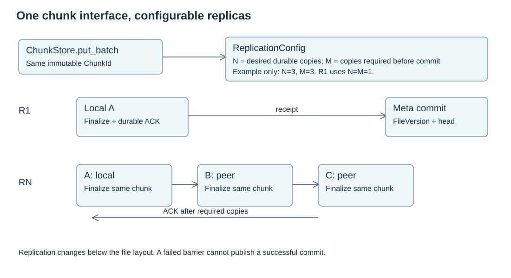

# Replication

Replication is below the file layout layer. Layout code asks for durable chunks and receives `ChunkReceipt` records. It does not know whether a receipt came from the local fast path or a multi-node replication path.



## Configurable Policy

Replica counts are configurable filesystem initialization policy, not hard-coded values.

```text
ReplicationConfig {
  desired_copies
  sync_required_copies
  min_distinct_nodes
  min_distinct_failure_domains
  local_copy
}
```

The base design treats this policy as stable for a filesystem instance. Per-inode dynamic policy revisions are intentionally outside the first contract.

## R=1 Local Fast Path

When the policy can be satisfied by one local durable copy, the writer finalizes the chunk locally and returns a receipt without peer data RPC.

## R=N Path

When the policy requires multiple synchronous copies, the writer derives a `ReplicationPlan` from Meta placement snapshots, sends the same chunk identity to peer targets, waits for enough `ReplicaAck` records and then returns a `ChunkReceipt`.

Each target still uses local chunk finalization: stage bytes, verify digest, make durable, publish, update local catalog and acknowledge.

## Evidence Records

| Record | Meaning |
| --- | --- |
| `ReplicaAck` | A target finalized one chunk copy on a specific device epoch and verified its digest |
| `ChunkReceipt` | The writer has enough acknowledgements to satisfy the synchronous policy |
| `CopyRecord` | Meta accepted a readable or recoverable copy into the catalog |
| `ReplicationTask` | Meta records async repair or extra-copy work |

Async repair can improve placement after a local-first success. It cannot retroactively make a weaker success mean a stronger synchronous durability contract.


## RPC Budget

The file layer batches work at sync boundaries, so the hot path is not one RPC per byte. The intended budget is:

| Case | Meta RPCs | Peer data RPCs | Notes |
| --- | --- | --- | --- |
| local-owner `write` | 0 | 0 | updates inode dirty state; remote-owner access adds one forwarding RPC |
| R=1 changed-data sync | 1 final commit | 0 | cached placement and valid lease; refresh/renew may add RPCs |
| R=N changed-data sync | 1 final commit | N-1 chain-link transfers per chunk, with batching | only replication below `ChunkStore` changes |
| read-only `open` | head lookup + version/layout lookup, up to 2 without cache | 0 | fixes one version for the handle |
| fixed-version peer read | 0 on valid source cache; source refresh otherwise | 1 range-read batch per selected peer/context | each operation retains its authorization |

The exact transport can be request/response, streaming, RDMA descriptors or another data-plane mechanism. The contract is that small data can be carried inline, while large data should move through a data path that avoids unnecessary copies and still returns the same receipt semantics.


## Peer Connection Reuse

Peer connection pooling belongs below replication and read planning. A pool can reuse channels and cap peer endpoints, but it must not cache authorization or file-version decisions. Those decisions stay with the `ReplicationPlan`, `DfsReadGrant` and per-operation request identity.

A no-change barrier can need zero Meta commits. A metadata-only full sync needs one metadata commit. Full sync following an unresolved data-only request may need the original request retry and then a metadata commit. These counts describe logical successful requests; transport retries reuse the exact operation identity and add attempts. Node-to-Meta control requests are separate from Node-to-Node byte transfers.
