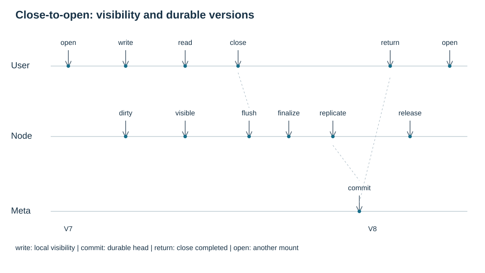

# Write Semantics

DFS separates ordinary visibility from recoverable durability. `write` changes the inode owner's dirty view. Explicit sync, synchronous write flags, close-time flush and background writeback can commit a recoverable file version. The default user contract follows JuiceFS: immediate visibility within one mount and close-to-open across mounts.



## User Contract

| Operation | Contract |
| --- | --- |
| `open` for read | Resolves a current file view; ordinary open is not a lifetime snapshot |
| `write` | Enters the inode owner's shared dirty state; other handles on the same mount, including previously opened read-only handles, can read accepted changes |
| read on the same write handle | Sees its own accepted writes through the owner dirty view |
| `fdatasync` | Commits file data, chunks, layout, length and inode head needed for recovery when there is dirty data |
| `fsync` | Includes `fdatasync`, then commits complete inode attributes such as `mtime` and `ctime` |
| `fsync(dir)` | Commits directory entries separately from file content |
| `flush` | Close-time error-reporting path: drains prior writes, satisfies the replica policy and commits data plus recovery-required metadata; repeated calls must be idempotent |
| `close` | Success makes completed writes durable under the configured policy and visible to subsequent opens on other mounts; a failure or timeout does not establish that guarantee |
| `release` | Releases the open-handle resources; it must not be the sole place to commit data or report commit failure |

After successful `close`, `fdatasync` or `fsync`, a subsequent `open` observes those completed changes or later committed changes. An already open reader on another mount is not promised immediate dirty visibility or a permanently pinned old version. Same-mount readers must observe local accepted writes through both the backend and FUSE/kernel caches.

A resolved committed read plan fixes one version, layout and chunk identity while selecting sources and assembling bytes. This internal coherence boundary is distinct from ordinary handle lifetime. If a barrier finds no dirty data or metadata, it can return without creating a new `FileVersion`.

The timeline shows a writer's `open`, `write`, same-mount `read`, and `close`, followed by a reader's new `open` on another mount. Node freezes and finalizes dirty data, obtains the required replicas, and asks Meta to commit before close returns. `V7` remains the committed head while dirty data is locally readable; `V8` becomes the recoverable head at Meta commit. Resource release follows the close-time flush; it is not the durability boundary.

## Sync Triggers

The user-visible triggers are POSIX barriers, close and open flags:

- `fdatasync(fd)` commits recoverable file data and the metadata required to find it again: chunks, layout, length and `head_version`.
- `fsync(fd)` does the same work and also commits complete inode attributes such as `mtime` and `ctime`. It still does not commit the parent directory entry; callers need `fsync(dir)` for that.
- `O_DSYNC` makes each accepted write wait for the data durability boundary before returning.
- `O_SYNC` makes each accepted write wait for the stronger file sync boundary before returning.
- `close(fd)` triggers FUSE flush of prior writes, including the data and metadata needed to reopen and recover them. Dup/fork can trigger multiple flushes before the final release; closing one descriptor must not discard another writer's state or create empty versions.
- Background writeback can freeze dirty state, finalize chunks and successfully commit a new `FileVersion`, including moving `head_version`. Applications cannot rely on when that happens; sync operations, sync write flags and successful close create caller-visible completion points.

## Node State

`InodeWriteState` is inode-owned, not handle-owned. It contains the base version, dirty extents, logical length, sequence numbers and pending error state. This lets multiple handles share one ordered current view.

All inode modifications are serialized by the inode owner. If a commit result is unknown, the precise request remains pending and later `write`, `resize` and `sync` operations for that inode are blocked until the result is recovered or failed. DFS does not start a next dirty batch in parallel behind an unknown commit.

### Retained State And Reopen

Closing the last writer can leave a reusable inode state on the node. That retained state is not proof that its lease or committed head is still current. A new writable open resolves the current owner through Meta; remote mutations are forwarded to that owner, including truncation performed before a file handle exists.

A local owner can adopt a fresh lease when its retained state has no protected writes or unresolved operation. Pending metadata can remain only when its committed inode revision and head still match. Dirty data, active writers and exact pending commits cannot be silently attached to another lease epoch.

A fresh readonly open revalidates the committed view. An inactive retained view can load the current version, layout and length together; a delayed older Meta response cannot replace a newer committed view. Observation does not rebind protected local write state or alter the identity of a pending commit. Same-mount readers continue to see the local dirty overlay while it is protected.

When a mount has a remote writable handle, same-mount reads and visible attributes reach that handle's inode owner to observe accepted dirty writes and their current length. A fully clean inactive local state cannot shadow that remote route. A write-only handle keeps its original access mode; the node retains a separate read-capable owner handle for same-mount readers and still rejects reads on the user's write-only handle. Data routing alone is insufficient: a committed length of zero can make the kernel return EOF before requesting any bytes. A handleless resize uses a temporary owner handle and a full sync before returning. Closing that temporary handle preserves the route for surviving writable handles. Provider replacement checks live handles and updates the route atomically; cleanup cannot restore an already closed handle or remove a newer route.


### Remote Open And Provider Lifetime

The caller assigns a nonzero admission sequence before contacting the owner. The identity includes both Nodes' process sessions and the inode/lease scope. Replaying an active admission returns the same owner handle; changing its request body is rejected. If the Open reply is lost, the caller retains that identity and uses the existing Release operation to cancel or retire it without requiring the missing opaque handle. Retirement rejects delayed Open replay.

Caller admission is serialized per caller-to-owner session route, so a later sequence cannot overtake an unresolved earlier admission. Owner replay state is bounded by live handles and per-route high-water marks; authoritative caller-session retirement removes the old route. An unknown Meta lookup does not prove retirement. Pending caller cleanup can also retire an old owner-session identity after Meta confirms that session is replaced or absent/expired. One bounded maintenance pass caches session evidence per owner Node; lookup errors retain and fairly rotate the exact debt. Retirement does not decrement reservations still held by live admissions.

A remote read provider admits reads and attribute requests through one shared lifetime guard. Close first stops new admissions and removes or replaces that exact provider, then waits for its admitted I/O before releasing owner handles. Replacement must still be live at publication. A fresh read cannot reuse a closing provider, and a reader already admitted can finish without its owner handle disappearing beneath the RPC. Network calls do not hold the provider or handle-table mutex.

The provider idle wait is bounded. If it times out, close reports the error and transfers its exact owner handles and shared lifetime guard to the bounded cleanup queue. The reservation becomes pending debt rather than disappearing. For the same live owner session, maintenance releases those handles only after admitted I/O drains. Authoritative owner-session replacement or expiry can retire the old identity; an unknown lookup retains it. A bounded provider wait does not by itself establish a total Node writeback or shutdown deadline.

## Commit Flow

```text
accepted writes
  -> InodeWriteState dirty ranges
  -> CommitBatch at a durability boundary
  -> ChunkObject creation and replica receipts
  -> LayoutRoot and FileVersion candidate
  -> Meta compare-and-set head_version
```

The file version number changes only at the Meta commit point. Chunks may already exist on nodes before the version is visible; without the Meta commit they are not the committed file head.


## Operation Uncertainty

A sync can reach a point where the node does not know whether Meta accepted the exact commit request. That result is not guessed. The inode keeps the operation identity as unresolved, returns or retries according to the caller contract, and blocks later `write`, `resize` and `sync` operations for that inode until recovery establishes whether the commit succeeded or failed.

Close-time flush follows the same uncertainty rule. Application timeout or descriptor release does not erase the pending request. Applications must check close errors; retrying close on a potentially released fd is unsafe. Reopen and validate the result or use application-level recovery when the outcome is unknown.

This rule prevents a later dirty batch from being ordered after an unknown version head. It also gives retry logic a precise idempotence key instead of relying on timeout interpretation.

## Node Shutdown

Shutdown closes FUSE request admission and waits for accepted callbacks before the final dirty drain. Background writeback can skip a busy inode; it cannot overtake an active commit or discard an unresolved request. The global inode table is not held while waiting for a single inode.

An incomplete drain is an explicit shutdown failure. A process deadline bounds termination without converting blocked disk work or an unknown Meta result into successful cancellation. Until termination, the exact pending identity and inode ordering remain protected. Recovery resolves committed metadata and durable chunks; an ordinary unsynced write is not an acknowledged durability watermark. Applications requiring persistence must check sync/close results before shutdown.

## Definite Rejection And Metadata

Timeout, transport failure and uncertain store persistence retain the exact pending request. A confirmed Meta validation or condition rejection stops this owner state from accepting further modifications; recovery must resolve the lease and committed head before writing resumes. Reopening a file is not itself owner recovery.

`fdatasync` may leave complete timestamp attributes dirty after committing recoverable data. `fsync` must complete that metadata phase even when retrying an older data-only request. Timestamps describe the accepted mutation time, rather than the later sync time. An unchanged file does not require a new version merely to complete a barrier.
