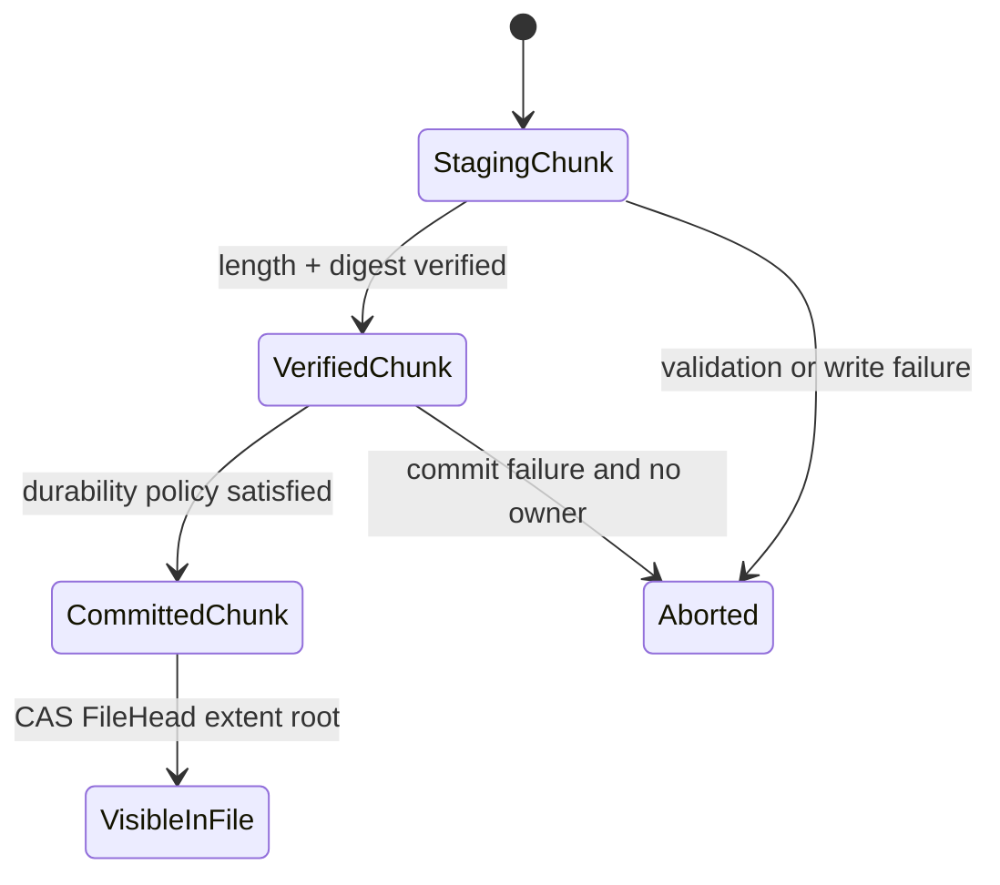
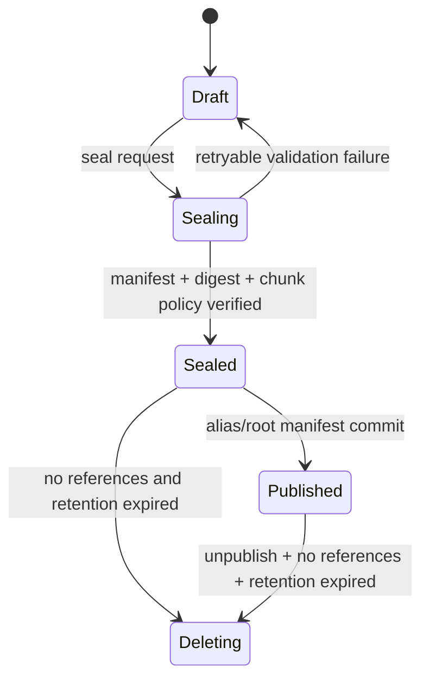

# RFC-0002：File、Blob、Chunk 统一数据模型

状态：Draft

作者：AFS contributors

目标 Milestone：M1

研究依据：[专题一](../architecture/01-file-blob-chunk-model.md)

权威原则：[PRINCIPLES.md](../../PRINCIPLES.md)

## 摘要

AFS 将 POSIX File 与不可变 Blob 建立在同一个 Extent/Chunk Store 上。File 是 Namespace 中具有稳定 FileId 的可变对象；Blob 是 sealed、可校验、可 range-read 的不可变逻辑字节对象。两者使用同一种 ExtentMap，并引用提交后不可变的 ChunkObject。Manifest 只保存稳定逻辑布局，副本和物理位置由独立 Copy Catalog 管理。

POSIX 是默认兼容入口。Runtime 和镜像工具可以选择 Native Blob API 执行并行摄入、seal、发布和范围读取。两个入口共享身份、授权、校验、placement、quota、GC 和 Storage Service。

## 用户 Case

### 通用可变文件

应用通过 POSIX 创建和修改文件。覆盖写提交新的 ChunkObject，并以 Extent overlay 原子更新 FileHead；路径与 FileId 不变。

### Workspace 或目录 Snapshot

Runtime 对 Namespace 取得稳定切点。被冻结的 FileHead 转换成引用相同 ChunkObject 的 BlobManifest；活动文件进入新的 FileGeneration 并继续 COW。

### 镜像与大对象直接摄入

镜像转换器并行写入 Blob Draft，seal 后得到不可变 Blob。多个沙箱按 range 从 DurableReplica、VerifiedCache 或 ExternalCommitted 读取，并校验 ChunkDigest。

## 目标

- 建立 File、Blob、Manifest、Extent、Chunk、Replica 和 Physical Position 的唯一层次；
- 让可变 POSIX 与不可变发布物共享同一数据事实源；
- 支持零数据拷贝的 Snapshot/Publish；
- 为 P2P 多源、校验、spill、clone 和 GC 提供稳定身份；
- 不把当前 transport、endpoint 或物理布局写入不可变 Manifest。

## 非目标

- 不在本 RFC 中确定 write/fsync/seal/publish 的完成级别；
- 不确定复制协议是 chain、quorum 还是异步策略；
- 不确定 Chunk/Extent 的最终大小参数和 compaction 算法；
- 不定义具体 protobuf、Rust struct 或磁盘编码；
- 不承诺跨租户去重。

## 术语

| 术语 | 定义 |
| --- | --- |
| File | POSIX Namespace 中的可变 regular inode |
| FileId | Meta 分配、跨路径和 Node 稳定的 File 身份 |
| FileGeneration | Snapshot、truncate 和 writer fencing 使用的数据分支 epoch |
| LayoutRevision | generation 内一次已提交 ExtentMap 状态 |
| Blob | sealed、不可修改、支持 range read 的逻辑字节对象 |
| PublishedVersion | 对 RootManifest/Blob 的命名、发布和可见性记录 |
| Manifest | 不含动态位置的规范化逻辑重建信息 |
| Extent | 文件逻辑范围到 ChunkObject 子范围或 HOLE 的映射 |
| ChunkObject | 提交后不可变的存储、校验、复制和回收数据单元 |
| Digest | 带算法标识的内容完整性证明 |
| Copy Catalog | ChunkObject 到 Replica/Cache/External copy 的动态位置与状态目录 |
| ReplicaGroup | Chunk 写入、读取、修复所使用的副本集合 |
| Chain | ReplicaGroup 的一种有序写入协议 |

## 外部语义

### POSIX

- 普通应用不需要 Blob API。
- File 可 overwrite、append、truncate、rename 和 unlink。
- `fsync` 不隐式产生 Blob，不隐式 seal，不隐式 publish。
- Published Blob 通过只读 Namespace 视图或 Block Adapter 暴露时不可原地修改。

### Native Blob API

API 语义形状为：

```text
BeginBlob -> DraftId
PutBlobPart(DraftId, offset, payload)
SealBlob(DraftId, expected_length, expected_digest?) -> BlobId
ReadBlobAt(BlobId, offset, length)
PublishAlias(name, expected_revision, BlobId | RootManifestId)
PublishFile(FileId, expected_generation, expected_revision) -> BlobId
```

API 不暴露 raw Chunk CRUD、Replica target 或 Physical Position。

单 Blob 发布使用 `Alias → BlobId`；目录树、镜像组合和多 Blob Snapshot 使用 `Alias → RootManifestId`。BlobRecord 与 BlobManifest 对每个 sealed Blob 必需；RootManifest 只在组合发布时存在。

## 数据模型

### FileRecord

```text
FileRecord {
  namespace_id
  file_id
  inode_revision
  attributes
  head: FileHead
}

FileHead {
  file_generation
  layout_revision
  logical_length
  extent_map_root
  layout_policy_id
}
```

### BlobRecord

```text
BlobRecord {
  namespace_id
  blob_id
  blob_digest
  logical_length
  manifest_id
  manifest_digest
  format_version
  dedup_domain_id
  source_ref?
  created_at
}
```

### Extent

```text
Extent {
  logical_offset
  logical_length
  kind: DATA | HOLE
  chunk_id?
  chunk_offset?
  chunk_digest?
}
```

Extent 必须按 logical offset 排序、互不重叠，并完整描述 `[0, logical_length)`；相邻可合并 Extent 应在 canonical Manifest 中合并。HOLE 不引用 Chunk。活动 FileHead 的 DATA Extent 可以只保存 ChunkId 并从 ChunkRecord 解析摘要；sealed BlobManifest 的 DATA Extent 必须内联 ChunkDigest 或强引用带摘要的不可变 ChunkRecord。

### ChunkObject

```text
ChunkObject {
  namespace_id
  chunk_id
  logical_length
  chunk_digest
  encoding
  format_version
  dedup_domain_id
}
```

ChunkObject 进入 committed 状态后不可修改。StagingChunk 不可被普通读取、Snapshot、publish 或 P2P seed 使用。

### CopyRecord

```text
PlacementRecord {
  chunk_id
  placement_epoch
  replica_group_id
  chain_version?
  durability_policy_id
}

CopyRecord {
  chunk_id
  placement_epoch
  copy_id
  node_id / external_provider
  node_epoch
  target_or_locator
  copy_state
  verified_digest
  catalog_revision
}
```

PlacementRecord 表达目标 ReplicaGroup、配置版本与 durability policy；CopyRecord 表达实际 copy。二者都不进入 BlobManifest。repair、rebalance、cache eviction 和 spill 只更新 Copy Catalog。

## 身份规则

1. `FileId`、`BlobId`、`ManifestId`、`ChunkId` 是不可复用的 opaque ID。
2. ID 不等同于路径、Node、slot、endpoint、裸指针或裸 hash。
3. `BlobDigest`、`ManifestDigest`、`ChunkDigest` 必须带算法标识。
4. Digest 用于完整性、P2P 匹配和可选去重；授权和生命周期以 ID 为主键。
5. 可选去重键至少包含 DedupDomain、算法、digest、length 与 encoding。
6. 默认不进行跨租户去重。
7. 所有 `Generation/Version/Epoch` 必须使用强类型全名，禁止协议中出现语义不明的裸字段。

## 不变量

1. FileHead 指向的 ExtentMap 是该 `FileGeneration + LayoutRevision` 的唯一可见逻辑布局。
2. BlobManifest 在 seal 后不可修改；内容变化生成新 BlobId。
3. committed ChunkObject 不原地修改；覆盖写生成新 ChunkObject 或引用已有等价对象。
4. Manifest 不包含 live endpoint、target-local position、RDMA key 或临时 URL。
5. Snapshot/Blob 必须 pin 精确 ChunkObject，不得读取“当前最新 Chunk”。
6. 未校验 StagingCopy 不可读取、不可发布、不可成为 seed。
7. Copy Catalog 变化不改变 BlobDigest 或 ManifestDigest。
8. File 与 Blob 共享 ChunkObject 时，任一上层对象删除都不能提前删除仍被引用的 Chunk。
9. `fsync` 与 `seal/publish` 是独立操作。
10. R=1、R=N、VerifiedCache 和 ExternalCommitted 改变可靠性与位置，不改变逻辑数据身份。
11. 已提交 ExtentMap root 及其可达节点不可原地修改；FileHead 只通过新 root 切换可见布局。
12. LogicalRef 与 CopyLiveness 是两套账本；copy 数量变化不创建或删除逻辑内容引用。

## Revision 推进规则

| 操作 | FileGeneration | LayoutRevision | InodeRevision |
| --- | --- | --- | --- |
| overwrite / append | 不变 | `+1` | 按属性变化决定 |
| chmod / chown 等纯属性修改 | 不变 | 不变 | `+1` |
| truncate shrink / extend | `+1` | 新 generation 初始值 | `+1` |
| snapshot / freeze | 活动 Head `+1`，冻结视图不变 | 新 generation 从共享 root 开始 | 按 Snapshot 合同决定 |
| writer fencing / session reset | 仅需切断旧 writer 时 `+1` | 新 generation 初始值 | 不一定变化 |

## 状态机

### File 写入



### Blob 生命周期



## 调用路径

### POSIX overwrite

```text
FUSE/SDK
→ resolve FileId and expected FileHead
→ write StagingChunk to Storage
→ verify and commit ChunkObject
→ build extent overlay
→ Meta CAS FileHead(LayoutRevision, ExtentMapRoot, length)
→ return according to the completion level defined by the write-semantics RFC
```

### File Snapshot

```text
Runtime RequestSnapshot
→ Meta freezes exact FileHead/Namespace cut
→ active writer moves to a new FileGeneration
→ build BlobManifest/RootManifest from frozen ExtentMapRoots
→ verify ChunkObject identities and durability proof
→ seal Blob(s)
→ publish RootManifest
```

### Blob range read

```text
resolve BlobId
→ verify ManifestDigest
→ map logical range to Extents/ChunkIds
→ resolve Copy Catalog
→ choose DurableReplica / VerifiedCache / ExternalCommitted
→ read and verify ChunkDigest
```

## 并发与幂等

- FileHead 更新使用 `expected FileGeneration + expected LayoutRevision` CAS；CAS 冲突是内部并发控制，普通 POSIX write 必须由实现重读后重放 extent overlay 或通过 writer ordering 串行化。
- 数据写入携带 OperationId 和 OperationDigest；响应丢失后查询同一操作结果。
- 相同 ChunkId 只能提交相同 length、digest、encoding 和 DedupDomain；冲突必须失败。
- Snapshot 固定精确 LayoutRevision，之后的 write 进入新 generation 或新 revision，不修改已冻结 Manifest。
- PublishedAlias 更新使用 expected alias revision，避免并发发布覆盖。

## 故障矩阵

| 故障点 | 可见状态 | 恢复动作 | 用户结果 |
| --- | --- | --- | --- |
| StagingChunk 写入中断 | FileHead/Blob 不引用它 | 按 OperationId 续传或清理 | write/seal 失败或重试 |
| Chunk 已提交，FileHead CAS 失败 | orphan/reusable committed Chunk，不可见 | 内部重读 Head 并重放 overlay，或按策略序列化；无法继续时返回明确 POSIX errno | 不暴露布局 CAS 冲突，不产生可见半写 |
| Snapshot 已冻结，Manifest 未 seal | 活动 File 可继续；Snapshot 不可见 | 重建 Manifest 或 abort | publish 未成功 |
| Blob sealed，Alias commit 响应丢失 | Blob 不变；Alias 结果未知 | 按 OperationId/alias revision 查询 | 返回确定结果 |
| Replica rebalance 中断 | Manifest 不变 | Copy Catalog 继续 repair | 从其他合格 copy 读取 |
| external spill 成功，Catalog 提交失败 | 外部 orphan，不作为逐出依据 | 对账后登记或删除 | 本地可靠副本保持 |

## 安全与隔离

- File/Blob/Chunk 的授权以 Namespace/Tenant 和 opaque ID 共同校验；知道 digest 不等于拥有读取权限。
- DedupDomain 默认不跨租户；实现不得通过去重命中泄漏对象存在性。
- Manifest 和 Chunk 必须校验 schema、范围、长度、digest 和资源上限。
- Copy locator、external credential 和 RDMA capability 不写入长期 Manifest。

## 引用与 GC

- `LogicalRef` 只由当前 FileHead、retained snapshot、Manifest 所有权边和 explicit pin 产生。
- PublishedAlias/Version 是命名根；RootManifest、BlobManifest 与 ChunkObject 通过所有权边可达，不重复计为多份根。
- `CopyLiveness` 独立管理 DurableReplica、VerifiedCache、ExternalCommitted 和在途 copy，不改变逻辑引用。
- 删除顺序固定为：移除命名根 → 事务性更新 Manifest/Chunk LogicalRef → 等待 lease/in-flight 保护窗口 → 按 durability policy 回收 Copy。
- 后台 reconciliation/mark-and-sweep 必须能从命名根重建可达集合，并校验增量引用账本。

## 可观测性

- FileHead CAS success/conflict、Extent count/overlay depth；
- Staging/Committed/Orphan Chunk 数量和字节；
- Blob seal/publish latency 与失败原因；
- Manifest size、depth、canonicalization time；
- logical/physical/cache/external bytes；
- Chunk ref count、GC queue、reconciliation mismatch；
- range read 的 copy source、digest failure 与 fallback。

## 兼容性

- 所有 Manifest、Extent、ChunkRecord 必须带 format/schema version；
- Digest 必须带 algorithm，Reader 支持滚动升级期间的旧算法；
- Copy Catalog 与 Manifest 独立升级；
- 当前 `BlobMeta` 占位协议不构成兼容承诺，实施时可替换字段；
- 本 RFC 若接受，需要澄清 `PRINCIPLES.md` 中 Blob 的定义：Blob 是不可变逻辑字节对象，Chunk 才是存储与复制数据单元。

## 备选方案

### 3FS 式可变逻辑 Chunk

优点是固定公式寻址、元数据少、覆盖写直接。未采用为统一模型，因为 Snapshot、跨对象共享、P2P 内容身份和 GC 仍需额外版本层。3FS 的 stripe/chain 和高性能传输仍可作为 placement/replication 参考。

### ChunkId 等于内容 hash

优点是天然内容寻址。未采用，因为授权、生命周期、算法迁移、编码和租户去重策略会与内容身份绑定。AFS 保留单独 Digest 和可选内容索引。

### File/Blob 两套 Store

未采用。它会复制 placement、repair、spill、quota、copy state 和 GC。

### Manifest 包含 replica location

未采用。位置变化会导致不可变内容身份变化，也会把瞬时 capability 泄漏到长期元数据。

## 验收标准

- 功能：同一 ChunkObject 可同时被 FileHead 和 BlobManifest 引用；覆盖 File 后旧 Blob 仍读出原内容。
- 并发：两个 POSIX writer 竞争更新 FileHead 时，内部 CAS 冲突不会作为布局错误泄露给应用，也不会产生可见半写。
- 故障：Chunk commit 与 FileHead/Publish commit 任一阶段中断均可对账，不产生可见半状态。
- 性能：顺序大对象 Manifest 可压缩为 Chunk run；随机覆盖不要求重写整文件；同一文件连续 N 次 4 KiB 覆盖后的读取放大、Extent depth 和 compaction debt 必须有上限或明确降级策略。
- 运维：可以从任一 FileId/BlobId 追到 Extent、Chunk、Copy state、引用和 GC 状态。
- 兼容：Manifest 中不存在 live endpoint 或物理 slot；schema/digest 可版本化。

## 未决问题

- Chunk/patch 的默认尺寸和 compaction 阈值；
- ExtentMap 的持久树结构与分片上限；
- 默认强摘要算法和 canonical serialization；
- 小文件 inline/packing；
- BlobManifest 的复制与缓存策略；
- 首版 ReplicaGroup 是公式映射还是显式 placement record。
