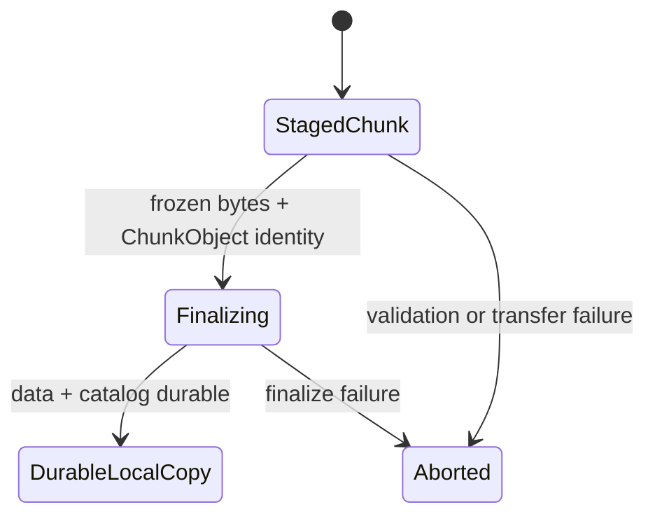
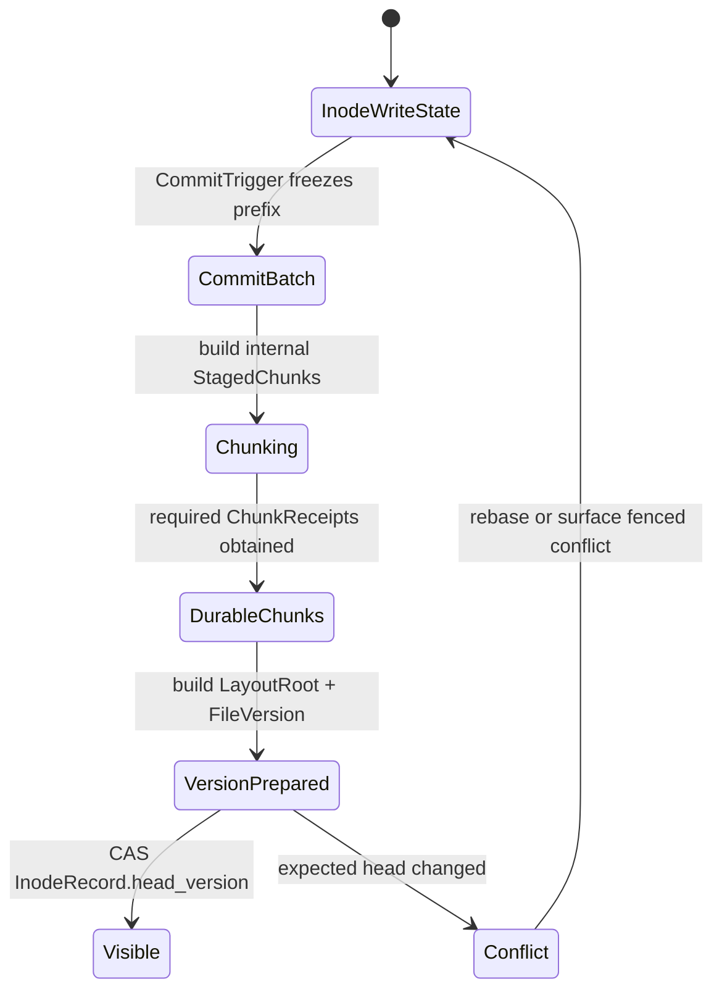

# RFC-0002：FileVersion、Extent 与 Chunk 数据模型

状态：Accepted
目标 Milestone：M1
研究依据：[专题一](../architecture/01-file-version-chunk-model.md)
产品合同：[PRINCIPLES.md](../../PRINCIPLES.md)

## 摘要

DistributedFs 使用不可变 Chunk 作为数据基座。可变 InodeRecord Head 指向不可变 FileVersion；FileVersion 通过不可变 LayoutRoot/ExtentMap 引用不可变 ChunkObject。普通文件和不可变优化负载使用同一模型，不引入必需的 BlobRecord、BlobManifest 或 Blob API。

## 适用范围

本 RFC 固定：

- InodeRecord、FileVersion、LayoutRoot、Extent 和 ChunkObject 的关系；
- StagedChunk 携带 ChunkObject 身份并 finalize 为持久副本的生命周期；
- R=1/R=N 在 ChunkStore 层的分界；
- FileVersion CAS 的可见点；
- FileVersion length、Extent 边界和隐式 Hole；
- 多源读取的数据身份；
- Pin、Alias 和 RootManifest 的可选位置；
- Meta 与 Node 的数据边界。
- OwnerFs 与 DFS 使用独立 mount 和 FuseSession，但复用 FUSE 模块代码与 Backend 接口。

本 RFC 不固定：

- 多 Writer、Append、Lease 和跨节点即时可见性的协议细节；这些合同由 [RFC-0003](0003-write-visibility-durability.md) 固定；
- Chunk、Patch、Extent Tree 和 Compaction 的具体参数；
- Replication Chain 的完整状态机；
- FUSE、SDK 和 RDMA 的 wire schema；
- Spill Provider 的实现。

## 外部语义

1. 应用通过 POSIX 文件接口创建、读取和修改文件，不需要对象 API。
2. 普通 write 进入 inode owner 的 InodeWriteState，不修改 committed FileVersion；同步或后台 CommitTrigger 才冻结写入前缀并提交新版本。
3. `fsync` 不自动 Pin、不创建 Alias、不创建多文件 Snapshot。
4. Snapshot/Pin/Publish 引用已经提交的精确 FileVersionId；多文件一致视图使用 RootManifest。
5. 已固定的 FileVersion 可以从多个通过校验的 Copy 并行读取。
6. 文件后续提交产生新 FileVersion，不修改旧版本和旧 Chunk；write 返回与版本提交是不同完成边界。

## 持久模型

```text
Dentry -> InodeRecord.head_version -> FileVersion
                                  -> LayoutRoot / inline Extents
                                  -> Extent[]
                                  -> ChunkObject[]
```

### InodeRecord

```text
InodeRecord {
  namespace_id
  inode_id
  inode_revision
  kind
  attributes
  link_count
  head_version_id?
}
```

### FileVersion

```text
FileVersion {
  version_id
  inode_id
  parent_version_id?
  length
  inline_extents? / layout_root_id?
  content_digest?
  created_at
}
```

### Extent

```text
Extent {
  file_offset
  length
  chunk_id
  chunk_offset
}
```

Extent 只记录 DATA。`[0, FileVersion.length)` 内未被 Extent 覆盖的范围是隐式 Hole，读取返回零且不创建零数据 Chunk。Extent 必须按 file offset 有序、不重叠，并完全位于 FileVersion length 以内。

### ChunkObject

```text
ChunkObject {
  chunk_id
  logical_length
  digest_algorithm
  digest
  encoding
  format_version
  dedup_domain_id
}
```

ChunkId 的规范化内容键至少包含 DedupDomain、算法、Digest、长度和 Encoding。默认不跨租户去重。授权仍以 Namespace、Inode/FileVersion 可达性和调用者身份决定。

### RootManifest

```text
RootManifest {
  root_manifest_id
  entries: Path -> InodeKind / FileVersionId
  format_version
  digest
}
```

RootManifest 只用于多文件一致视图。单文件不需要额外 Manifest；FileVersion 与 LayoutRoot 已经完整描述其内容。

### Placement 与 Copy

```text
PlacementRecord {
  chunk_id
  placement_epoch
  replica_group_id
  durability_policy_id
}

CopyRecord {
  chunk_id
  copy_id
  role
  node_id / external_provider
  node_epoch
  locator
  verified_digest
  catalog_revision
}
```

Placement 和 Copy Catalog 不进入 FileVersion 或 LayoutRoot。位置变化不能改变逻辑内容身份。

## 状态机

### Chunk 生命周期



### 文件版本提交



Chunk 已成功而 Head CAS 最终失败时，ChunkObject 保持完整但不可达，进入安全期后的 Orphan GC。实现不能产生只引用部分新 Chunk 的可见 FileVersion。

## 不变量

1. InodeRecord 的 `head_version_id` 是当前内容的唯一权威指针。
2. 已提交 FileVersion 不可修改；新内容产生新 VersionId。
3. 已提交 LayoutRoot 及其可达 Extent Tree Node 不可修改。
4. ChunkObject 身份一经确定不可修改；同一 ChunkId 只能对应同一规范化内容。只有完成 finalize 的本地副本才能产生 ReplicaAck。
5. StagedChunk 不可被 FileVersion、读取、Snapshot、Cache Seed 或 Repair 使用。
6. FileVersion 的 DATA Extent 按文件偏移有序、不重叠且不越过 `[0, length)`；未覆盖区间是隐式 Hole，读取返回零。
7. Hole 不创建 ChunkObject；文件逻辑长度与实际分配字节数是不同指标。
8. Copy Catalog、Repair、Rebalance、Cache Eviction 和 Spill 不改变 FileVersion 或 ChunkId。
9. R=1、R=N、VerifiedCache 和 ExternalCommitted 只改变可靠性和位置，不改变逻辑数据身份。
10. 多源读取必须固定一个 FileVersionId，并验证每个 Chunk 身份和摘要。
11. Cache Copy 不自动成为 Durable Replica。
12. FileVersion、Pin、RootManifest 与 in-flight lease 构成逻辑可达根；Copy 数量不等同于逻辑引用数量。
13. 普通 write 不修改 FileVersion 或 `InodeRecord.head_version`；只有 Meta CAS 可以发布新版本。
14. DirtyExtentMap 属于 Node 运行时状态，不是可持久引用的 Mutable FileVersion。
15. StagedChunk 只存在于 CommitBatch 和 ChunkStore 内部，不进入 Meta UML 或公开 API。
16. Shrink 后再次 Grow 不得让新版本重新暴露已被截断的旧 Extent；新增范围必须表现为 Hole。

## R=1 与 R=N 边界

文件层使用统一接口：

```text
ChunkStore::put_batch(Vec<StagedChunk>) -> Vec<ChunkReceipt>
```

- R=1：本机 staging、校验、介质提交、Finalize；
- R=N：本机作为优先 Chain Head，接收、落盘和转发流水执行；
- ChunkReceipt 证明当前请求满足策略；
- FileVersionManager 不知道副本数量、Chain 顺序和 Repair 细节。

不可变 Chunk 已经可以作为未引用对象存在，FileVersion CAS 又是文件可见点，因此基础协议不增加第二轮 Chunk Visibility Commit。

## RPC 合同

1. 每个 FUSE WRITE 不访问 Meta。
2. 每个 Chunk 不同步查询路由；PlacementPolicy 和 Epoch 按 Session 或批次缓存。
3. Client 不向所有副本 Fan-out；ReplicationEngine 负责副本协议。
4. PeerConnectionPool 复用连接，Chunk 操作使用长连接上的 Frame。
5. Cache Copy 异步批量登记，不阻塞读取返回。
6. 一个可见性批次只执行一次 FileVersion CAS。
7. 指标分别记录连接建立、逻辑操作、Meta 事务和 Data Hop。

## 失败合同

| 故障点 | 可见状态 | 恢复 |
| --- | --- | --- |
| StagedChunk 传输中断 | Head 不引用 | 按 OperationId 续传或清理 |
| 副本 Finalize 结果未知 | Head 不引用 | 幂等查询或重复 Finalize |
| Chunk 满足策略，Head CAS 冲突 | 旧版本仍可见 | 重放 Overlay；不用时进入 Orphan GC |
| Head CAS 响应丢失 | 结果未知 | 按 OperationId/InodeRevision 查询 |
| Replica 丢失 | FileVersion 不变 | 从合格 Copy Repair |
| Spill 成功、Catalog 提交失败 | 外部 Orphan | 对账后登记或删除，本地可靠副本不逐出 |

## 模块合同

### Meta

- Namespace/Dentry/InodeRecord；
- WriteLease 的 owner 与 fencing epoch；
- FileVersion 和 LayoutRoot；
- Head CAS；
- Policy、PlacementEpoch 和 Copy Catalog；
- Pin、Alias、RootManifest 和 GC Roots。

### Node

- 共享 `fuse` 模块代码；OwnerFs 和 DFS 各自建立独立 mount、FuseSession、inode/handle table 与缓存策略；
- `DistributedFs`、`DfsFileHandle`、`DfsWriteSession`、`InodeWriteState` 与 `DirtyExtentMap`；
- CommitBatch、ChunkBuilder、BufferPool 和 ChunkStore 内部的 StagedChunk；
- ChunkStore、ReplicationEngine 和 PeerConnectionPool；
- Cache、Spill、Integrity、Compaction 和 Repair 执行。

OwnerFs 只复用 FUSE/Backend 接口和公共连接工具，不进入 DFS 的 FileVersion、Extent、Chunk 与 DfsWriteSession 状态机。当前阶段不设计 OwnerFs 到 DFS 的 Snapshot 转换。Meta 不转发内容；Node 不独立决定 Namespace 权威状态。

## 备选方案

### 独立 BlobRecord 与 BlobManifest

拒绝。FileVersion 与 LayoutRoot 已经描述不可变单文件内容；增加 Blob 会复制身份、生命周期、Manifest 和 API。业务发布通过 Pin、Alias 和 RootManifest 完成。

### FileVersion 和 ExtentMap 原地修改

拒绝。原地修改会破坏并发读取、Snapshot、结构共享和多源一致性。

### 每次覆盖重写完整 Chunk

不作为唯一机制。顺序大写可使用完整 Chunk；小范围写使用普通小 Chunk 和 Extent Overlay，并以 Compaction 限制长期代价。

### Client 并行 Fan-out 到所有副本

拒绝。它把 ReplicaGroup、重配置、重试和连接管理泄漏到文件层。ReplicationEngine 可以在专题三比较 Chain 与内部并行 Fan-out，但接口保持统一。

### FileVersion 内联所有 Extent

只用于小文件。大文件使用持久化 Extent Tree，否则 Range Lookup、版本创建和小范围 COW 会产生线性元数据开销。

## 验收标准

- 顺序写：10 MiB 文件可以由多个 FUSE WRITE 聚合为三个示例 Chunk，并一次提交 FileVersion。
- 随机写：4 KiB 覆盖不重写整个文件，旧 FileVersion 仍能读出原内容。
- 副本：R=1 与可配置 R=N 使用相同文件布局接口，副本策略只由 DurabilityPolicy 和 ChunkReceipt 表达。
- 多源读：固定 FileVersion 的多个 Chunk 可以从不同 Peer 读取并通过摘要校验。
- 故障：Chunk 完成与 Head CAS 任一阶段中断都不会产生半个可见版本。
- RPC：普通 WRITE 不访问 Meta；每个可见性批次最多一次 Head CAS；Peer 连接可复用。
- 运维：可以从 InodeId 追踪 Head、FileVersion、Extent、Chunk、Copy 和 GC 状态。

## 后续 RFC 输入

- RFC-0003 已固定 write/flush/fdatasync/fsync/O_SYNC、WriteLease 与跨节点可见性；
- 多 Writer、Lease、Append 和 truncate；
- R=1/R=N、Chain 重配置和 result-unknown；
- Chunk/Patch 大小、Extent Tree、Compaction 和 GC；
- P2P、Cache、Spill 和 Native SDK。
