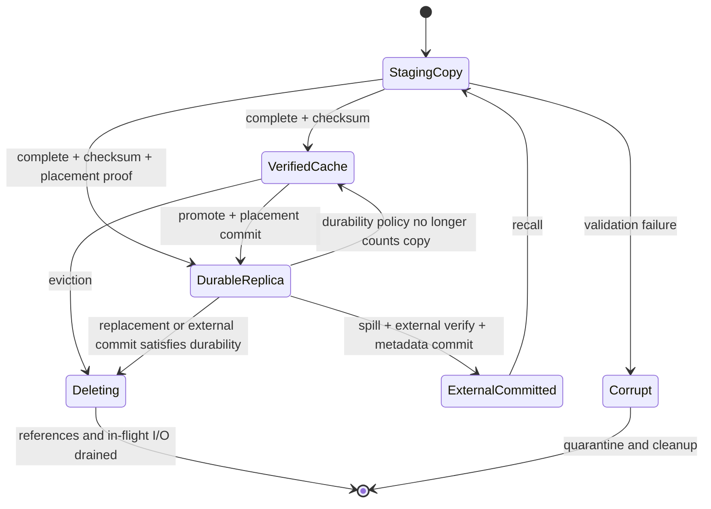

# 数据副本与缓存状态

状态：Accepted Design
实现状态：Planned

## 目的

集群本地磁盘相对于 OBS/S3 可以整体视为近计算缓存层。AFS 内部必须记录每份数据的正确性角色，确保未完成数据不会被读取、发布或计入可靠性。

## 状态

| 状态 | 含义 | 可读取 | 可成为 seed | 计入本地可靠副本 | 可作为逐出依据 |
| --- | --- | ---: | ---: | ---: | ---: |
| `StagingCopy` | 接收、复制或校验尚未完成 | 否 | 否 | 否 | 否 |
| `VerifiedCache` | 完整且校验通过的可淘汰本地缓存 | 是 | 是 | 否 | 否 |
| `DurableReplica` | 位于合格故障域的持久本地副本 | 是 | 是 | 是 | 是，仍须满足策略 |
| `ExternalCommitted` | 已在 OBS/S3 等外部层持久提交 | 是 | 作为回源 | 按策略计入 | 是 |
| `Deleting` | 已从布局移除，等待引用和在途 I/O 清空 | 仅已有引用 | 否 | 否 | 否 |
| `Corrupt` | checksum 或介质校验失败 | 否 | 否 | 否 | 否 |

## 状态转换



`ExternalCommitted` 表示外部副本状态，不要求删除本地副本。一个 chunk 可以同时拥有多个 `DurableReplica`、多个 `VerifiedCache` 和一个或多个外部位置。

## 发布门禁

PublishedVersion 的每个必需数据单元都必须满足策略：

```text
verified manifest
AND verified data identity
AND required local durable replicas or accepted external durability
AND placement across required failure domains
AND metadata publication commit
```

`StagingCopy` 和 `VerifiedCache` 不满足本地持久副本数量。发布策略可以显式接受外部层作为耐久来源，但不能静默降低级别。

## P2P seed 门禁

节点只有在以下条件全部成立时才能 announce：

- 版本身份确定；
- piece 完整；
- digest 校验通过；
- 本地文件已原子进入可读状态；
- tenant 和授权允许对外服务；
- 节点未进入 drain 或高压拒绝状态。

seed 身份不等于持久副本身份。`VerifiedCache` 可以成为 seed，但仍可按缓存策略淘汰。

## Spill 门禁

从本地持久副本逐出数据需要：

1. 外部对象写入完成；
2. 长度和 digest 校验通过；
3. 外部位置与版本身份提交到 Meta；
4. 剩余本地副本和外部副本满足 durability policy；
5. pin、引用和在途 I/O 允许逐出；
6. 删除操作可重试且幂等。

活动 Mutable head 不直接按对象存储覆盖语义 spill。首选冻结 generation，再把稳定数据写入外部层。

## 故障规则

- 复制中断：`StagingCopy` 不可见，恢复或清理。
- 校验失败：进入 `Corrupt`，不得自动 promote。
- 外部写成功但 Meta 提交失败：本地副本保持，外部对象作为 orphan 对账。
- Meta 提交成功但客户端响应丢失：幂等查询返回已提交结果。
- seed 退出：客户端选择其他 VerifiedCache、DurableReplica 或外部回源。
- 本地空间不足：拒绝新 staging、触发安全逐出或将稳定数据 spill；不删除唯一事实源。
