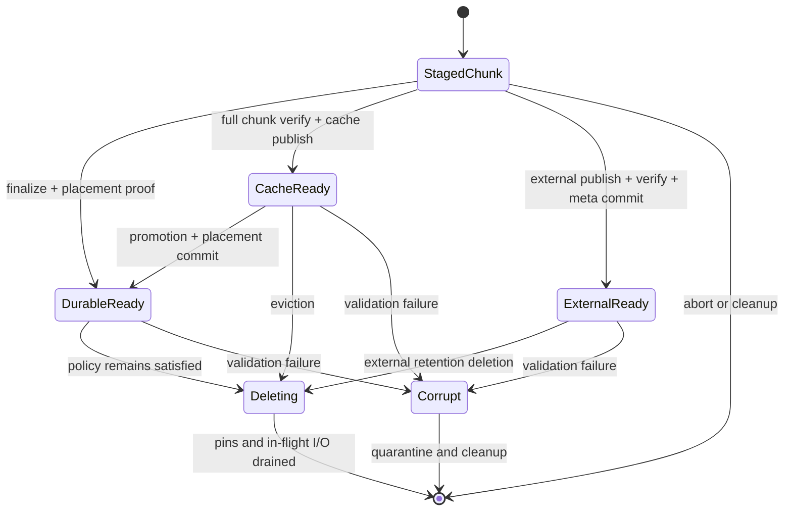

# 数据 Copy、状态与 Seed

状态：Accepted Design

实现状态：Planned；当前代码只实现 DurableReplica，并把角色与 Corrupt/Deleting 混在一个枚举中

规范合同：[RFC-0004](../rfcs/0004-replication-state-machine.md) · [RFC-0005](../rfcs/0005-local-chunk-engine-cow.md) · [RFC-0006](../rfcs/0006-chunk-transfer-cache-spill.md)

## 目的

集群本地磁盘相对于 OBS/S3 可以整体视为近计算缓存层，但 AFS 内部仍需区分每份数据承担的责任和当前健康状态，确保临时数据、可淘汰缓存和持久副本不会被混为一谈。

## 正交模型

```text
CopyRecord {
  role: CopyRole
  state: CopyState
  ...
}

CopyRole = DurableReplica | VerifiedCache | ExternalCommitted
CopyState = Ready | Corrupt | Deleting
```

角色回答“这份 Copy 承担什么责任”，状态回答“它现在能否使用”。

| Role + State | 含义 | 可读取 | 可成为 Seed | 计入集群内同步副本 | 可作为逐出依据 |
| --- | --- | ---: | ---: | ---: | ---: |
| `DurableReplica + Ready` | 位于合格故障域的持久副本 | 是 | 是 | 是 | 是，仍须满足策略 |
| `VerifiedCache + Ready` | 完整且通过 Chunk digest 校验的可淘汰缓存 | 是 | 是 | 否 | 否 |
| `ExternalCommitted + Ready` | 已在外部层发布、校验并提交到 Meta | 是，作为回源 | 否 | 默认否；显式 tiering policy 可计入整体 durability | 是 |
| 任意 Role + `Deleting` | 停止新读取，等待 pin/in-flight I/O 清空 | 仅已有 pin | 否 | 否 | 否 |
| 任意 Role + `Corrupt` | 内容或介质校验失败 | 否 | 否 | 否 | 否 |

`StagedChunk` 是 Node 内部未完成对象，不是 CopyRole 或 CopyState，不进入 Meta Copy Catalog，也不可读取、Seed 或计数。

## 状态转换



Spill 不把同一 Copy 从 DurableReplica 改成 ExternalCommitted。它创建新的外部 Copy；一个 Chunk 可以同时拥有多个 DurableReplica、VerifiedCache 和 ExternalCommitted。

## 写入与发布门禁

FileVersion commit 的每个新增 Chunk 必须满足当前 ReplicationConfig：

```text
verified Chunk identity
AND required Ready DurableReplica copies
AND placement across required failure domains
AND metadata publication commit
```

VerifiedCache 不满足集群内同步副本。ExternalCommitted 默认也不满足 `sync_required_copies`；只有显式 tiering policy 才能改变整体 durability 计算，不能静默降低级别。

## P2P Seed 门禁

Seed 不是 CopyRole。节点只有在以下条件全部成立时才能申请 SeedLease：

- 固定 FileVersion 引用的 Chunk 身份确定；
- 本地持有完整 Chunk；
- 完整 Chunk digest 校验通过；
- 对应 Copy 是 `DurableReplica + Ready` 或 `VerifiedCache + Ready`；
- tenant 和授权允许对外服务；
- 节点未进入 drain 或高压拒绝状态。

SeedLease 是带期限的软状态，包含 ChunkId、CopyId、Node epoch、endpoint、expires_at 和 load hint。Lease 过期、Node 重启、Copy 状态改变或缓存逐出后自动失效；它不提供耐久性承诺。

只取得部分 Range 的节点不能成为该 Chunk 的 Seed。Range checksum 只验证一次传输，不能代替完整 Chunk digest。

## Spill 门禁

从本地逐出数据需要：

1. 外部临时对象写入完成；
2. 完整长度和 Chunk digest 校验通过；
3. 外部对象原子发布；
4. `ExternalCommitted + Ready` 提交到 Meta；
5. 剩余本地副本、外部副本和显式 durability policy 满足要求；
6. pin、引用和在途 I/O 允许逐出；
7. 删除操作可重试且幂等。

活动文件不需要先转换成 Blob。Spill 的单位是已提交 FileVersion 引用的不可变 Chunk；后续文件写入产生新的 Chunk 和 FileVersion，不覆盖已 spill 的 Chunk。

## 故障规则

- staging 中断：不可见，依据 operation journal 恢复或清理；
- Cache 完整校验失败：不安装、不 announce Seed；
- Ready Copy 后续校验失败：进入 Corrupt，退出选源、Seed 和可靠性计数；
- 外部写成功但 Meta 提交失败：本地副本保持，外部对象作为 orphan 对账；
- Meta 提交成功但响应丢失：按 OperationId 查询原结果；
- Seed 退出：读取选择其他 Ready DurableReplica、VerifiedCache Seed 或 ExternalCommitted；
- 本地空间不足：拒绝新 staging、触发安全逐出或 Spill，不删除唯一事实源；
- 所有来源耗尽：返回明确 I/O 错误，不返回旧版本、零数据或未校验 staging。
